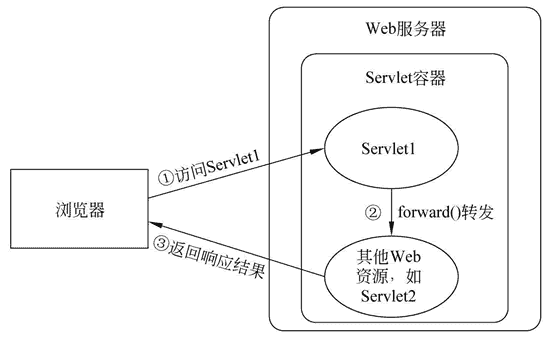
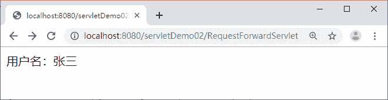

# RequestDispatcher 实现请求转发

> 原文：[`c.biancheng.net/view/4013.html`](http://c.biancheng.net/view/4013.html)

当一个 Web 资源收到客户端的请求后，如果希望服务器通知另外一个资源处理请求，那么这时可以通过 RequestDispatcher 接口的实例对象实现。ServletRequest 接口中定义了一个获取 RequestDispatcher 对象的方法，如表 1 所示。

表 1 获取 RequestDispatcher 对象的方法

| 方法声明 | 功能描述 |
| --- | --- |
| RequestDispatcher getRequestDispatcher (String path) | 返回封装了某条路径所指定资源的 RequestDispatcher 对象。其中，参数 path 必须以“/”开头，用于表示当前 Web 应用的根目录。需要注意的是，WEB-INF 目录中的内容对 RequestDispatcher 对象也是可见的。因此，传递给 getRequestDispatcher(String path) 方法的资源可以是 WEB-INF 目录中的文件 |

获取到 RequestDispatcher 对象后，最重要的工作就是通知其他 Web 资源处理当前的 Servlet 请求，为此，RequestDispatcher 接口定义了两个相关方法，如表 2 所示。

表 2 RequestDispatcher 接口的方法

| 方法声明 | 功能描述 |
| --- | --- |
| forward(ServletRequest request,ServletResponse response) | 该方法用于将请求从一个 Servlet 传递给另一个 Web 资源。在 Servlet 中，可以对请求做一个初步处理，然后通过调用这个方法，将请求传递给其他资源进行响应。需要注意的是，该方法必须在响应提交给客户端之前被调用，否则将抛出 IllegalStateException 异常 |
| include(ServletRequest request,ServletResponse response) |  该方法用于将其他的资源作为当前响应内容包含进来 |

## 请求转发

在 RequestDispatcher 接口中，forward() 方法可以实现请求转发，include() 方法可以实现请求包含，本节将以请求转发为例，讲解 forward() 方法的使用。

在 Servlet 中，如果当前 Web 资源不想处理请求，则可以通过 forward() 方法将当前请求传递给其他的 Web 资源进行处理，这种方式称为请求转发。请求转发的工作原理如图 1 所示。

从图 1 中可以看出，当客户端访问 Servlet1 时，可以通过 forward() 方法将请求转发给其他 Web 资源，其他 Web 资源处理完请求后，直接将响应结果返回到客户端。

了解了 forward() 方法的工作原理后，下面通过案例演示 forward() 方法的使用。在 servletDemo02 项目的 com.mengma.request 包中创建一个名为 RequestForwardServlet 的 Servlet 类，该类使用 forword() 方法将请求转发到一个新的 Servlet 页面，如下所示。
图 1  forward() 方法的工作原理

```

package com.mengma.servlet;

import java.io.IOException;
import javax.servlet.*;
import javax.servlet.http.*;

public class RequestForwardServlet extends HttpServlet {

    public void doGet(HttpServletRequest request,HttpServletResponse response)throws ServletException, IOException {
        response.setContentType("text/html;charset=utf-8");
        request.setAttribute("username", "张三");    // 将数据存储到 request 对象中
        RequestDispatcher dispatcher = request.getRequestDispatcher("/ResultServlet");
        dispatcher.forward(request,response);
    }

    public void doPost(HttpServletRequest request,HttpServletResponse response)throws ServletException,IOException {
        doGet(request,response);
    }
}
```

在 RequestForwardServlet 中，通过使用 forward() 方法，将当前 Servlet 的请求转发到 ResultServlet 页面，在 com.mengma.request 包中编写一个名为 ResultServlet 的 Servlet 类，该类用于获取 RequestForwardServlet 类中存储在 request 对象中的数据并输出，ResultServlet 类的代码实现如下所示。

```

package com.mengma.servlet;

import java.io.IOException;
import java.io.PrintWriter;
import javax.servlet.ServletException;
import javax.servlet.http.HttpServlet;
import javax.servlet.http.HttpServletRequest;
import javax.servlet.http.HttpServletResponse;

public class ResultServlet extends HttpServlet {

    public void doGet(HttpServletRequest request, HttpServletResponse response)throws ServletException, IOException {
        response.setContentType("text/html;charset=utf-8");
        PrintWriter out = response.getWriter();
        String username = (String) request.getAttribute("username");
        if (username != null) {
            out.println("用户名：" + username + "<br/>");
        }
    }

    public void doPost(HttpServletRequest request, HttpServletResponse response)
            throws ServletException, IOException {
        doGet(request, response);
    }
}
```

启动 Tomcat 服务器，在浏览器的地址栏中输入地址 http://localhost:8080/servletDemo02/RequestForwardServlet 访问 RequestForwardServlet，浏览器的显示结果如图 2 所示。


图 2  运行结果
从图 2 中可以看出，地址栏中显示的仍然是 RequestForwardServlet 的请求路径，但是浏览器却显示出了 ResultServlet 中要输出的内容。这是因为请求转发是发生在服务器内部的行为，从 RequestForwardServlet 到 ResultServlet 属于一次请求，在一次请求中是可以使用 request 属性进行数据共享的。