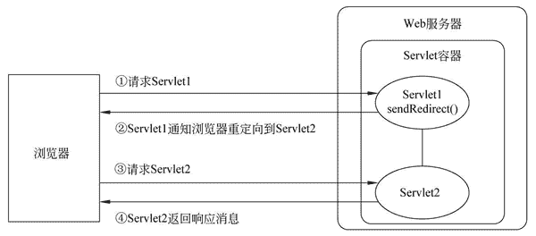
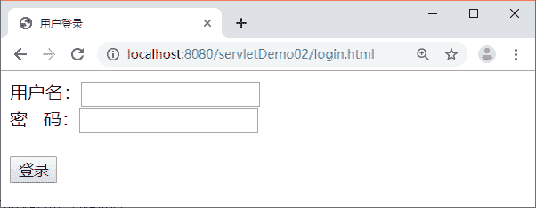
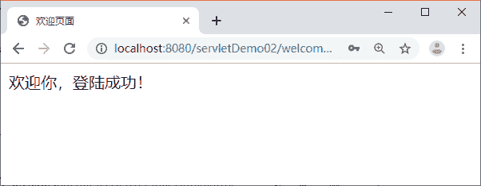

# response.sendRedirect()实现重定向（页面跳转）

> 原文：[`c.biancheng.net/view/4015.html`](http://c.biancheng.net/view/4015.html)

在某些情况下，针对客户端的请求，一个 Servlet 类可能无法完成全部工作。这时，可以使用请求重定向完成这一工作。

请求重定向指 Web 服务器接收到客户端的请求后，可能由于某些条件的限制，不能访问当前请求 URL 所指向的 Web 资源，而是指定了一个新的资源路径，让客户端重新发送请求。

为了实现请求重定向，HttpServletResponse 接口定义了一个 sendRedirect() 方法，该方法用于生成 302 响应码和 Location 响应头，从而通知客户端重新访问 Location 响应头中指定的 URL，sendRedirect() 方法的完整语法如下所示：

public void sendRedirect(java.lang.String location) throws java.io.IOException

在上述方法代码中，参数 location 可以使用相对 URL，Web 服务器会自动将相对 URL 翻译成绝对 URL，再生成 Location 头字段。

sendRedirect() 方法的工作原理如图 1 所示。

图 1  sendRedirect()方法的工作原理
在图 1 中，当客户端访问 Servlet1 时，由于在 Servlet1 中调用了 sendRedirect() 方法将请求重定向到 Servlet2，因此，浏览器收到 Servlet1 的响应消息后，立刻向 Servlet2 发送请求，Servlet2 对请求处理完毕后，再将响应消息回送给客户端浏览器并显示。

下面通过一个用户登录的案例分步骤讲解 sendRedirect() 方法的使用。

#### 1）创建页面文件

在 servletDemo02 项目的 WebContent 目录下创建一个用户登录的页面 login.html 和登录成功的页面 welcome.html，编辑后如下所示。

#### ① login.html 文件

```

<!DOCTYPE HTML>
<html>
<head>
<meta charset="UTF-8">
<title>用户登录</title>
</head>
<body>
    <!-- 把表单内容提交到 servletDemo02 工程下的 LoginServlet -->
    <form action="/servletDemo02/LoginServlet" method="POST">
        用户名：<input type="text" name="username"><br/>
        密&nbsp;&nbsp;&nbsp;码：<input type="password" name="password"/><br/>
        <br/>
        <input type="submit" value="登录"/>
    </form>
</body>
</html>
```

#### ② welcome.html 文件

```

<!DOCTYPE HTML>
<html>
<head>
<meta charset="UTF-8">
<title>欢迎页面</title>
</head>
<body>
    欢迎你，登陆成功！
</body>
</html>
```

#### 2）创建 Servlet

在 servletDemo02 项目的 com.mengma.response 包中创建一个名为 LoginServlet 的 Servlet 类，用于处理用户登录请求，如下所示。

```

package com.mengma.servlet;

import java.io.IOException;

import javax.servlet.ServletException;
import javax.servlet.http.HttpServlet;
import javax.servlet.http.HttpServletRequest;
import javax.servlet.http.HttpServletResponse;

public class LoginServlet extends HttpServlet {

    public void doGet(HttpServletRequest request, HttpServletResponse response)throws ServletException, IOException {
        response.setContentType("text/html;charset=utf-8");
        // 用 HttpServletRequest 对象的 getParameter() 方法获取用户名和密码
        String username = request.getParameter("username");
        String password = request.getParameter("password");
        // 假设用户名和密码分别为 admin 和 123456
        if ("admin".equals(username) && ("123456").equals(password)) {
            // 如果用户名和密码正确，重定向到 welcome.html
            response.sendRedirect("/servletDemo02/welcome.html");
        } else {
            // 如果用户名和密码错误，重定向到 login.html
            response.sendRedirect("/servletDemo02/login.html");
        }
    }

    public void doPost(HttpServletRequest request, HttpServletResponse response)throws ServletException, IOException {
        doGet(request, response);
    }
}
```

在上述代码中，首先通过 getParameter() 方法分别获取用户名和密码，然后判断表单中输入的用户名和密码是否为指定的“admin”和“123456”，如果是，则将请求重定向到 welcome.html 页面，否则重定向到 login.html 页面。

#### 3）运行项目并查看结果

启动 Tomcat 服务器，在浏览器的地址栏中输入地址 http://localhost:8080/servletDemo02/login.html 访问 login.html，浏览器的显示结果如图 2 所示。


图 2  运行结果
在图 2 所示的界面中填写用户名“admin”和密码“123456”，单击【登录】按钮，浏览器的显示结果如图 3 所示。


图 3  运行结果
从图 3 中可以看出，当用户名和密码输入正确后，浏览器跳转到了 welcome.html 页面。但是，如果用户名或者密码输入错误，则会跳转到图 2 所示的登录页面。