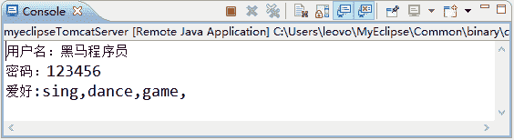

# Java Servlet 的 request/response 中文乱码问题的解决方案

> 原文：[`c.biancheng.net/view/4012.html`](http://c.biancheng.net/view/4012.html)

大家在使用 Java Servlet 开发网站的时候经常会遇到中文乱码问题，不管是请求（request）还是响应（response）的过程，本节我们分别给出对应的解决方案。

## Request 中文乱码问题以及解决方案

在填写表单数据时，难免需要输入中文，如用户名和公司名称等。如果将 servletDemo02 项目中表单页面的的用户名输入为“黑马程序员”，则提交后控制台的显示将如图 1 所示。


图 1  运行结果
从图 3 中可以看出，当输入的用户名为中文时，出现了“é??é??...”的乱码。本节将介绍如何处理请求参数中的中文乱码。

在 HttpServletRequest 接口中提供了一个 setCharacterEncoding() 方法，该方法用于设置 request 对象的解码方式。接下来对 RequestParamsServlet 进行修改，在第 7～8 行代码之间添加如下代码：

request.setCharacterEncoding("utf-8");  //设置 request 对象的解码方式

重启 Tomcat 服务器，再次输入中文“黑马程序员”并提交表单信息后，控制台显示的信息如图 2 所示。


图 2  运行结果
需要注意的是，这种解决乱码的方式只对 POST 方式有效，而对 GET 方式无效。如果将 form.html 文件中 method 属性的值改为 GET，重新访问 form.html 页面并填写中文信息，则控制台依然会出现如图 1 所示的乱码问题。

为了解决 GET 方式提交表单时出现的中文乱码问题，可以先使用错误码表 ISO-8859-1 将用户名重新编码，然后使用码表 UTF-8 进行解码。再次对 RequestParamsServlet 进行修改，在第 9～10 行代码之间增加一行代码，如下所示：

name = new String(name.getBytes("iso8859-1"),"utf-8");

重启 Tomcat 服务器，再次访问 form.html 网页，输入中文用户名“黑马程序员”，这时，控制台显示的信息将不会出现乱码。

## Response 中文乱码问题以及解决方案

由于计算机中的数据都是以二进制形式存储的，因此，当传输文本数据时，会发生字符和字节之间的转换。字符与字节之间的转换是通过查码表完成的，将字符转换成字节的过程称为编码，将字节转换成字符的过程称为解码，如果编码和解码使用的码表不一致，则会导致乱码问题。下面通过案例演示乱码问题的产生原因以及解决方式。

在 servletDemo02 项目中新建一个名称为 com.mengma.response 的包，在该包中新建一个名为 ChineseServlet 的类，在类中定义一个中文字符串，然后使用字符输出流输出，如下所示。

```

package com.mengma.servlet;

import java.io.IOException;
import java.io.PrintWriter;
import javax.servlet.ServletException;
import javax.servlet.http.HttpServlet;
import javax.servlet.http.HttpServletRequest;
import javax.servlet.http.HttpServletResponse;

public class ChineseServlet extends HttpServlet {

    public void doGet(HttpServletRequest request, HttpServletResponse response)throws ServletException, IOException {
        String data = "中国";
        PrintWriter out = response.getWriter();
        out.println(data);
    }

    public void doPost(HttpServletRequest request, HttpServletResponse response)throws ServletException, IOException {
        doGet(request, response);
    }
}
```

启动 Tomcat 服务器，在浏览器的地址栏中输入地址 http://localhost:8080/servletDemo02/ChineseServlet 访问 ChineseServlet，浏览器的显示结果如图 3 所示。


图 3  运行结果
从图 1 中可以看出，浏览器显示的内容是“??”，说明发生了乱码。实际上此处产生乱码的原因是 response 对象的字符输出流在编码时采用的字符码表是 ISO-8859-1，该码表不兼容中文，会将“中国”编码为 63 63（在 ISO-8859-1 的码表中查不到的字符就会显示 63）。当浏览器对接收到的数据进行解码时，会采用默认的码表 GB2312，将 63 解码为?，因此，浏览器将“中国”两个字符显示为“??”，具体分析如图 4 所示。
图 4  编码错误分析
为了解决上述编码错误，HttpServletResponse 对象提供了两种解决乱码的方式，具体如下。

第一种方式：

response.setCharacterEncoding("utf-8");    //设置 HttpServletResponse 使用 utf-8 编码
response.setHeader("Content-Type", "text/html;charset=utf-8");    //通知浏览器使用 utf-8 解码

第二种方式：

response.setContentType("text/html;charset=utf-8");    //包含第一种方式的两个功能

在通常情况下，为了使代码更加简洁，一般会采用第二种方式。接下来对 ChineseServlet 进行修改，在第 7～8 行代码之间加入第二种方式的代码，重新启动 Tomcat 服务器并使用浏览器访问 ChineseServlet，浏览器显示出了正确的中文字符，如图 5 所示。


图 5  运行结果