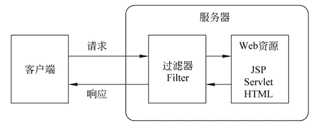

# Java Servlet Filter（过滤器）是什么？它的方法有哪些？

> 原文：[`c.biancheng.net/view/4024.html`](http://c.biancheng.net/view/4024.html)

Filter 是 Servlet 的过滤器，是 Servlet 2.3 规范中新增加的一个功能，主要用于完成一些通用的操作，如编码的过滤、判断用户的登录状态等。

在现实生活中，人们可以使用污水净化设备对水源进行过滤净化。同样，在程序中人们也可以使用 Filter 对请求和响应信息进行过滤。

Filter 被称为过滤器，其主要作用是对 Servlet 容器调用 Servlet 的过程进行拦截，从而在 Servlet 进行响应处理的前后实现一些特殊功能。Filter 在 Web 应用中的拦截过程如图 1 所示。

图 1  Filter 拦截过程
在图 1 中，当用户通过浏览器访问服务器中的目标资源时，首先会被 Filter 拦截，在 Filter 中进行预处理操作，然后再将请求转发给目标资源。当服务器接收到这个请求后会对其进行响应，在服务器处理响应的过程中，也需要将响应结果经过滤器处理后，才发送给客户端。

本质上，Filter 过滤器就是一个实现了 javax.servlet.Filter 接口的类，在 javax.servlet.Filter 接口中定义了三个方法，如表 1 所示。

表 1 Filter 接口中的方法

| 方法声明 | 功能描述 |
| --- | --- |
| init(FilterConfig filterConfig) | init() 方法用于初始化过滤器，开发人员可以在 init() 方法中完成与构造方法类似的初始化功能，如果初始化代码中要使用到 FillerConfig 对象，那么，这些初始化代码就只能在 Filler 的 init() 方法中编写，而不能在构造方法中编写 |
|  doFilter(ServletRequest request,SeivletResponse response, FilterChain chain) | doFilter() 方法有多个参数，其中，参数 request 和 response 为 Web 服务器或 Filter 链中的上一个 Filter 传递过来的请求和响应对象； 参数 chain 代表当前 Filter 链的对象，只有在当前 Filter 对象中的 doFilter() 方法内部需要调用 FilterChain 对象的 doFilter() 方法，才能把请求交付给 Filter 链中的下一个 Filter 或者目标程序处理 |
| destroy() | destroy() 方法在 Web 服务器卸载 Filter 对象之前被调用，该方法用于释放被 Filter 对象打开的资源，例如关闭数据库和 I/O 流 |

表 1 中的三个方法都是可以表现 Filter 生命周期的方法，其中 init() 方法在 Web 应用程序加载时会被调用，destroy() 方法在 Web 应用程序卸载（或关闭）时被调用，这两个方法都只会被调用一次，而 doFilter() 方法会被调用多次（只要客户端有请求时就会被调用），Filter 所有的工作集中在 doFilter() 方法中。