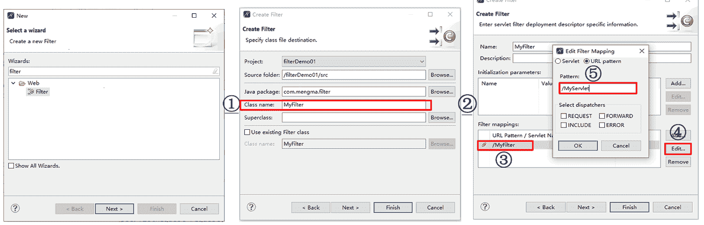
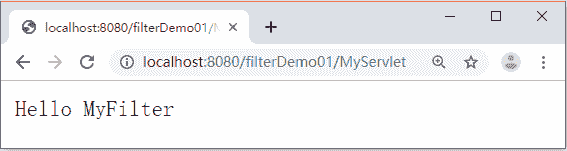

# 第一个 Filter 程序

> 原文：[`c.biancheng.net/view/4025.html`](http://c.biancheng.net/view/4025.html)

为了帮助读者快速了解 Filter 的开发过程，下面通过案例演示 Filter 程序如何对 Servlet 程序的调用过程进行拦截。

#### 1）创建 Servlet

在 MyEclipse 中创建一个名为 filterDemo01 的 Web 项目，并在项目的 src 下创建一个名为 com.mengma.filter 的包，在该包中创建一个名为 MyServlet 的 Servlet 类，该类用于访问时在浏览器中输出“Hello MyServlet”。MyServlet 类的实现代码如下所示。

```

package com.mengma.filter;

import java.io.IOException;
import java.io.PrintWriter;

import javax.servlet.ServletException;
import javax.servlet.http.HttpServlet;
import javax.servlet.http.HttpServletRequest;
import javax.servlet.http.HttpServletResponse;

public class MyServlet extends HttpServlet {

    public void doGet(HttpServletRequest request, HttpServletResponse response)
            throws ServletException, IOException {
        response.getWriter().write("Hello MyServlet");
    }

    public void doPost(HttpServletRequest request, HttpServletResponse response)
            throws ServletException, IOException {
        doGet(request, response);
    }
}
```

#### 2）创建 Filter 类

右击 com.mengma.filter 包，然后选择 New→Other...，在弹出窗口中的 Web 文件夹下找到 Filter，单击 Next 按钮，在新窗口的 Class name 文本框中填写所创建的 Filter，单击 Next 按钮进入 Filter 映射信息的配置窗口，如图 1 所示。
图 1  创建一个 Filter
在图 1 中，单击 Filter Mappings 窗口中的 /MyFilter，然后单击右侧的 Edit 按钮，在弹出窗口中的 Pattern 文本框中将 /MyFilter 更改为 /MyServlet（/MyFilter 是默认拦截的 URL，/MyServlet 是需要拦截的 URL，这里指 MyServlet 类）。

依次单击 OK 和 Finish 按钮即可完成 Filter 类的创建。创建后的 MyFilter 类的主要代码如下所示。

```

package com.mengma.filter;

import java.io.IOException;
import javax.servlet.Filter;
import javax.servlet.FilterChain;
import javax.servlet.FilterConfig;
import javax.servlet.ServletException;
import javax.servlet.ServletRequest;
import javax.servlet.ServletResponse;
import javax.servlet.annotation.WebFilter;

@WebFilter("/MyServlet")
public class MyFilter implements Filter {

    public MyFilter() {
    }
    public void destroy() {
    }
    public void doFilter(ServletRequest request, ServletResponse response,
            FilterChain chain) throws IOException, ServletException {
        chain.doFilter(request, response);
    }
    public void init(FilterConfig fConfig) throws ServletException {
    }
}
```

在上述代码中，MyFilter() 是 MyFilter 类默认的构造方法，其他三个方法是 Filter 接口中的方法。在 doFilter() 方法中，chain.doFilter（request，response）用于过滤处理，表示将请求向下传递。

使用 MyEclipse 创建过滤器类后，需在 web.xml 中创建过滤器信息，代码如下：

```

<filter>
    <filter-name>MyFilter</filter-name>
    <filter-class>com.mengma.filter.MyFilter</filter-class>
</filter>
<filter-mapping>
    <filter-name>MyFilter</filter-name>
    <url-pattern>/MyServlet</url-pattern>
</filter-mapping>
```

在上述代码中，设置了过滤器对 /MyServlet 请求资源进行拦截，将在请求到达 MyServlet 程序前执行 MyFilter 程序。过滤器的配置信息中包含多个元素，这些元素分别具有不同的作用。

*   <filter> 根元素用于注册一个 Filter。
*   <filter-name> 子元素用于设置 Filter 名称。
*   <filter-class> 子元素用于设置 Filter 类的完整名称。
*   <filter-mapping> 根元素用于设置一个过滤器所拦截的资源。
*   <filter-name> 子元素必须与 <filter> 中的 <filter-name> 子元素相同。
*   <url-pattern> 子元素用于匹配用户请求的 URL，例如 /MyServlet，这个 URL 还可以使用通配符*表示，例如 *.do 适用于所有以 .do 结尾的 Servlet 路径。

#### 3）修改 Filter

为了演示 Filter 的拦截效果，对 MyFilter 类中的 doFilter() 方法进行修改，修改后的代码如下：

```

public void doFilter(ServletRequest request, ServletResponse response,
        FilterChain chain) throws IOException, ServletException {
    PrintWriter out = response.getWriter();
    out.write("Hello MyFilter");
}
```

#### 4）运行项目并查看结果

启动 Tomcat 服务器，在浏览器的地址栏中输入地址 http://localhost:8080/filterDemo01/MyServlet 访问 MyServlet，此时，浏览器窗口显示的结果如图 2 所示。


图 2  运行结果
从图 2 中可以看出，在使用浏览器访问 MyServlet 时，浏览器窗口中只显示了 MyFilter 的输出信息，而没有显示 MyServlet 的输出信息，这说明 MyFilter 成功拦截了 MyServlet 程序。