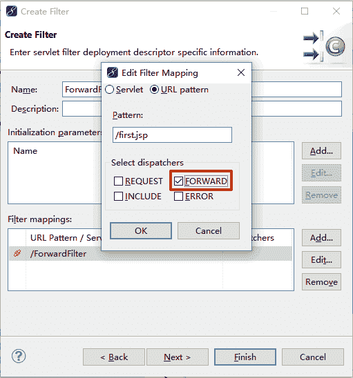
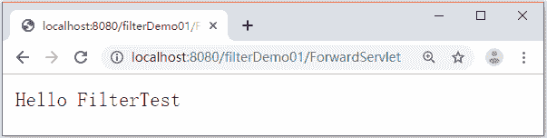

# Java Servlet Filter 的两种映射方式

> 原文：[`c.biancheng.net/view/4027.html`](http://c.biancheng.net/view/4027.html)

使用 MyEclipse 创建 Filter 后，在 web.xml 中的对应配置信息就是 Filter 映射。Filter 的映射方式可分为两种。

#### 1）使用通配符`*`拦截用户的所有请求

Filter 的 <filter-mapping> 元素用于配置过滤器拦截的资源信息，如果想让过滤器拦截所有的请求，那么可以使用通配符`*`实现，具体实现方式如下：

```

<filter>
    <filter-name>MyFilter</filter-name>
    <filter-class>com.mengma.filter.MyFilter</filter-class>
</filter>
<filter-mapping>
    <filter-name>MyFilter</filter-name>
    <url-pattern>/*</url-pattern>
</filter-mapping>
```

#### 2）拦截不同方式的访问请求

在 web.xml 文件中，每一个 <filter-mapping> 元素都可以配置一个 Filter 所负责拦截的资源。在 <filter-mapping> 元素中有一个特殊的子元素 <dispatcher>，该元素用于指定过滤器所拦截的资源被 Servlet 容器调用的方式。<dispatcher> 元素的值共有四个，如表 1 所示。

表 1 <dispatcher>元素的值

| 名称 | 功能描述 |
| --- | --- |
| REQUEST | 当用户直接访问页面时，Web 容器将会调用过滤器。如果目标资源通过 RequestDispatcher 的 include() 或 forward() 方法访问，那么该过滤器将不会被调用 |
| INCLUDE | 如果目标资源通过 RequestDispatcher 的 include() 方法访问，那么该过滤器将会被调用。除此之外，该过滤器不会被调用 |
| FORWARD | 如果目标资源通过 RequestDispatcher 的 forward() 方法访问，那么该过滤器将会被调用。除此之外，该过滤器不会被调用 |
| ERROR | 如果目标资源通过声明式异常处理机制调用，那么该过滤器将会被调用。除此之外，该过滤器不会被调用 |

为了让读者更好地理解表 1 中的四个值的作用，下面以 FORWARD 为例，分步骤演示 Filter 对转发请求的拦截效果。

#### 1）创建 ForwardServlet

在 filterDemo01 项目的 com.mengma.filter 包中创建一个名为 ForwardServlet 的 Servlet 类，该类用于将请求转发给 first.jsp 页面，如下所示。

```

package com.mengma.filter;

import java.io.IOException;

import javax.servlet.ServletException;
import javax.servlet.http.HttpServlet;
import javax.servlet.http.HttpServletRequest;
import javax.servlet.http.HttpServletResponse;

public class ForwardServlet extends HttpServlet {

    public void doGet(HttpServletRequest request, HttpServletResponse response)
            throws ServletException, IOException {
        request.getRequestDispatcher("/first.jsp").forward(request, response);
    }

    public void doPost(HttpServletRequest request, HttpServletResponse response)
            throws ServletException, IOException {
        doGet(request, response);
    }
}
```

#### 2）创建 first.jsp

在项目的 WebContent 目录中创建一个名称为 first.jsp 的页面，该页面用于输出内容，编辑代码如下所示。

```

<%@ page language="java" contentType="text/html; charset=utf-8"
    pageEncoding="utf-8"%>
<!DOCTYPE html PUBLIC "-//W3C//DTD HTML 4.01 Transitional//EN"
       "http://www.w3.org/TR/html4/loose.dtd">
<html>
<head>
<meta http-equiv="Content-Type" content="text/html; charset=utf-8">
<title>Insert title here</title>
</head>
<body>
    first.jsp
</body>
</html>
```

#### 3）创建并编辑过滤器 ForwardFilter

在 com.mengma.filter 包中创建一个名称为 ForwardFilter 的过滤器，该过滤器专门用于对 first.jsp 页面进行拦截。需要注意的是，在填写配置信息时，需要将 Edit Filter Mapping 窗口中 Select dispatchers 下的 Forward 复选框选中，如图 1 所示。


图 1  配置拦截信息
创建完成后，编辑 ForwardFilter 类。编辑后的实现代码如下所示。

```

package com.mengma.filter;

import java.io.IOException;
import java.io.PrintWriter;

import javax.servlet.Filter;
import javax.servlet.FilterChain;
import javax.servlet.FilterConfig;
import javax.servlet.ServletException;
import javax.servlet.ServletRequest;
import javax.servlet.ServletResponse;

public class ForwardFilter implements Filter {

    public void init(FilterConfig fConfig) throws ServletException {
        // 过滤对象在初始化时调用，可以配置一些初始化参数
    }

    public void doFilter(ServletRequest request, ServletResponse response,
            FilterChain chain) throws IOException, ServletException {
        // 用于拦截用户的请求，如果和当前过滤器的拦截路径匹配，该方法会被调用
        PrintWriter out = response.getWriter();
        out.write("Hello FilterTest");
    }

    public void destroy() {
        // 过滤器对象在销毁时自动调用，释放资源
    }
}
```

此时需在 web.xml 文件中添加 ForwardFilter 的映射信息。代码中增加了一个 <dispatcher> 子元素，并且该元素的值为 FORWARD，如下所示：

```

<filter>
    <filter-name>ForwardFilter</filter-name>
    <filter-class>com.mengma.filter.ForwardFilter</filter-class>
</filter>
<filter-mapping>
    <filter-name>ForwardFilter</filter-name>
    <url-pattern>/first.jsp</url-pattern>
    <dispatcher>FORWARD</dispatcher>
</filter-mapping>
```

#### 4）运行项目并查看结果

启动 Tomcat 服务器，在浏览器的地址栏中输入地址 http://localhost:8080/filterDemo01/ForwardServlet 访问 ForwardServlet，浏览器显示的结果如图 2 所示。


图 2  运行结果
从图 2 中可以看出，浏览器窗口显示的是 ForwardFilter 类中的内容，而 first.jsp 页面的输出内容没有显示。由此可见，ForwardServlet 中通过 forward() 方法转发的 first.jsp 页面被成功拦截。