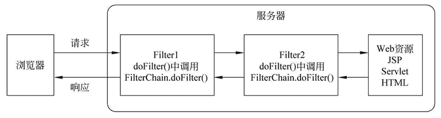
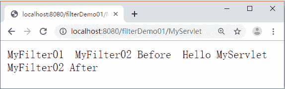

# FilterChain（过滤器链）详解

> 原文：[`c.biancheng.net/view/4031.html`](http://c.biancheng.net/view/4031.html)

在一个 Web 应用程序中可以注册多个 Filter 程序，每个 Filter 程序都可以针对某一个 URL 进行拦截。如果多个 Filter 程序都对同一个 URL 进行拦截，那么这些 Filter 就会组成一个 Filter 链（也称过滤器链）。

Filter 链用 FilterChain 对象表示，FilterChain 对象中有一个 doFilter() 方法，该方法的作用是让 Filter 链上的当前过滤器放行，使请求进入下一个 Filter。

Filter 链的拦截过程如图 1 所示。
图 1  Filter 链
在图 1 中，当浏览器访问 Web 服务器中的资源时，需要经过两个过滤器 Filter1 和 Filter2。首先 Filter1 会对这个请求进行拦截，在 Filter1 中处理完请求后，通过调用 Filter1 的 doFilter() 方法将请求传递给 Filter2，Filter2 处理用户请求后同样调用 doFilter() 方法，最终将请求发送给目标资源。当 Web 服务器对这个请求做出响应时，也会被过滤器拦截，但这个拦截顺序与之前相反，最终将响应结果发送给客户端浏览器。

为了便于读者理解 Filter 链的拦截过程以及掌握 Filter 链的使用，下面通过案例演示如何使用 Filter 链拦截 MyServlet 的同一个请求。

#### 1）创建过滤器

在 filterDemo01 项目的 com.mengma.filter 包中新建两个过滤器 MyFilter01 和 MyFilter02，如 MyFilter01 和 MyFilter02 所示。

#### ① MyFilter01

```

package com.mengma.filter;

import java.io.IOException;
import java.io.PrintWriter;

import javax.servlet.Filter;
import javax.servlet.FilterChain;
import javax.servlet.FilterConfig;
import javax.servlet.ServletException;
import javax.servlet.ServletRequest;
import javax.servlet.ServletResponse;

public class MyFilter01 implements Filter {

    public void init(FilterConfig fConfig) throws ServletException {
        // 过滤器对象在初始化时调用，可以配置一些初始化参数
    }

    public void doFilter(ServletRequest request, ServletResponse response,
            FilterChain chain) throws IOException, ServletException {
        // 用于拦截用户的请求，如果和当前过滤器的拦截路径匹配，则该方法会被调用
        PrintWriter out = response.getWriter();
        out.write("MyFilter01<br/>");
        chain.doFilter(request, response);
    }

    public void destroy() {
        // 过滤器对象在销毁时自动调用，释放资源
    }
}
```

#### ② MyFilter02

```

package com.mengma.filter;

import java.io.IOException;
import java.io.PrintWriter;

import javax.servlet.Filter;
import javax.servlet.FilterChain;
import javax.servlet.FilterConfig;
import javax.servlet.ServletException;
import javax.servlet.ServletRequest;
import javax.servlet.ServletResponse;

public class MyFilter02 implements Filter {

    public void init(FilterConfig fConfig) throws ServletException {
        // 过滤器对象在初始化时调用，可以配置一些初始化参数
    }

    public void doFilter(ServletRequest request, ServletResponse response,
            FilterChain chain) throws IOException, ServletException {
        // 用于拦截用户的请求，如果和当前过滤器的拦截路径匹配，则该方法会被调用
        PrintWriter out = response.getWriter();
        out.write("MyFilter02 Before<br/>");
        chain.doFilter(request, response);
        out.write("<br/>MyFilter02 After<br/>");
    }

    public void destroy() {
        // 过滤器对象在销毁时自动调用，释放资源
    }
}
```

#### 2）修改 web.xml

为了防止其他过滤器影响此次 Filter 链的演示效果，需要先将 web.xml 文件中的其他过滤器的配置信息注释掉，然后将 MyFilter01 和 MyFilter02 过滤器的映射信息配置在 MyServlet 配置信息前面，具体如下所示。

```

<?xml version="1.0" encoding="UTF-8"?>
<web-app xmlns:xsi="http://www.w3.org/2001/XMLSchema-instance"
    xmlns="http://java.sun.com/xml/ns/javaee" xmlns:web="http://java.sun.com/xml/ns/javaee/web-app_2_5.xsd"
    xsi:schemaLocation="http://java.sun.com/xml/ns/javaee http://java.sun.com/xml/ns/javaee/web-app_3_0.xsd"
    version="3.0">
    <filter>
        <filter-name>MyFilter01</filter-name>
        <filter-class>com.mengma.filter.MyFilter01</filter-class>
    </filter>
    <filter-mapping>
        <filter-name>MyFilter01</filter-name>
        <url-pattern>/MyServlet</url-pattern>
    </filter-mapping>
    <filter>
        <filter-name>MyFilter02</filter-name>
        <filter-class>com.mengma.filter.MyFilter02</filter-class>
    </filter>
    <filter-mapping>
        <filter-name>MyFilter02</filter-name>
        <url-pattern>/MyServlet</url-pattern>
    </filter-mapping>
    <servlet>
        <servlet-name>MyServlet</servlet-name>
        <servlet-class>com.mengma.filter.MyServlet</servlet-class>
    </servlet>
    <servlet-mapping>
        <servlet-name>MyServlet</servlet-name>
        <url-pattern>/MyServlet</url-pattern>
    </servlet-mapping>
</web-app>
```

#### 3）运行项目并查看结果

启动 Tomcat 服务器，在浏览器的地址栏中输入 http://localhost:8080/filterDemo01/MyServlet，此时，浏览器窗口中的显示结果如图 2 所示。


图 2  运行结果
 从图 2 中可以看出，MyServlet 首先被 MyFilter01 拦截了，显示出 MyFilter01 中的内容，然后被 MyFilter02 拦截，直到 MyServlet 被 MyFilter02 放行后，浏览器才显示出 MyServlet 中的输出内容。

需要注意的是，Filter 链中各个 Filter 的拦截顺序与它们在 web.xml 文件中 <filter-mapping> 元素的映射顺序一致，由于 MyFilter01 的 <filter-mapping> 元素位于 MyFilter02 的 <filter-mapping> 元素前面，因此，用户的访问请求首先会被 MyFilter01 拦截，然后再被 MyFilter02 拦截。