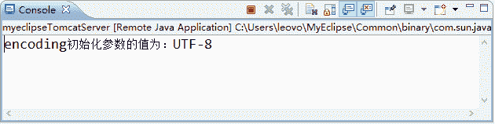

# FilterConfig 接口及其使用方法详解

> 原文：[`c.biancheng.net/view/4037.html`](http://c.biancheng.net/view/4037.html)

FilterConfig 是 Servlet API 提供的一个用于获取 Filter 程序在 web.xml 文件中的配置信息的接口，该接口封装了 Filter 程序在 web.xml 中的所有注册信息，并且提供了一系列获取这些配置信息的方法，具体如表 1 所示。

表 1 FilterConfig 接口中的方法

| 方法声明 | 功能描述 |
| --- | --- |
| String getFilterName() | getFilterName() 方法用于返回在 web.xml 文件中为 Filter 所设置的名称，也就是返回 ＜filter-name＞ 元素的设置值 |
| String getInitParameter(String name) | getInitParameter(String name) 方法用于返回在 web.xml 文件中为 Filter 所设置的某个名称的初始化参数值，如果指定名称的初始化参数不存在，则返回 null |
| Enumeration getInitParameterNames() | getInitParameterNames() 方法用于返回一个 Enumeration 集合对象，该集合对象包含在 web.xml 文件中为当前 Filter 设置的所有初始化参数的名称 |
| ServletContext getServletContext() | getServletContext()方法用于返回 FilterConfig 对象中所包装的 ServletContext 对象的引用 |

表 1 列举了 FilterConfig 接口中的一系列方法，为了让读者更好地掌握这些方法，下面以 getInitParameter（String name）方法的使用为例演示 FilterConfig 接口的使用。

#### 1）创建过滤器

在 filterDemo01 项目的 com.mengma.filter 包中创建过滤器 MyFilter03，使用该过滤器获取 web.xml 中设置的参数，如下所示。

```

package com.mengma.filter;

import java.io.IOException;
import java.io.PrintWriter;

import javax.servlet.Filter;
import javax.servlet.FilterChain;
import javax.servlet.FilterConfig;
import javax.servlet.ServletException;
import javax.servlet.ServletRequest;
import javax.servlet.ServletResponse;

public class MyFilter03 implements Filter {
    private String characterEncoding;
    FilterConfig fc;

    public void init(FilterConfig fConfig) throws ServletException {
        // 获取 FilterConfig 对象
        this.fc = fConfig;
    }

    public void doFilter(ServletRequest request, ServletResponse response,
            FilterChain chain) throws IOException, ServletException {
        // 输出参数信息
        characterEncoding = fc.getInitParameter("Encoding");
        System.out.println("encoding 初始化参数的值为：" + characterEncoding);
        chain.doFilter(request, response);
    }

    public void destroy() {
    }
}
```

#### 2）配置过滤器

在 web.xml 文件中配置过滤器信息。为了防止其他过滤器影响 MyFilter03 的拦截效果，需要先将 web.xml 文件中其他过滤器的配置信息注释掉，然后将 MyFilter03 过滤器的映射信息配置在 MyServlet 配置信息的前面，具体代码如下所示：

```

<filter>
    <filter-name>MyFilter03</filter-name>
    <filter-class>com.mengma.filter.MyFilter03</filter-class>
    <init-param>
        <param-name>encoding</param-name>
        <param-value>UTF-8</param-value>
    </init-param>
</filter>
<filter-mapping>
    <filter-name>MyFilter03</filter-name>
    <url-pattern>/MyServlet</url-pattern>
</filter-mapping>
```

#### 3）运行项目并查看结果

启动 Tomcat 服务器，在浏览器的地址栏中输入地址 http://localhost:8080/filterDemo01/MyServlet 访问 MyServlet，控制台窗口中显示的结果如图 1 所示。


图 1  控制台窗口
从图 1 中可以看出，使用 Filter 成功获取到配置文件中的初始化参数。当 Tomcat 服务器启动时，会加载所有的 Web 应用，在加载 filterDemo01 时，MyFilter03 会被初始化调用 init() 方法，从而可以得到 FilterConfig 对象，然后在 doFilter() 方法中通过调用 FilterConfig 对象的 getInitParameter() 方法便可以获取在 web.xml 文件中配置的某个参数信息。