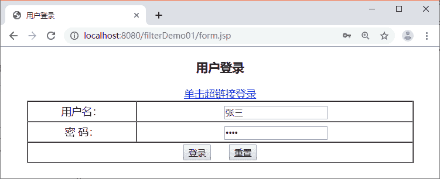
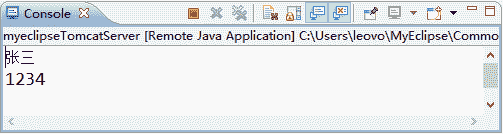

# Servlet Filter 实现全站统一编码，解决中文乱码问题

> 原文：[`c.biancheng.net/view/4041.html`](http://c.biancheng.net/view/4041.html)

在开发 Web 项目时，解决中文乱码问题是不可避免的。在前面所学的知识中，解决乱码的通常做法是在 Servlet 程序中设置编码方式，但是，当多个 Servlet 程序都需要设置编码方式时，就会书写大量重复的代码。

为了解决这一问题，我们可以在 Filter 中对获取到的请求和响应消息进行编码处理，这样就可以实现全站编码方式的统一。本节将分步骤演示如何使用 Filter 实现全站编码的统一。

#### 1）编写 form.jsp 页面

在 filterDemo01 项目的 WebContent 目录中编写一个 form.jsp 页面，该页面用于提交用户登录的表单信息，如下所示。

```

<%@ page language="java" contentType="text/html; charset=utf-8"
    pageEncoding="utf-8"%>
<!DOCTYPE html PUBLIC "-//W3C//DTD HTML 4.01 Transitional//EN"
                            "http://www.w3.org/TR/html4/loose.dtd">
<html>
<head>
<meta http-equiv="Content-Type" content="text/html; charset=utf-8">
<title>用户登录</title>
</head>
<center>
    <h3>用户登录</h3>
</center>
<body style="text-align:center;">
    <a href="<%=request.getContextPath()%>/CharacterServlet?name=张三&password=1234">
        单击超链接登录
    </a>
    <form action="<%=request.getContextPath()%>/CharacterServlet" method="post">
        <table border="1" width="600px" cellpadding="0" cellspacing="0" align="center">
            <tr>
                <td height="30" align="center">用户名：</td>
                <td>&nbsp;<input type="text" name="name" /></td>
            </tr>
            <tr>
                <td height="30" align="center">密&nbsp;码</td>
                <td>&nbsp;<input type="password" name="password" /></td>
            </tr>
            <tr>
                <td height="30" colspan="2" align="center">
                    <input type="submit" value="登录"/>
                    &nbsp;&nbsp;&nbsp;&nbsp;
                    <input type="reset" value="重置" />
                </td>
            </tr>
        </table>
    </form>
</body>
</html>
```

在 form.jsp 中，第 14～16 行代码是一个请求方式为 GET 的超链接；第 17～35 行代码是一个 POST 提交方式 form 表单。

#### 2）创建 Servlet

在 filterDemo01 项目的 com.mengma.filter 包中创建一个名称为 CharacterServlet 的 Servlet 类，该类用于获取用户输入的请求参数，并将参数输出到控制台，其代码如下所示。

```

package com.mengma.filter;

import java.io.IOException;

import javax.servlet.ServletException;
import javax.servlet.http.HttpServlet;
import javax.servlet.http.HttpServletRequest;
import javax.servlet.http.HttpServletResponse;

public class CharacterServlet extends HttpServlet {

    public void doGet(HttpServletRequest request, HttpServletResponse response)
            throws ServletException, IOException {
        System.out.println(request.getParameter("name"));
        System.out.println(request.getParameter("password"));
    }

    public void doPost(HttpServletRequest request, HttpServletResponse response)
            throws ServletException, IOException {
        doGet(request, response);
    }
}
```

#### 3）创建过滤器

在 filterDemo01 项目的 com.mengma.filter 包中创建一个名称为 CharacterFilter 的 Filter 类，该类用于拦截用户的请求访问，并实现全站编码的统一，其具体实现代码如下所示。

```

package com.mengma.filter;

import java.io.IOException;
import java.io.UnsupportedEncodingException;

import javax.servlet.Filter;
import javax.servlet.FilterChain;
import javax.servlet.FilterConfig;
import javax.servlet.ServletException;
import javax.servlet.ServletRequest;
import javax.servlet.ServletResponse;
import javax.servlet.http.HttpServletRequest;
import javax.servlet.http.HttpServletRequestWrapper;
import javax.servlet.http.HttpServletResponse;

public class CharacterFilter implements Filter {
    public void init(FilterConfig fConfig) throws ServletException {

    }

    public void doFilter(ServletRequest req, ServletResponse res,
            FilterChain chain) throws IOException, ServletException {
        HttpServletRequest request = (HttpServletRequest) req;
        HttpServletResponse response = (HttpServletResponse) res;
        // 拦截所有的请求，解决全站中文乱码，指定 request 和 response 的编码
        request.setCharacterEncoding("utf-8"); // 只对消息体有效
        response.setContentType("text/html;charset=utf-8");
        // 对 request 进行包装
        CharacterRequest characterRequest = new CharacterRequest(request);
        chain.doFilter(characterRequest,response);
    }

    public void destroy() {
    }

}

// 继承默认包装类 HttpServletRequestWrapper
class CharacterRequest extends HttpServletRequestWrapper {
    private HttpServletRequest request;

    public CharacterRequest(HttpServletRequest request) {
        super(request);
        this.request = request;
    }

    // 子类继承父类一定会覆写一些方法，此处用于重写 getParameter()方法
    public String getParameter(String name) {
        // 调用被包装对象 getParameter()方法，获得请求参数
        String value = super.getParameter(name);
        if (value == null) {
            return null;
        }
        String method = super.getMethod(); // 判断请求方式
        if ("get".equalsIgnoreCase(method)) {
            try {
                value = new String(value.getBytes("iso-8859-1"), "utf-8");
            } catch (UnsupportedEncodingException e) {
                throw new RuntimeException(e);
            }
        }
        return value; // 解决乱码后返回结果

    }
}
```

在 CharacterFilter 中，针对请求的方式不同，采用了不同的乱码解决方式。其中，由于 POST 方式的请求参数存放在消息体中，所以通过 setCharacterEncoding() 方法进行设置，而 GET 方式的请求参数存放在消息头中，通过 HttpServletRequestWrapper 类对 HttpServletRequest 类进行包装，并通过重写 getParameter() 的方式设置 GET 方式提交参数的编码。

需要注意的是，由于要拦截用户访问资源的所有请求，因此需要将 CharacterFilter 映射信息中 <filter-mapping> 元素拦截的路径设置为“/*”，如下所示：

```

<filter>
    <filter-name>CharacterFilter</filter-name>
    <filter-class>com.mengma.filter.CharacterFilter</filter-class>
</filter>
<filter-mapping>
    <filter-name>CharacterFilter</filter-name>
    <url-pattern>/*</url-pattern>
</filter-mapping>
```

#### 4）运行项目并查看结果

启动 Tomcat 服务器，在浏览器的地址栏中输入地址 http://localhost:8080/filterDemo01/form.jsp，此时，浏览器窗口中会显示一个用户登录的表单，在这个表单中输入用户名“张三”和密码“1234”，如图 1 所示。


图 1  运行结果
单击图 1 中的【登录】按钮提交表单，此时，MyEclipse 控制台显示的结果如图 2 所示。


图 2  控制台窗口
从图 2 中可以看出，form.jsp 表单中输入的信息已经显示在了控制台窗口中，而且中文的用户名也没有出现乱码。需要注意的是，由于 form.jsp 表单的提交方式是 POST，因此可以说明使用 CharacterFilter 类可以解决 POST 提交方式的中文乱码问题。

接下来验证 GET 方式提交表单的乱码问题是否可以解决。单击图 1 中的“单击超链接登录”链接后（这种提交方式相当于 GET 方式提交信息），MyEclipse 控制台窗口显示的结果同样如图 2 所示。因此可以说明，使用 CharacterFilter 类可以解决 GET 提交方式的中文乱码问题。