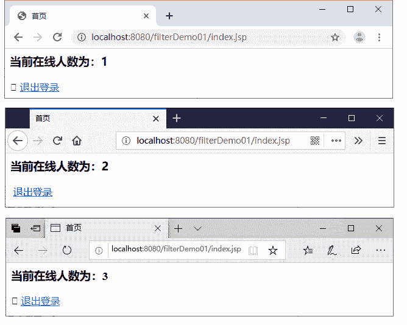
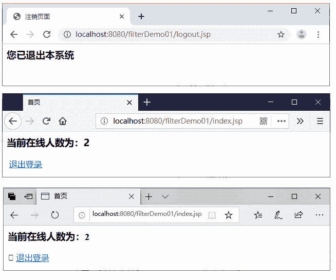

# Servlet HttpSessionListener 监听器统计网站在线人数

> 原文：[`c.biancheng.net/view/4049.html`](http://c.biancheng.net/view/4049.html)

在许多网站或者软件应用中都有统计当前在线人数这一功能。在通常情况下，当一个用户进入网站时就会创建一个 HttpSession 对象，而当用户离开网站时，HttpSession 对象就会被销毁。

在 Servlet 的八种监听器中，HttpSessionListener 监听器就可以监听 Web 应用中 HttpSession 对象的创建和销毁过程。因此，可以使用实现了 HttpSessionListener 接口的监听器统计网站的当前在线人数。下面将分步骤讲解如何使用监听器统计网站当前在线人数。

#### 1\. 创建监听器

在 filterDemo01 项目的 com.mengma.listener 包中，创建一个实现了 HttpSessionListener 接口的监听器类 OnlineListener，在该类中编写用于实现统计网站在线人数的代码，如下所示。

```

package com.mengma.listener;

import javax.servlet.ServletContext;
import javax.servlet.http.HttpSessionEvent;
import javax.servlet.http.HttpSessionListener;

public class OnlineListener implements HttpSessionListener {

    private int count = 0; // 用于统计在线人数

    @Override
    public void sessionCreated(HttpSessionEvent hse) {
        count++; // Session 对象创建时 count 变量加 1
        ServletContext context = hse.getSession().getServletContext();
        context.setAttribute("count", new Integer(count));
    }

    @Override
    public void sessionDestroyed(HttpSessionEvent hse) {
        count--; // session 对象销毁时 count 变量减 1
        ServletContext context = hse.getSession().getServletContext();
        context.setAttribute("count", new Integer(count));
    }
}
```

在 OnlineListener.java 中，首先定义了一个用于统计在线人数的成员变量 count。当每次监听到 HttpSession 对象创建时，count 成员变量会加 1。当每次监听到 HttpSession 对象销毁时，count 成员变量会减 1。

在每次修改 count 成员变量后，还应该将 count 成员变量的值保存到 ServletContext 对象中，以便其他 JSP 页面程序可以从 ServletContext 对象中取出 count 成员变量，从而在页面上显示当前在线用户数量。

在 web.xml 文件中，配置 OnlineListener 事件监听器，具体代码如下：

```

<listener>
    <listener-class>
        com.mengma.listener.OnlineListener
    </listener-class>
</listener>
```

需要注意的是，这个 HttpSession 对象在不活动时的最长存活时间仍然是 2min。

#### 2\. 创建首页和注销页面

#### 1）实现首页

在项目的 WebContext 目录中，创建一个名称为 index.jsp 的页面，该页面用于保存在 ServletContext 对象中的 count 变量值，即相当于显示当前在线人数，如下所示。

```

<%@ page language="java" contentType="text/html; charset=utf-8"
    pageEncoding="utf-8"%>
<html>
<head>
<title>首页</title>
</head>
<body>
    <h3>
            当前在线人数为：<%=application.getAttribute("count") %>
    </h3>
    <a href="<%=response.encodeUrl("logout.jsp") %>">退出登录</a>
</body>
</html>
```

#### 2）实现注销页面

在项目的 WebContext 目录中，编写注销页面 logout.jsp，logout.jsp 页面用于使当前 Session 对象失效，即完成用户注销功能，如下所示。

```

<%@ page language="java" contentType="text/html; charset=utf-8"
    pageEncoding="utf-8"%>
<html>
<head>
<title>注销页面</title>
</head>
<body>
    <%session.invalidate();%>
    <h3>您已退出本系统</h3>
</body>
</html>
```

#### 3\. 运行项目并查看结果

启动 Tomcat 服务器，在浏览器的地址栏中输入地址 http://localhost:8080/filterDemo01/index.jsp 访问 index.jsp 页面，然后再分别开启两个不同的浏览器窗口（如火狐和谷歌浏览器）同时访问 index.jsp 页面（目的是防止同一个浏览器共享同一个 Session 会话），此时，各个浏览器窗口中显示的结果如图 1 所示。


图 1  login.jsp 页面
单击图 1 中任意一个浏览器窗口中的“退出登录”超链接，都会访问 logout.jsp 页面，而 logout.jsp 页面中的 session.invalidate() 语句会使当前 Session 失效，从而触发 HttpSession 对象的销毁事件并调用监听器 OnlineListener 中的 sessionDestroyed() 方法，使统计用户数量的 count 变量减 1。

然后，刷新其余的浏览器窗口，此时，各个浏览器窗口中显示的结果如图 2 所示。
图 2  logout.jsp 页面
从图 2 中可以看出，谷歌浏览器中的用户已被注销，而其余两个浏览器窗口中的在线人数显示为 2。

需要注意的是，如果直接关闭图 2 所示的某个浏览器窗口或保持浏览器窗口不刷新，与之对应的 HttpSession 对象会在 2 分钟之后才被销毁，即统计的在线人数的 count 变量会在 2 分钟后自动减 1。因此，可以说明网站统计的在线人数并不是真正意义上的并发访问人数，而是指某一个时间段内的访问人数。