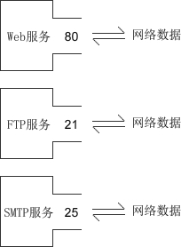

# socket 是什么意思

在计算机通信领域，socket 被翻译为“套接字”，它是计算机之间进行通信的一种约定或一种方式。通过 socket 这种约定，一台计算机可以接收其他计算机的数据，也可以向其他计算机发送数据。

socket 的典型应用就是 Web 服务器和浏览器：浏览器获取用户输入的 URL，向服务器发起请求，服务器分析接收到的 URL，将对应的网页内容返回给浏览器，浏览器再经过解析和渲染，就将文字、图片、视频等元素呈现给用户。

学习 socket，也就是学习计算机之间如何通信，并编写出实用的程序。

## IP 地址（IP Address）

计算机分布在世界各地，要想和它们通信，必须要知道确切的位置。确定计算机位置的方式有多种，IP 地址是最常用的，例如，114.114.114.114 是国内第一个、全球第三个开放的 DNS 服务地址，127.0.0.1 是本机地址。

其实，我们的计算机并不知道 IP 地址对应的地理位置，当要通信时，只是将 IP 地址封装到要发送的数据包中，交给路由器去处理。路由器有非常智能和高效的算法，很快就会找到目标计算机，并将数据包传递给它，完成一次单向通信。

目前大部分软件使用 IPv4 地址，但 IPv6 也正在被人们接受，尤其是在教育网中，已经大量使用。

## 端口（Port）

有了 IP 地址，虽然可以找到目标计算机，但仍然不能进行通信。一台计算机可以同时提供多种网络服务，例如 Web 服务、FTP 服务（文件传输服务）、SMTP 服务（邮箱服务）等，仅有 IP 地址，计算机虽然可以正确接收到数据包，但是却不知道要将数据包交给哪个网络程序来处理，所以通信失败。

为了区分不同的网络程序，计算机会为每个网络程序分配一个独一无二的端口号（Port Number），例如，Web 服务的端口号是 80，FTP 服务的端口号是 21，SMTP 服务的端口号是 25。

端口（Port）是一个虚拟的、逻辑上的概念。可以将端口理解为一道门，数据通过这道门流入流出，每道门有不同的编号，就是端口号。如下图所示：

## 协议（Protocol）

协议（Protocol）就是网络通信的约定，通信的双方必须都遵守才能正常收发数据。协议有很多种，例如 TCP、UDP、IP 等，通信的双方必须使用同一协议才能通信。协议是一种规范，由计算机组织制定，规定了很多细节，例如，如何建立连接，如何相互识别等。

> 协议仅仅是一种规范，必须由计算机软件来实现。例如 IP 协议规定了如何找到目标计算机，那么各个开发商在开发自己的软件时就必须遵守该协议，不能另起炉灶。

所谓协议族（Protocol Family），就是一组协议（多个协议）的统称。最常用的是 TCP/IP 协议族，它包含了 TCP、IP、UDP、Telnet、FTP、SMTP 等上百个互为关联的协议，由于 TCP、IP 是两种常用的底层协议，所以把它们统称为 TCP/IP 协议族。

## 数据传输方式

计算机之间有很多数据传输方式，各有优缺点，常用的有两种：SOCK_STREAM 和 SOCK_DGRAM。

1) SOCK_STREAM 表示面向连接的数据传输方式。数据可以准确无误地到达另一台计算机，如果损坏或丢失，可以重新发送，但效率相对较慢。常见的 http 协议就使用 SOCK_STREAM 传输数据，因为要确保数据的正确性，否则网页不能正常解析。

2) SOCK_DGRAM 表示无连接的数据传输方式。计算机只管传输数据，不作数据校验，如果数据在传输中损坏，或者没有到达另一台计算机，是没有办法补救的。也就是说，数据错了就错了，无法重传。因为 SOCK_DGRAM 所做的校验工作少，所以效率比 SOCK_STREAM 高。

QQ 视频聊天和语音聊天就使用 SOCK_DGRAM 传输数据，因为首先要保证通信的效率，尽量减小延迟，而数据的正确性是次要的，即使丢失很小的一部分数据，视频和音频也可以正常解析，最多出现噪点或杂音，不会对通信质量有实质的影响。

> 注意：SOCK_DGRAM 没有想象中的糟糕，不会频繁的丢失数据，数据错误只是小概率事件。

有可能多种协议使用同一种数据传输方式，所以在 socket 编程中，需要同时指明数据传输方式和协议。

综上所述：IP 地址和端口能够在广袤的互联网中定位到要通信的程序，协议和数据传输方式规定了如何传输数据，有了这些，两台计算机就可以通信了。