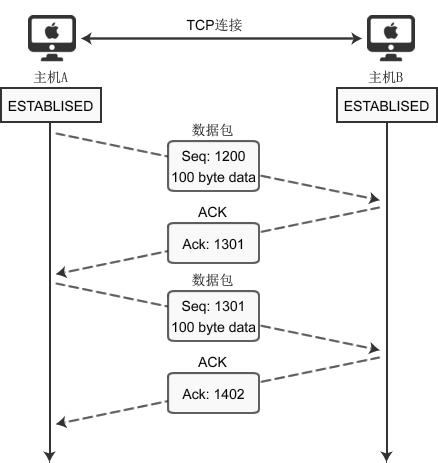

# TCP 数据的传输过程

建立连接后，两台主机就可以相互传输数据了。如下图所示：
图 1：TCP 套接字的数据交换过程
上图给出了主机 A 分 2 次（分 2 个数据包）向主机 B 传递 200 字节的过程。首先，主机 A 通过 1 个数据包发送 100 个字节的数据，数据包的 Seq 号设置为 1200。主机 B 为了确认这一点，向主机 A 发送 ACK 包，并将 Ack 号设置为 1301。

> 为了保证数据准确到达，目标机器在收到数据包（包括 SYN 包、FIN 包、普通数据包等）包后必须立即回传 ACK 包，这样发送方才能确认数据传输成功。

此时 Ack 号为 1301 而不是 1201，原因在于 Ack 号的增量为传输的数据字节数。假设每次 Ack 号不加传输的字节数，这样虽然可以确认数据包的传输，但无法明确 100 字节全部正确传递还是丢失了一部分，比如只传递了 80 字节。因此按如下的公式确认 Ack 号：

Ack 号 = Seq 号 + 传递的字节数 + 1

与三次握手协议相同，最后加 1 是为了告诉对方要传递的 Seq 号。

下面分析传输过程中数据包丢失的情况，如下图所示：
图 2：TCP 套接字数据传输过程中发生错误
上图表示通过 Seq 1301 数据包向主机 B 传递 100 字节的数据，但中间发生了错误，主机 B 未收到。经过一段时间后，主机 A 仍未收到对于 Seq 1301 的 ACK 确认，因此尝试重传数据。

为了完成数据包的重传，TCP 套接字每次发送数据包时都会启动定时器，如果在一定时间内没有收到目标机器传回的 ACK 包，那么定时器超时，数据包会重传。

> 上图演示的是数据包丢失的情况，也会有 ACK 包丢失的情况，一样会重传。

#### 重传超时时间（RTO, Retransmission Time Out）

这个值太大了会导致不必要的等待，太小会导致不必要的重传，理论上最好是网络 RTT 时间，但又受制于网络距离与瞬态时延变化，所以实际上使用自适应的动态算法（例如 Jacobson 算法和 Karn 算法等）来确定超时时间。

> 往返时间（RTT，Round-Trip Time）表示从发送端发送数据开始，到发送端收到来自接收端的 ACK 确认包（接收端收到数据后便立即确认），总共经历的时延。

#### 重传次数

TCP 数据包重传次数根据系统设置的不同而有所区别。有些系统，一个数据包只会被重传 3 次，如果重传 3 次后还未收到该数据包的 ACK 确认，就不再尝试重传。但有些要求很高的业务系统，会不断地重传丢失的数据包，以尽最大可能保证业务数据的正常交互。

最后需要说明的是，发送端只有在收到对方的 ACK 确认包后，才会清空输出缓冲区中的数据。