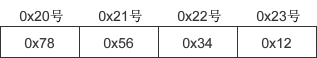

# socket 网络字节序以及大端序小端序

不同 CPU 中，4 字节整数 1 在内存空间的存储方式是不同的。4 字节整数 1 可用 2 进制表示如下：

00000000 00000000 00000000 00000001

有些 CPU 以上面的顺序存储到内存，另外一些 CPU 则以倒序存储，如下所示：

00000001 00000000 00000000 00000000

若不考虑这些就收发数据会发生问题，因为保存顺序的不同意味着对接收数据的解析顺序也不同。

## 大端序和小端序

CPU 向内存保存数据的方式有两种：

*   大端序（Big Endian）：高位字节存放到低位地址（高位字节在前）。
*   小端序（Little Endian）：高位字节存放到高位地址（低位字节在前）。

仅凭描述很难解释清楚，不妨来看一个实例。假设在 0x20 号开始的地址中保存 4 字节 int 型数据 0x12345678，大端序 CPU 保存方式如下图所示：
图 1：整数 0x12345678 的大端序字节表示
对于大端序，最高位字节 0x12 存放到低位地址，最低位字节 0x78 存放到高位地址。小端序的保存方式如下图所示：
图 2：整数 0x12345678 的小端序字节表示
不同 CPU 保存和解析数据的方式不同（主流的 Intel 系列 CPU 为小端序），小端序系统和大端序系统通信时会发生数据解析错误。因此在发送数据前，要将数据转换为统一的格式——网络字节序（Network Byte Order）。网络字节序统一为大端序。

主机 A 先把数据转换成大端序再进行网络传输，主机 B 收到数据后先转换为自己的格式再解析。

## 网络字节序转换函数

在《[使用 bind()和 connect()函数](http://c.biancheng.net/cpp/html/3033.html)》一节中讲解了 sockaddr_in 结构体，其中就用到了网络字节序转换函数，如下所示：

```
//创建 sockaddr_in 结构体变量
struct sockaddr_in serv_addr;
memset(&serv_addr, 0, sizeof(serv_addr));  //每个字节都用 0 填充
serv_addr.sin_family = AF_INET;  //使用 IPv4 地址
serv_addr.sin_addr.s_addr = inet_addr("127.0.0.1");  //具体的 IP 地址
serv_addr.sin_port = htons(1234);  //端口号
```

htons() 用来将当前主机字节序转换为网络字节序，其中`h`代表主机（host）字节序，`n`代表网络（network）字节序，`s`代表 short，htons 是 h、to、n、s 的组合，可以理解为”将 short 型数据从当前主机字节序转换为网络字节序“。

常见的网络字节转换函数有：

*   htons()：host to network short，将 short 类型数据从主机字节序转换为网络字节序。
*   ntohs()：network to host short，将 short 类型数据从网络字节序转换为主机字节序。
*   htonl()：host to network long，将 long 类型数据从主机字节序转换为网络字节序。
*   ntohl()：network to host long，将 long 类型数据从网络字节序转换为主机字节序。

通常，以`s`为后缀的函数中，`s`代表 2 个字节 short，因此用于端口号转换；以`l`为后缀的函数中，`l`代表 4 个字节的 long，因此用于 IP 地址转换。

举例说明上述函数的调用过程：

```
#include <stdio.h>
#include <stdlib.h>
#include <WinSock2.h>
#pragma comment(lib, "ws2_32.lib")

int main(){
    unsigned short host_port = 0x1234, net_port;
    unsigned long host_addr = 0x12345678, net_addr;

    net_port = htons(host_port);
    net_addr = htonl(host_addr);

    printf("Host ordered port: %#x\n", host_port);
    printf("Network ordered port: %#x\n", net_port);
    printf("Host ordered address: %#lx\n", host_addr);
    printf("Network ordered address: %#lx\n", net_addr);

    system("pause");
    return 0;
}
```

运行结果：
Host ordered port: 0x1234
Network ordered port: 0x3412
Host ordered address: 0x12345678
Network ordered address: 0x78563412

另外需要说明的是，sockaddr_in 中保存 IP 地址的成员为 32 位整数，而我们熟悉的是点分十进制表示法，例如 127.0.0.1，它是一个字符串，因此为了分配 IP 地址，需要将字符串转换为 4 字节整数。

inet_addr() 函数可以完成这种转换。inet_addr() 除了将字符串转换为 32 位整数，同时还进行网络字节序转换。请看下面的代码：

```
#include <stdio.h>
#include <stdlib.h>
#include <WinSock2.h>
#pragma comment(lib, "ws2_32.lib")

int main(){
    char *addr1 = "1.2.3.4";
    char *addr2 = "1.2.3.256";

    unsigned long conv_addr = inet_addr(addr1);
    if(conv_addr == INADDR_NONE){
        puts("Error occured!");
    }else{
        printf("Network ordered integer addr: %#lx\n", conv_addr);
    }

    conv_addr = inet_addr(addr2);
    if(conv_addr == INADDR_NONE){
        puts("Error occured!");
    }else{
        printf("Network ordered integer addr: %#lx\n", conv_addr);
    }

    system("pause");
    return 0;
}
```

运行结果：
Network ordered integer addr: 0x4030201
Error occured!

从运行结果可以看出，inet_addr() 不仅可以把 IP 地址转换为 32 位整数，还可以检测无效 IP 地址。

注意：为 sockaddr_in 成员赋值时需要显式地将主机字节序转换为网络字节序，而通过 write()/send() 发送数据时 TCP 协议会自动转换为网络字节序，不需要再调用相应的函数。