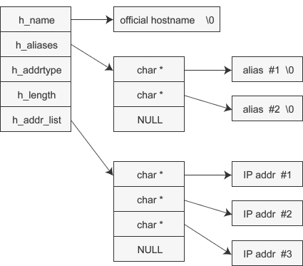

# 在 socket 中使用域名

客户端中直接使用 IP 地址会有很大的弊端，一旦 IP 地址变化（IP 地址会经常变动），客户端软件就会出现错误。

而使用域名会方便很多，注册后的域名只要每年续费就永远属于自己的，更换 IP 地址时修改域名解析即可，不会影响软件的正常使用。

关于域名注册、域名解析、host 文件、DNS 服务器等本节并未详细讲解，请读者自行脑补。本节重点讲解如何使用域名。

## 通过域名获取 IP 地址

域名仅仅是 IP 地址的一个助记符，目的是方便记忆，通过域名并不能找到目标计算机，通信之前必须要将域名转换成 IP 地址。

gethostbyname() 函数可以完成这种转换，它的原型为：

```
struct hostent *gethostbyname(const char *hostname);
```

hostname 为主机名，也就是域名。使用该函数时，只要传递域名字符串，就会返回域名对应的 IP 地址。返回的地址信息会装入 hostent 结构体，该结构体的定义如下：

```
struct hostent{
    char *h_name;  //official name
    char **h_aliases;  //alias list
    int  h_addrtype;  //host address type
    int  h_length;  //address lenght
    char **h_addr_list;  //address list
}
```

从该结构体可以看出，不只返回 IP 地址，还会附带其他信息，各位读者只需关注最后一个成员 h_addr_list。下面是对各成员的说明：

*   h_name：官方域名（Official domain name）。官方域名代表某一主页，但实际上一些著名公司的域名并未用官方域名注册。
*   h_aliases：别名，可以通过多个域名访问同一主机。同一 IP 地址可以绑定多个域名，因此除了当前域名还可以指定其他域名。
*   h_addrtype：gethostbyname() 不仅支持 IPv4，还支持 IPv6，可以通过此成员获取 IP 地址的地址族（地址类型）信息，IPv4 对应 AF_INET，IPv6 对应 AF_INET6。
*   h_length：保存 IP 地址长度。IPv4 的长度为 4 个字节，IPv6 的长度为 16 个字节。
*   h_addr_list：这是最重要的成员。通过该成员以整数形式保存域名对应的 IP 地址。对于用户较多的服务器，可能会分配多个 IP 地址给同一域名，利用多个服务器进行均衡负载。

hostent 结构体变量的组成如下图所示：


下面的代码主要演示 gethostbyname() 的应用，并说明 hostent 结构体的特性：

```
#include <stdio.h>
#include <stdlib.h>
#include <WinSock2.h>
#pragma comment(lib, "ws2_32.lib")

int main(){
    WSADATA wsaData;
    WSAStartup( MAKEWORD(2, 2), &wsaData);

    struct hostent *host = gethostbyname("www.baidu.com");
    if(!host){
        puts("Get IP address error!");
        system("pause");
        exit(0);
    }

    //别名
    for(int i=0; host->h_aliases[i]; i++){
        printf("Aliases %d: %s\n", i+1, host->h_aliases[i]);
    }

    //地址类型
    printf("Address type: %s\n", (host->h_addrtype==AF_INET) ? "AF_INET": "AF_INET6");

    //IP 地址
    for(int i=0; host->h_addr_list[i]; i++){
        printf("IP addr %d: %s\n", i+1, inet_ntoa( *(struct in_addr*)host->h_addr_list[i] ) );
    }

    system("pause");
    return 0;
}
```

运行结果：
Aliases 1: www.baidu.com
Address type: AF_INET
IP addr 1: 61.135.169.121
IP addr 2: 61.135.169.125