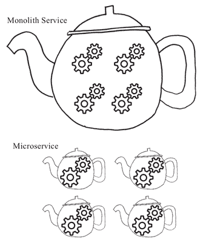

# 微服务（Microservice）是什么？为什么会出现微服务？

> 原文：[`c.biancheng.net/view/4615.html`](http://c.biancheng.net/view/4615.html)

微服务（Microservice）虽然是当下刚兴起的比较流行的新名词，但本质上来说，微服务并非什么新的概念。

实际上，很多 SOA（面向服务的架构）实施成熟度比较好的企业，已经在使用和实施微服务了。只不过，它们只是在闷声发大财，并不介意是否有一个比较时髦的名词来明确表述 SOA 的这个发展演化趋势罢了。

微服务其实就是服务化思路的一种最佳实践方向，遵循 SOA 的思路，各个企业在服务化治理的道路上走的时间长了，踩的坑多了，整个软件交付链路上各个环节的基础设施逐渐成熟了，微服务自然而然就诞生了。

当然，之所以叫微服务，是与之前的服务化思路和实践相比较而来的。

早些年的服务实现和实施思路是将很多功能从开发到交付都打包成一个很大的服务单元（一般称为 Monolith），而微服务实现和实施思路则更强调功能趋向单一，服务单元小型化和微型化。

如果用“茶壶煮饺子”来打比方的话，原来我们是在一个茶壶里煮很多个饺子，现在（微服务化之后）则基本上是在一个茶壶煮一个饺子，而这些饺子就是服务的功能，茶壶则是将这些服务功能打包交付的服务单元，如图 1 所示。

图 1  论茶壶里煮“饺子”的不同形式
所以，从思路和理念上来讲，微服务就是要倡导大家尽量将功能进行拆分，将服务粒度做小，使之可以独立承担对外服务的职责，沿着这个思路开发和交付的软件服务实体就叫作“微服务”，而围绕着这个思路和理念构建的一系列基础设施和指导思想，笔者将它称为“微服务体系”。

## 微服务是怎么来的？

微服务的概念我们应该大体了解了，那么微服务又是怎么来的？原来将很多功能打包为一个很大的服务单元进行交付的做法不能满足需求吗？

实际上，并非原来“大一统”（Monolith）的服务化实践不能满足要求，也不是不好，只是，它有自己存在的合理场景。

对于 Monolith 服务来说，如果团队不大，软件复杂度不高，那么，使用 Monolith 的形式进行服务化治理是比较合适的，而且，这种方式对运维和各种基础设施的要求也不高。

但是，随着软件系统的复杂度持续飙升，软件交付的效率要求更高，投入的人力以及各项资源越来越多，基于 Monolith 的服务化思路就开始“捉襟见肘”。

在开发阶段，如果我们遵循 Monolith 的服务化理念，通常会将所有功能的实现都统一归到一个开发项目下，但随着功能的膨胀，这些功能一定会分发给不同的研发人员进行开发，造成的后果就是，大家在提交代码的时候频繁冲突并需要解决这些冲突，单一的开发项目成为了开发期间所有人的工作瓶颈。

为了减轻这种苦恼，我们自然会将项目按照要开发的功能拆分为不同的项目，从而负责不同功能的研发人员就可以在自己的代码项目上进行开发，从而解决了大家无法在开发阶段并行开发的苦恼。

到了软件交付阶段，如果我们遵循 Monolith 的服务化理念，那么，我们一定是将所有这些开发阶段并行开发的项目集合到一起进行交付。

这就涉及服务化早期实践中比较有名的“火车模型”，即交付的服务就像一辆火车，而这个服务相关的所有功能对应的项目成果，就是要装上火车车厢的一件件货物，交付的列车只有等到所有项目都开发测试完成后才可以装车出发，完成整个服务的交付。

很显然，只要有一个车厢没有准备好货物（即功能项目未开发测试完成），火车就不能发车，服务就不能交付，这大大降低了服务的交付效率。如果每个功能项目可以各自独立交付，那么就不需要都等同一辆火车，各自出发就可以了。

顺着这个思路，自然而然地，大家逐渐各自独立，每一个功能或者少数相近的功能作为单一项目开发完成后将作为一个独立的服务单元进行交付，从而在服务交付阶段，大家也能够并行不悖，各自演化而不受影响。

所以，随着服务和系统的复杂度逐渐飙升，为了能够在整个软件的交付链路上高效扩展，将独立的功能和服务单元进行拆分，从而形成一个一个的微服务是自然而然发生的事情。

这就像打不同的战役一样，在双方兵力不多、战场复杂度不高的情况下，Monolith 的统一指挥调度方式是合适的。而一旦要打大的战役（类似于系统复杂度提升），双方一定会投入大量的兵力（软件研发团队的规模增长），如果还是在狭小甚至固定的战场上进行厮杀，显然施展不开！

所以，小战役有小战役的打法，大战役有大战役的战法，而微服务实际上就是一种帮助扩展组织能力、提升团队效率的应对“大战役”的方法，它帮助我们从软件开发到交付，进而到团队和组织层面多方位进行扩展。

总的来说，一方面微服务可以帮助我们应对飙升的系统复杂度；另一个方面，微服务可以帮助我们进行更大范围的扩展，从开发阶段项目并行开发的扩展，到交付阶段并行交付的扩展，再到相应的组织结构和组织能力的扩展，皆因微服务而受惠。

您还可以继续阅读：

*   微服务的好处（优点）有哪些？
*   实现微服务会带来哪些挑战？