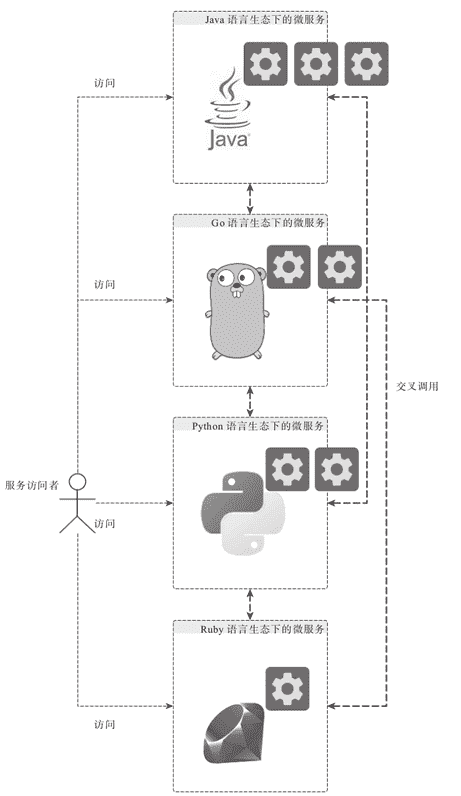

# 微服务的好处（优点）有哪些？

> 原文：[`c.biancheng.net/view/4618.html`](http://c.biancheng.net/view/4618.html)

显然，随着系统复杂度的提升，以及对系统扩展性的要求越来越高，微服务化是一个很好的方向，但除此之外，微服务还会给我们带来哪些好处？

## 独立，独立，还是独立

我们说微服务打响的是各自的独立战争，所以，每一个微服务都是一个小王国，这些微服务跳出了“大一统”（Monolith）王国的统治，开始从各个层面打造自己的独立能力，从而保障自己的小王国可以持续稳固的运转。

首先，在开发层面，每个微服务基本上都是各自独立的项目（project），而对应各自独立项目的研发团队基本上也是独立对应，这样的结构保证了微服务的并行研发，并且各自快速迭代，不会因为所有研发都投入一个近乎单点的项目，从而造成开发阶段的瓶颈。开发阶段的独立，保证了微服务的研发可以高效进行。

服务开发期间的形态，跟服务交付期间的形态原则上是不需要完全高度统一的，即使我们在开发的时候都是各自进行，但交付的时候还是可以一起交付，不过这不是微服务的做法。

在微服务治理体系下，各个微服务交付期间也是各自独立交付的，从而使得每个微服务从开发到交付整条链路上都是独立进行，这大大加快了微服务的迭代和交付效率。

服务交付之后需要部署运行，对微服务来说，它们运行期间也是各自独立的。

微服务独立运行可以带来两个比较明显的好处，第一个就是可扩展性。我们可以快速地添加服务集群的实例，提升整个微服务集群的服务能力，而在传统 Monolith 模式下，为了能够提升服务能力，很多时候必须强化和扩展单一结点的服务能力来达成。如果单结点服务能力已经扩展到了极限，再寻求扩展的话，就得从软件到硬件整体进行重构。

软件行业有句话：“Threads don't scale，Processes do！”，很明确地道出了原来 Monolith 服务与微服务在扩展（Scale）层面的差异。

对于 Java 开发者来说，早些年（当然现在也依然存在），我们遵循 Java EE 规范开发的 Web 应用，都需要以 WAR 包的形式部署到 TOMCAT、Jetty、RESIN 等 Web 容器中运行，即使每个 WAR 包提供的都是独立的微服务，但因为它们都是统一部署运行在一个 Web 容器中，所以扩展能力受限于 Web 容器作为一个进程（process）的现状。

无论如何调整 Web 容器内部实现的线程（thread）设置，还是会受限于 Web 容器整体的扩展能力。所以，现在很多情况下，大家都是一个 TOMCAT 只部署一个 WAR，然后通过复制和扩展多个 TOMCAT 实例来扩展整个应用服务集群。

当然，说到在 TOMCAT 实例中只部署一个 WAR 包这样的做法，实际上不单单只是因为扩展的因素，还涉及微服务运行期间给我们带来的第二个好处，即隔离性。

隔离性实际上是可扩展性的基础，当我们将每个微服务都隔离为独立的运行单元之后，任何一个或者多个微服务的失败都将只影响自己或者少量其他微服务，而不会大面积地波及整个服务运行体系。

在架构设计上有一种实践模式，即隔板模式（Bulkhead Pattern），这种架构设计模式的首要目的就是为了隔离系统中的各个功能单元和实体，使得系统不会因为一个单元或者服务的失败而导致整体失败。

这种思路在造船行业、兵工行业都有类似的应用场景。现在任何大型船舶在设计上都会有隔舱，目的就是即使有少量进水，也可以只将进水部位隔离在小范围，不会扩散而导致船舶大面积进水，从而沉没。当年泰坦尼克号虽然沉了，但不意味着他们没有做隔舱设计，只能说，伤害度已经远远超出隔舱可以提供的基础保障范围。

在坦克的设计上，现在一般也会将弹药舱和乘员舱隔离，从而可以保障当坦克受创之后，将伤害尽量限定在指定区域，尽量减少对车乘成员的伤害。

前面我们提到，现在大家基本上弱化了 Java EE 的 Web 容器早期采用的“一个 Web 容器部署多个 WAR 包”的做法，转而使用“一个 Web 容器只部署一个 WAR 包”的做法，这实际上正是综合考虑了 Web 容器的设计和实现现状与真实需求之后做出的合理实践选择。

这些 Web 容器内部大多通过类加载器（Classloader）以及线程来实现一定程度上的依赖和功能隔离，但这些机制从基因上决定了这些做法不是最好的隔离手段。而进程（Process）拥有天然的隔离特性，所以，一个 WAR 包只部署运行在一个 Web 容器进程中才是最好的隔离方式。

现在回想一下，好像自从各个微服务打响独立战争并且独立之后，无论从哪个层面来看，各自“活”得都挺好。

## 多语言生态

微服务独立之后，给了对应的团队和组织快速迭代和交付的能力，同时，也给团队和组织带来了更多的灵活性，实际上，对应交付不同微服务的团队或者组织来说，现在可以基于不同的计算机语言生态构建这些微服务，如图 1 所示。

微服务的提供者既可以使用 Java 或者 Go 等静态语言完成微服务的开发和交付，也可以使用 Python 或者 Ruby 等动态语言完成微服务的开发和交付，对于团队内部拥有繁荣且有差异的语言文化来说，多语言生态下的微服务开发和交付将可以最大化的发挥团队和组织内部各成员的优势。

当然，对于多语言生态下的微服务研发来说，有一点需要注意：为了让服务的访问者可以用统一的接口访问所有这些用不同语言开发和交互的微服务，应该尽量统一微服务的服务接口和协议。

在微服务的生态下，互通性应该是需要重点关注的因素，没有互通，不但服务的访问者和用户无法很好地使用这些微服务，微服务和微服务之间也无法相互信赖和互助，这将大大损耗微服务研发体系带来的诸多好处，而多语言生态也会变成一种障碍和负累，而不是益处。

记得时任黑猫宅急便社长的小仓昌男在其所著的《黑猫宅急便的经营学》中提到一个故事，日本国铁曾经采用不同于国际标准的集装箱和铁路规格，然后发现货物的运输效率很低，经过考察发现，原来是货物从国际标准集装箱卸载之后，在通过日本国铁运输之前，需要先拆箱，重新装入日本国铁规格的集装箱，然后装载到日本国铁上进行运输。

但是，如果日本国铁采用国际标准的集装箱规格，那么货物集装箱从远洋轮船上卸载之后就可以直接装上国铁，这将大大加快运输效率（日本，国铁改革后也证明确实如此）。日本国铁在前期采用私有方案时，只关注了自己的利益和效率，舍弃了互通，也带来了效率的低下。

所以，在开发和交付微服务的时候，尤其是在多语言生态下开发和交付微服务，我们从一开始就要将互通性作为首要考虑因素，从而不会因为执迷于某些服务或者系统的单点效率而失去了整个微服务体系的整体效率。

图 1  多语言的微服务生态