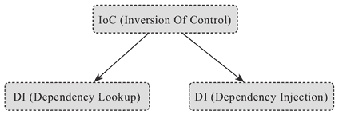

# Spring IoC 介绍

> 原文：[`c.biancheng.net/view/4627.html`](http://c.biancheng.net/view/4627.html)

有部分 Java 开发者对 IoC（Inversion Of Control）和 DI（Dependency Injection）的概念有些混淆，认为二者是对等的。

IoC 其实有两种方式，一种就是 DI，而另一种是 DL，即 Dependency Lookup（依赖查找），前者是当前软件实体被动接受其依赖的其他组件被 IoC 容器注入，而后者则是当前软件实体主动去某个服务注册地查找其依赖的那些服务，概念之间的关系如图 1 所示可能更贴切些。

图 1  IoC 相关概念示意图
我们通常提到的 Spring IoC，实际上是指 Spring 框架提供的 IoC 容器实现（IoC Container），而使用 Spring IoC 容器的一个典型代码片段就是：

```

public class App {
    public static void main(String[] args) {
        ApplicationContext context = new FileSystemXmlApplication-Context("...");
        // ...
        MockService service = context.getBean(MockService.class);
        service.doSomething();
    }
}
```

任何一个使用 Spring 框架构建的独立的 Java 应用（Standalone Java Application），通常都会存在一行类似于“context.getBean（..）；”的代码。

实际上，这行代码做的就是 DL 的工作，而构建的任何一种 IoC 容器背后（比如 BeanFactory 或者 ApplicationContext）发生的事情，则更多是 DI 的过程（也可能有部分 DL 的逻辑用于对接遗留系统）。

Spring 的 IoC 容器中发生的事情其实也很简单，总结下来即两个阶段：

*   采摘和收集“咖啡豆”（bean）
*   研磨和烹饪咖啡

Spring IoC 容器的依赖注入工作可以分为两个阶段：

#### 1）收集和注册

第一个阶段可以认为是构建和收集 bean 定义的阶段，在这个阶段中，我们可以通过 XML 或者 Java 代码的方式定义一些 bean，然后通过手动组装或者让容器基于某些机制自动扫描的形式，将这些 bean 定义收集到 IoC 容器中。

假设我们以 XML 配置的形式来收集并注册单一 bean，一般形式如下：

<bean id="mockService" class="..MockServiceImpl"> ...</bean>

如果嫌逐个收集 bean 定义麻烦，想批量地收集并注册到 IoC 容器中，我们也可以通过 XML Schema 形式的配置进行批量扫描并采集和注册：

<context:component-scan base-package="com.keevol">

注意基于 JavaConfig 形式的收集和注册，不管是单一还是批量，后面我们都会单独提及。

#### 2）分析和组装

当第一阶段工作完成后，我们可以先暂且认为 IoC 容器中充斥着一个个独立的 bean，它们之间没有任何关系。

但实际上，它们之间是有依赖关系的，所以，IoC 容器在第二阶段要干的事情就是分析这些已经在 IoC 容器之中的 bean，然后根据它们之间的依赖关系先后组装它们。

如果 IoC 容器发现某个 bean 依赖另一个 bean，它就会将这另一个 bean 注入给依赖它的那个 bean，直到所有 bean 的依赖都注入完成，所有 bean 都“整装待发”，整个 IoC 容器的工作即算完成。

至于分析和组装的依据，Spring 框架最早是通过 XML 配置文件的形式来描述 bean 与 bean 之间的关系的，随着 Java 业界研发技术和理念的转变，基于 Java 代码和 Annotation 元信息的描述方式也日渐兴盛（比如 @Autowired 和 @Inject），但不管使用哪种方式，都只是为了简化绑定逻辑描述的各种“表象”，最终都是为本阶段的最终目的服务。

很多 Java 开发者一定认为 Spring 的 XML 配置文件是一种配置（Configuration），但本质上，这些配置文件更应该是一种代码形式，XML 在这里其实可以看作一种 DSL，它用来表述的是 bean 与 bean 之间的依赖绑定关系，如果没有 IoC 容器就要自己写代码新建（new）对象并配置（set）依赖。