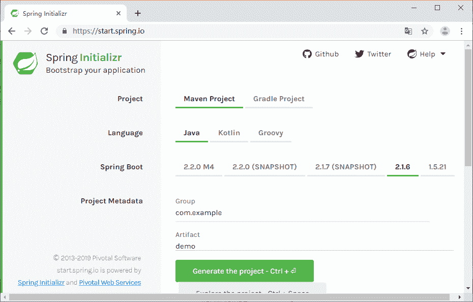
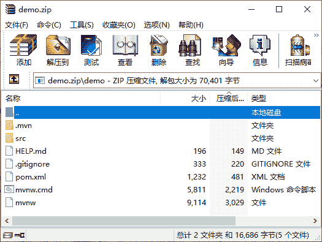

# SpringBoot 快速搭建

> 原文：[`c.biancheng.net/view/4624.html`](http://c.biancheng.net/view/4624.html)

我们说 SpringBoot 是 Spring 框架对“约定优先于配置（Convention Over Configuration）”理念的最佳实践的产物，一个典型的 SpringBoot 应用本质上其实就是一个基于 Spring 框架的应用，而如果大家对 Spring 框架已经了如指掌，那么，在我们一步步揭开 SpringBoot 微框架的面纱之后，大家就会发现“阳光之下，并无新事”。

一个典型的 SpringBoot 应用长什么样子呢？下面我们快速搭建一个 SpringBoot 应用。

1）打开浏览器，输入网址 [`start.spring.io/`](http://start.spring.io/) ，如图 1 所示：


图 1  spring.io 页面
2）创建一个最简单的依赖 Web 模块的 SpringBoot 应用，填写项目信息，如图 1 所示。

我们在此以 Maven 作为项目构建方式，Spring Boot 还支持以 Gradle 作为项目构建工具。部署形式以 jar 包形式，当然也可以用传统的 war 包形式。Spring Boot 选择 2.1.6，Spring boot 还支持以 Groovy 语言开发，应用中选择 Java 作为开发语言。

3）选择完之后，下载代码，如图 2 所示：
图 2  下载代码
一般情况下，我们会得到一个 SpringBoot 应用的启动类，如下面代码所示：

```

import org.springframework.boot.SpringApplication;
import org.springframework.boot.autoconfigure.SpringBootApplication;

@SpringBootApplication
public class DemoApplication {
    public static void main(String[] args) {
        SpringApplication.run(DemoApplication.class, args);
    }
}
```

所有的 SpringBoot 无论怎么定制，本质上与上面的启动类代码是一样的，而以上代码示例中，Annotation 定义（@SpringBootApplication）和类定义（SpringApplication.run）最为耀眼，那么，要揭开 SpringBoot 应用的奥秘，很明显的，我们只要先从这两位开始就可以了。

由于篇幅有限，可点击下方链接进行阅读：

*   SpringBoot 中@SpringBootApplication 注解的三体结构解析
*   SpringApplication.run 执行流程详解