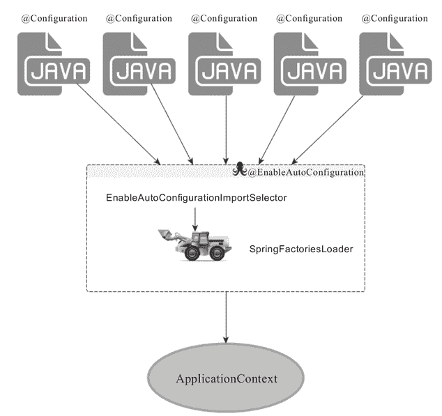

# SpringBoot 中@SpringBootApplication 注解的三体结构解析

> 原文：[`c.biancheng.net/view/4625.html`](http://c.biancheng.net/view/4625.html)

@SpringBootApplication 是一个“三体”结构，实际上它是一个复合 Annotation：

@Target(ElementType.TYPE)
@Retention(RetentionPolicy.RUNTIME)
@Documented
@Inherited
@Configuration
@EnableAutoConfiguration
@ComponentScanpublic
@interface
SpringBootApplication{...}

虽然它的定义使用了多个 Annotation 进行元信息标注，但实际上对于 SpringBoot 应用来说，重要的只有三个 Annotation，而“三体”结构实际上指的就是这三个 Annotation：

*   @Configuration
*   @EnableAutoConfiguration
*   @ComponentScan

所以，如果我们使用如下的 SpringBoot 启动类，整个 SpringBoot 应用依然可以与之前的启动类功能对等：

```

@Configuration
@EnableAutoConfiguration
@ComponentScanpublic
class DemoApplication {
    public static void main(String[] args) {
        SpringApplication.run(DemoApplication.class, args);
    }
}
```

但每次都写三个 Annotation 显然过于繁琐，所以写一个 @SpringBootApplication 这样的一站式复合 Annotation 显然更方便些。

## @Configuration 创世纪

这里的 @Configuration 对我们来说并不陌生，它就是 JavaConfig 形式的 Spring IoC 容器的配置类使用的那个 @Configuration，既然 SpringBoot 应用骨子里就是一个 Spring 应用，那么，自然也需要加载某个 IoC 容器的配置，而 SpringBoot 社区推荐使用基于 JavaConfig 的配置形式，所以，很明显，这里的启动类标注了 @Configuration 之后，本身其实也是一个 IoC 容器的配置类！

很多 SpringBoot 的代码示例都喜欢在启动类上直接标注 @Configuration 或者 @SpringBootApplication，对于初接触 SpringBoot 的开发者来说，其实这种做法不便于理解，如果我们将上面的 SpringBoot 启动类拆分为两个独立的 Java 类，整个形势就明朗了：

```

@Configuration
@EnableAutoConfiguration
@ComponentScan
public class DemoConfiguration {
    @Bean
    public Controller controller() {
        return new Controller();
    }
}

public class DemoApplication {
    public static void main(String[] args) {
        SpringApplication.run(DemoConfiguration.class, args);
    }
}
```

所以，启动类 DemoApplication 其实就是一个标准的 Standalone 类型 Java 程序的 main 函数启动类，没有什么特殊的。而 @Configuration 标注的 DemoConfiguration 定义其实也是一个普通的 JavaConfig 形式的 IoC 容器配置类。

## @EnableAutoConfiguration 的功效

@EnableAutoConfiguration 其实也没啥“创意”，各位是否还记得 Spring 框架提供的各种名字为 @Enable 开头的 Annotation 定义？

比如 @EnableScheduling、@EnableCaching、@EnableMBeanExport 等，@EnableAutoConfiguration 的理念和“做事方式”其实一脉相承，简单概括一下就是，借助 @Import 的支持，收集和注册特定场景相关的 bean 定义：

*   @EnableScheduling 是通过 @Import 将 Spring 调度框架相关的 bean 定义都加载到 IoC 容器。
*   @EnableMBeanExport 是通过 @Import 将 JMX 相关的 bean 定义加载到 IoC 容器。

而 @EnableAutoConfiguration 也是借助 @Import 的帮助，将所有符合自动配置条件的 bean 定义加载到 IoC 容器，仅此而已！

@EnableAutoConfiguration 作为一个复合 Annotation，其自身定义关键信息如下：

@Target(ElementType.TYPE)
@Retention(RetentionPolicy.RUNTIME)
@Documented
@Inherited
@AutoConfigurationPackage
@Import(EnableAutoConfigurationImportSelector.class)
public @interface EnableAutoConfiguration {...}

其中，最关键的要属 @Import（EnableAutoConfigurationImportSelector.class），借助 EnableAutoConfigurationImportSelector，@EnableAutoConfiguration 可以帮助 SpringBoot 应用将所有符合条件的 @Configuration 配置都加载到当前 SpringBoot 创建并使用的 IoC 容器，就跟一只“八爪鱼”一样（如图 1 所示）。
图 1  EnableAutoConfiguration 得以生效的关键组件关系图
借助于 Spring 框架原有的一个工具类：SpringFactoriesLoader 的支持，@EnableAutoConfiguration 可以“智能”地自动配置功效才得以大功告成！

## SpringFactoriesLoader 详解

SpringFactoriesLoader 属于 Spring 框架私有的一种扩展方案（类似于 Java 的 SPI 方案 java.util.ServiceLoader），其主要功能就是从指定的配置文件 META-INF/spring.factories 加载配置，spring.factories 是一个典型的 java properties 文件，配置的格式为 Key=Value 形式，只不过 Key 和 Value 都是 Java 类型的完整类名（Fully qualified name），比如：

example.MyService=example.MyServiceImpl1,example.MyServiceImpl2 然后框架就可以根据某个类型作为 Key 来查找对应的类型名称列表了：

```

public abstract class SpringFactoriesLoader {
    // ...
    public static <T> List<T> loadFactories(Class<T> factoryClass, ClassLoader classLoader) {
        ...
    }

    public static List<String> loadFactoryNames(Class<?> factoryClass, ClassLoader classLoader) {
        ...
    }
    // ...
}
```

对于 @EnableAutoConfiguration 来说，SpringFactoriesLoader 的用途稍微不同一些，其本意是为了提供 SPI 扩展的场景，而在 @EnableAutoConfiguration 的场景中，它更多是提供了一种配置查找的功能支持，即根据 @EnableAutoConfiguration 的完整类名 org.springframework.boot.autoconfigure.EnableAutoConfiguration 作为查找的 Key，获取对应的一组 @Configuration 类：

org.springframework.boot.autoconfigure.EnableAutoConfiguration=
\org.springframework.boot.autoconfigure.admin.SpringApplicationAdmin- JmxAutoConfiguration,
\org.springframework.boot.autoconfigure.aop.AopAutoConfiguration,
\org.springframework.boot.autoconfigure.amqp.RabbitAutoConfiguration,
\org.springframework.boot.autoconfigure.MessageSourceAutoConfiguration,
\org.springframework.boot.autoconfigure.PropertyPlaceholderAuto- Configuration,
\org.springframework.boot.autoconfigure.batch.BatchAutoConfiguration,
\org.springframework.boot.autoconfigure.cache.CacheAutoConfiguration,
\org.springframework.boot.autoconfigure.cassandra.CassandraAuto-Configuration,
\org.springframework.boot.autoconfigure.cloud.CloudAutoConfiguration,
\org.springframework.boot.autoconfigure.context.ConfigurationProperties-AutoConfiguration,
\org.springframework.boot.autoconfigure.dao.PersistenceException-TranslationAutoConfiguration,
\org.springframework.boot.autoconfigure.data.cassandra.Cassandra-DataAutoConfiguration,
\org.springframework.boot.autoconfigure.data.cassandra.Cassandra-RepositoriesAutoConfiguration,
\...

以上是从 SpringBoot 的 autoconfigure 依赖包中的 META-INF/spring.factories 配置文件中摘录的一段内容，可以很好地说明问题。

所以，@EnableAutoConfiguration 自动配置的魔法其实就变成了：从 classpath 中搜寻所有 META-INF/spring.factories 配置文件，并将其中 org.spring-framework.boot.autoconfigure.EnableAutoConfiguration 对应的配置项通过反射（Java Reflection）实例化为对应的标注了 @Configuration 的 JavaConfig 形式的 IoC 容器配置类，然后汇总为一个并加载到 IoC 容器。

## 可有可无的@ComponentScan

为啥说 @ComponentScan 是可有可无的？

因为原则上来说，作为 Spring 框架里的“老一辈革命家”，@ComponentScan 的功能其实就是自动扫描并加载符合条件的组件或 bean 定义，最终将这些 bean 定义加载到容器中。加载 bean 定义到 Spring 的 IoC 容器，我们可以手工单个注册，不一定非要通过批量的自动扫描完成，所以说 @ComponentScan 是可有可无的。

对于 SpringBoot 应用来说，同样如此，比如我们本章的启动类：

```

@Configuration
@EnableAutoConfiguration
@ComponentScanpublic
class DemoApplication {
    public static void main(String[] args) {
        SpringApplication.run(DemoApplication.class, args);
    }
}
```

如果我们当前应用没有任何 bean 定义需要通过 @ComponentScan 加载到当前 SpringBoot 应用对应使用的 IoC 容器，那么，除去 @ComponentScan 的声明，当前 SpringBoot 应用依然可以照常运行，功能对等。