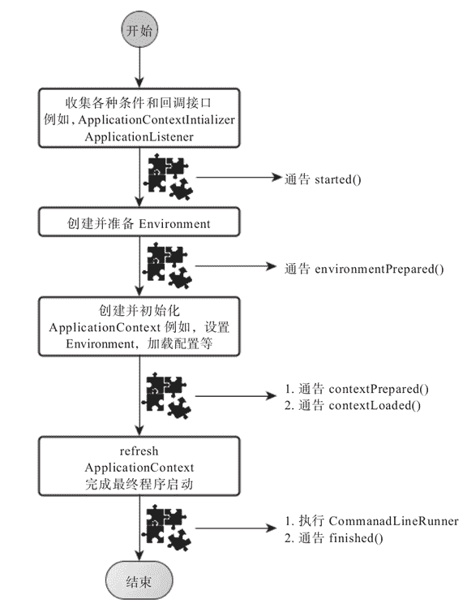

# SpringApplication.run 执行流程详解

> 原文：[`c.biancheng.net/view/4632.html`](http://c.biancheng.net/view/4632.html)

SpringApplication 将一个典型的 Spring 应用启动的流程“模板化”（这里是动词），在没有特殊需求的情况下，默认模板化后的执行流程就可以满足需求了但有特殊需求也没关系，SpringApplication 在合适的流程结点开放了一系列不同类型的扩展点，我们可以通过这些扩展点对 SpringBoot 程序的启动和关闭过程进行扩展。

最“肤浅”的扩展或者配置是 SpringApplication 通过一系列设置方法（setters）开放的定制方式，比如，我们之前的启动类的 main 方法中只有一句：

SpringApplication.run（DemoApplication.class，args）;

但如果我们想通过 SpringApplication 的一系列设置方法来扩展启动行为，则可以用如下方式进行：

```

public class DemoApplication {
    public static void main(String[] args) {
        // SpringApplication.run(DemoConfiguration.class, args);
        SpringApplication bootstrap = new SpringApplication(Demo - Configuration.class);
        bootstrap.setBanner(new Banner() {
            @Override
            public void printBanner(Environment environment, Class<?> aClass, PrintStream printStream) {
                // 比如打印一个我们喜欢的 ASCII Arts 字符画
            }
        });
        bootstrap.setBannerMode(Banner.Mode.CONSOLE);
        // 其他定制设置...
        bootstrap.run(args);
    }
}
```

设置自定义 banner 最简单的方式其实是把 ASCII Art 字符画放到一个资源文件，然后通过 ResourceBanner 来加载：

bootstrap.setBanner(new ResourceBanner(new ClassPathResource("banner.txt")));

大部分情况下，SpringApplication 已经提供了很好的默认设置，所以，我们不再对这些表层进行探究了，因为对表层之下的东西进行探究才是我们的最终目的。

## 深入探索 SpringApplication 执行流程

SpringApplication 的 run 方法的实现是我们本次旅程的主要线路，该方法的主要流程大体可以归纳如下：

1）如果我们使用的是 SpringApplication 的静态 run 方法，那么，这个方法里面首先需要创建一个 SpringApplication 对象实例，然后调用这个创建好的 SpringApplication 的实例 run 方 法。在 SpringApplication 实例初始化的时候，它会提前做几件事情：

根据 classpath 里面是否存在某个特征类（org.springframework.web.context.ConfigurableWebApplicationContext）来决定是否应该创建一个为 Web 应用使用的 ApplicationContext 类型，还是应该创建一个标准 Standalone 应用使用的 ApplicationContext 类型。

使用 SpringFactoriesLoader 在应用的 classpath 中查找并加载所有可用的 ApplicationContextInitializer。

使用 SpringFactoriesLoader 在应用的 classpath 中查找并加载所有可用的 ApplicationListener。

推断并设置 main 方法的定义类。

2）SpringApplication 实例初始化完成并且完成设置后，就开始执行 run 方法的逻辑了，方法执行伊始，首先遍历执行所有通过 SpringFactoriesLoader 可以查找到并加载的 SpringApplicationRunListener，调用它们的 started() 方法，告诉这些 SpringApplicationRunListener，“嘿，SpringBoot 应用要开始执行咯！”。

3）创建并配置当前 SpringBoot 应用将要使用的 Environment（包括配置要使用的 PropertySource 以及 Profile）。

4）遍历调用所有 SpringApplicationRunListener 的 environmentPrepared（）的方法，告诉它们：“当前 SpringBoot 应用使用的 Environment 准备好咯！”。

5）如果 SpringApplication 的 showBanner 属性被设置为 true，则打印 banner（SpringBoot 1.3.x 版本，这里应该是基于 Banner.Mode 决定 banner 的打印行为）。这一步的逻辑其实可以不关心，我认为唯一的用途就是“好玩”（Just For Fun）。

6）根据用户是否明确设置了 applicationContextClass 类型以及初始化阶段的推断结果，决定该为当前 SpringBoot 应用创建什么类型的 ApplicationContext 并创建完成，然后根据条件决定是否添加 ShutdownHook，决定是否使用自定义的 BeanNameGenerator，决定是否使用自定义的 ResourceLoader，当然，最重要的，将之前准备好的 Environment 设置给创建好的 ApplicationContext 使用。

7）ApplicationContext 创建好之后，SpringApplication 会再次借助 Spring-FactoriesLoader，查找并加载 classpath 中所有可用的 ApplicationContext-Initializer，然后遍历调用这些 ApplicationContextInitializer 的 initialize（applicationContext）方法来对已经创建好的 ApplicationContext 进行进一步的处理。

8）遍历调用所有 SpringApplicationRunListener 的 contextPrepared（）方法，通知它们：“SpringBoot 应用使用的 ApplicationContext 准备好啦！”

9）最核心的一步，将之前通过 @EnableAutoConfiguration 获取的所有配置以及其他形式的 IoC 容器配置加载到已经准备完毕的 ApplicationContext。

10）遍历调用所有 SpringApplicationRunListener 的 contextLoaded() 方法，告知所有 SpringApplicationRunListener，ApplicationContext "装填完毕"！

11）调用 ApplicationContext 的 refresh() 方法，完成 IoC 容器可用的最后一道工序。

12）查找当前 ApplicationContext 中是否注册有 CommandLineRunner，如果有，则遍历执行它们。

13）正常情况下，遍历执行 SpringApplicationRunListener 的 finished() 方法，告知它们：“搞定！”。（如果整个过程出现异常，则依然调用所有 SpringApplicationRunListener 的 finished() 方法，只不过这种情况下会将异常信息一并传入处理）。

至此，一个完整的 SpringBoot 应用启动完毕！

整个过程看起来冗长无比，但其实很多都是一些事件通知的扩展点，如果我们将这些逻辑暂时忽略，那么，其实整个 SpringBoot 应用启动的逻辑就可以压缩到极其精简的几步，如图 1 所示。

图 1  SpringBoot 应用启动步骤简要示意图
前后对比我们就可以发现，其实 SpringApplication 提供的这些各类扩展点近乎“喧宾夺主”，占据了一个 Spring 应用启动逻辑的大部分“江山”，除了初始化并准备好 ApplicationContext，剩下的大部分工作都是通过这些扩展点完成的，所以，我们接下来对各类扩展点进行逐一剖析。

## SpringApplicationRunListener

SpringApplicationRunListener 是一个只有 SpringBoot 应用的 main 方法执行过程中接收不同执行时点事件通知的监听者：

```

public interface SpringApplicationRunListener {
    void started();
    void environmentPrepared(ConfigurableEnvironment environment);
    void contextPrepared(ConfigurableApplicationContext context);
    void contextLoaded(ConfigurableApplicationContext context);
    void finished(ConfigurableApplicationContext context, Throwable exception);
}
```

对于我们来说，基本没什么常见的场景需要自己实现一个 Spring-ApplicationRunListener，即使 SpringBoot 默认也只是实现了一个 org.spring-framework.boot.context.event.EventPublishingRunListener，用于在 SpringBoot 启动的不同时点发布不同的应用事件类型（ApplicationEvent），如果有哪些 ApplicationListener 对这些应用事件感兴趣，则可以接收并处理。

假设我们真的有场景需要自定义一个 SpringApplicationRunListener 实现，那么有一点需要注意，即任何一个 SpringApplicationRunListener 实现类的构造方法（Constructor）需要有两个构造参数，一个构造参数的类型就是我们的 org.springframework.boot.SpringApplication，另外一个就是 args 参数列表的 String[]：

```

public class DemoSpringApplicationRunListener implements SpringApplicationRunListener {

    @Override
    public void started() {
        // do whatever you want to do
    }

    @Override
    public void environmentPrepared(ConfigurableEnvironment environment) {
        // do whatever you want to do
    }

    @Override
    public void contextPrepared(ConfigurableApplicationContext context) {
        // do whatever you want to do
    }

    @Override
    public void contextLoaded(ConfigurableApplicationContext context) {
        // do whatever you want to do
    }

    @Override
    public void finished(ConfigurableApplicationContext context, Throwable exception) {
        // do whatever you want to do

    }
}
```

之后，我们可以通过 SpringFactoriesLoader 立下的规矩，在当前 SpringBoot 应用的 classpath 下的 META-INF/spring.factories 文件中进行类似如下的配置：

org.springframework.boot.SpringApplicationRunListener=\com.keevol.springboot.demo.DemoSpringApplicationRunListener

然后 SpringApplication 就会在运行的时候调用它啦！

## ApplicationListener

ApplicationListener 其实是老面孔，属于 Spring 框架对 Java 中实现的监听者模式的一种框架实现，这里唯一值得着重强调的是，对于初次接触 SpringBoot，但对 Spring 框架本身又没有过多接触的开发者来说，可能会将这个名字与 SpringApplicationRunListener 混淆。

关于 ApplicationListener 我们就不做过多介绍了，如果感兴趣，请参考 Spring 框架相关的资料和书籍。

如果我们要为 SpringBoot 应用添加自定义的 ApplicationListener，有两种方式：

*   通过 SpringApplication.addListeners（..）或者 SpringApplication.setListeners（..）方法添加一个或者多个自定义的 ApplicationListener。
*   借助 SpringFactoriesLoader 机制，在 META-INF/spring.factories 文件中添加配置（以下代码是为 SpringBoot 默认注册的 ApplicationListener 配置）。

org.springframework.context.ApplicationListener=
\org.springframework.boot.builder.ParentContextCloserApplicationListener,
\org.springframework.boot.cloudfoundry.VcapApplicationListener,
\org.springframework.boot.context.FileEncodingApplicationListener,
\org.springframework.boot.context.config.AnsiOutputApplicationListener,
\org.springframework.boot.context.config.ConfigFileApplicationListener,
\org.springframework.boot.context.config.DelegatingApplicationListener,
\org.springframework.boot.liquibase.LiquibaseServiceLocatorApplicat-ionListener,
\org.springframework.boot.logging.ClasspathLoggingApplicationListener,
\org.springframework.boot.logging.LoggingApplicationListener

关于 ApplicationListener，我们就说这些。

## ApplicationContextInitializer

ApplicationContextInitializer 也是 Spring 框架原有的概念，这个类的主要目的就是在 ConfigurableApplicationContext 类型（或者子类型）的 ApplicationContext 做 refresh 之前，允许我们对 ConfigurableApplicationContext 的实例做进一步的设置或者处理。

实现一个 ApplicationContextInitializer 很简单，因为它只有一个方法需要实现：

```

public class DemoApplicationContextInitializer implements ApplicationContextInitializer {
    @Override
    public void initialize(ConfigurableApplicationContext applicationContext) {
        // do whatever you want with applicationContext,
        // e.g.
        applicationContext.registerShutdownHook();
    }
}
```

不过，一般情况下我们基本不会需要自定义一个 ApplicationContext-Initializer，即使 SpringBoot 框架默认也只是注册了三个实现：

org.springframework.context.ApplicationContextInitializer=
\org.springframework.boot.context.ConfigurationWarningsApplication-ContextInitializer,
\org.springframework.boot.context.ContextIdApplicationContextInitia-lizer,
\org.springframework.boot.context.config.DelegatingApplicationContex-tInitializer

如果我们真的需要自定义一个 ApplicationContextInitializer，那么只要像上面这样，通过 SpringFactoriesLoader 机制进行配置，或者通过 SpringApplication.addInitializers（..）设置即可。

## CommandLineRunner

CommandLineRunner 是很好的扩展接口，不是 Spring 框架原有的“宝贝”，它属于 SpringBoot 应用特定的回调扩展接口。源码如下所示：

```

public interface CommandLineRunner {
    void run(String... args) throws Exception;
}
```

CommandLineRunner 需要大家关注的其实就两点：

1）所有 CommandLineRunner 的执行时点在 SpringBoot 应用的 Application-Context 完全初始化开始工作之后（可以认为是 main 方法执行完成之前最后一步）。

2）只要存在于当前 SpringBoot 应用的 ApplicationContext 中的任何 Command-LineRunner，都会被加载执行（不管你是手动注册这个 CommandLineRunner 到 IoC 容器，还是自动扫描进去的）。

与其他几个扩展点接口类型相似，建议 CommandLineRunner 的实现类使用 @org.springframework.core.annotation.Order 进行标注或者实现 org.springframework.core.Ordered 接口，便于对它们的执行顺序进行调整，这其实十分重要，我们不希望顺序不当的 CommandLineRunner 实现类阻塞了后面其他 CommandLineRunner 的执行。