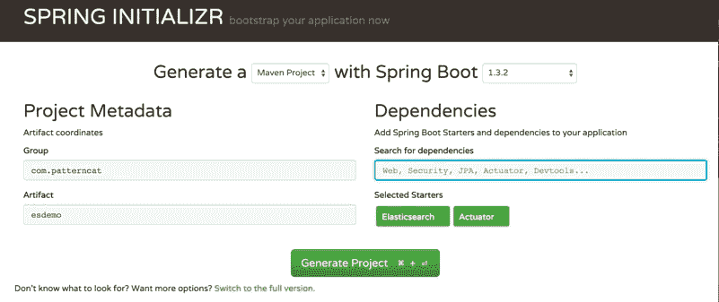

# Spring-Boot-Starter 常用依赖模块详解

> 原文：[`c.biancheng.net/view/4638.html`](http://c.biancheng.net/view/4638.html)

一般认为，SpringBoot 微框架从两个主要层面影响 Spring 社区的开发者们：

*   基于 Spring 框架的“约定优先于配置（COC）”理念以及最佳实践之路。
*   提供了针对日常企业应用研发各种场景的 spring-boot-starter 自动配置依赖模块，如此多“开箱即用”的依赖模块，使得开发各种场景的 Spring 应用更加快速和高效。

SpringBoot 提供的这些“开箱即用”的依赖模块都约定以 spring-boot-starter- 作为命名的前缀，并且皆位于 org.springframework.boot 包或者命名空间下（虽然 SpringBoot 的官方参考文档中提到不建议大家使用 spring-boot-starter- 来命名自己写的类似的自动配置依赖模块，但实际上，配合不同的 groupId，这不应该是什么问题）。

如果我们访问 [`start.spring.io`](http://start.spring.io)，并单击图 1 中的“Switch to the full version”链接，就会发现 SpringBoot1.3.2 默认支持和提供了大约 80 多个自动配置依赖模块。

图 1  Spring Initializr 示意图
鉴于数量如此之多，并且也不是所有人都会在任何一个应用中用到所有，这里我们只对几个常见的通用 spring-boot-starter 模块进行讲解，希望大家可以举一反三，灵活应用所有日后工作过程中将会用到的那些 spring-boot-starter 模块。

所有的 spring-boot-starter 都有约定俗成的默认配置，但允许我们调整这些配置以改变默认的配置行为，即“约定优先于配置”。在介绍相应的 spring-boot-starter 的默认配置（约定）以及可调整配置之前，我们有必要对 SpringBoot 应用的配置约定先做一个简单的介绍。

由于篇幅有限，我们分成以下几节对 spring-boot-starter 常用模块进行详细讲解：

*   spring-boot-starter-logging 和 spring-boot-starter-web
*   spring-boot-starter-web 和快速 Web 应用开发
*   spring-boot-starter-jdbc 与数据访问
*   spring-boot-starter-aop 及其使用场景说明
*   spring-boot-starter-security 与应用安全
*   spring-boot-starter-actuator 与应用监控