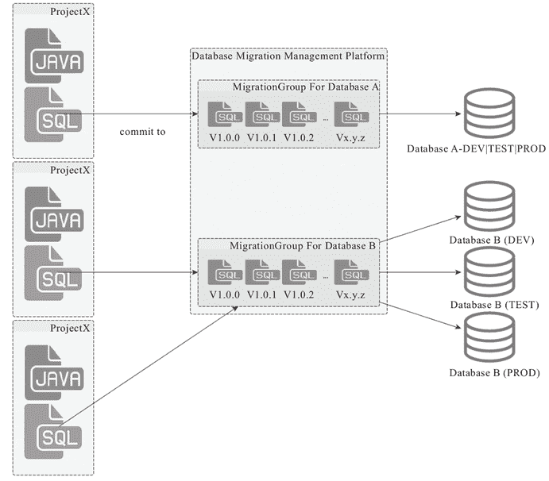

# spring-boot-starter-jdbc 与数据访问

> 原文：[`c.biancheng.net/view/4644.html`](http://c.biancheng.net/view/4644.html)

大部分 Java 应用都需要访问数据库，尤其是服务层，所以，SpringBoot 会为我们自动配置相应的数据访问设施。

若想 SpringBoot 为我们自动配置数据访问的基础设施，那么，我们需要直接或者间接地依赖 spring-jdbc，一旦 spring-jdbc 位于我们 SpringBoot 应用的 classpath，即会触发数据访问相关的自动配置行为，最简单的做法就是把 spring-boot-starter-jdbc 加为应用的依赖。

默认情况下，如果我们没有配置任何 DataSource，那么，SpringBoot 会为我们自动配置一个基于嵌入式数据库的 DataSource，这种自动配置行为其实很适合于测试场景，但对实际的开发帮助不大，基本上我们会自己配置一个 DataSource 实例，或者通过自动配置模块提供的配置参数对 DataSource 实例进行自定义的配置。

假设我们的 SpringBoot 应用只依赖一个数据库，那么，使用 DataSource 自动配置模块提供的配置参数是最方便的：

spring.datasource.url=jdbc:mysql://{database host}:3306/{databaseName}
spring.datasource.username={database username}
spring.datasource.password={database password}

当然，自己配置一个 DataSource 也是可以的，SpringBoot 也会智能地选择我们自己配置的这个 DataSource 实例（只不过必要性真不大）。

除了 DataSource 会自动配置，SpringBoot 还会自动配置相应的 JdbcTemplate、DataSourceTransactionManager 等关联“设施”，可谓服务周到，我们只要在使用的地方注入就可以了：

```

class SomeDao {
    @Autowired
    JdbcTemplate jdbcTemplate;
    public <T> List<T> queryForList(String sql){
        // ...
    }
    // ...
}
```

不过，spring-boot-starter-jdbc 以及与其相关的自动配置也不总是带来便利，在某些场景下，我们可能会在一个应用中需要依赖和访问多个数据库，这个时候就会出现问题了。

假设我们在 ApplicationContext 中配置了多个 DataSource 实例指向多个数据库：

```

@Bean
public DataSource dataSource1() throws Throwable {
    DruidDataSource dataSource = new DruidDataSource();
    dataSource.setUrl(...);
    dataSource.setUsername(...);
    dataSource.setPassword(...);
    // TODO other settings if necessary in the future.
    return dataSource;
}
@Bean
public DataSource dataSource2() throws Throwable {
    DruidDataSource dataSource = new DruidDataSource();
    dataSource.setUrl(...);
    dataSource.setUsername(...);
    dataSource.setPassword(...);
    // TODO other settings if necessary in the future.
    return dataSource;
}
```

那么，不好意思，启动 SpringBoot 应用的时候会抛出类似如下的异常（Exception）：

Exception）：No qualifying bean of type [javax.sql.DataSource] is defined: expected single matching bean but found 2 

为了避免这种情况的发生，我们需要在 SpringBoot 的启动类上做点儿“手脚”：

```

@SpringBootApplication(exclude = { DataSourceAutoConfiguration.class,
        DataSourceTransactionManagerAutoConfiguration.class })
public class UnveilSpringChapter3Application {
    public static void main(String[] args) {
        SpringApplication.run(UnveilSpringChapter3Application.class, args);
    }
}
```

也就是说，我们需要在这种场景下排除掉对 SpringBoot 默认提供的 DataSource 相关的自动配置。但如果我们还是想要享受 SpringBoot 提供的自动配置 DataSource 的机能，也可以通过为其中一个 DataSource 配置添加 org.springframework.context.annotation.Primary 这个 Annotation 的方式以实现两全其美：

```

@Bean
@Primary
public DataSource dataSource1() throws Throwable {
    DruidDataSource dataSource = new DruidDataSource();
    dataSource.setUrl(...);
    dataSource.setUsername(...);
    dataSource.setPassword(...);
    // TODO other settings if necessary in the future.
    return dataSource;
}
@Bean
public DataSource dataSource2() throws Throwable {
    DruidDataSource dataSource = new DruidDataSource();
    dataSource.setUrl(...);
    dataSource.setUsername(...);
    dataSource.setPassword(...);
    // TODO other settings if necessary in the future.
    return dataSource;
    }
}
```

另外，SpringBoot 还提供了很多其他数据访问相关的自动配置模块，比如 spring-boot-starter-data-jpa、spring-boot-starter-data-mongodb 等，大家可以根据自己数据访问的具体场景选择使用这些自动配置模块。

如果选择了 spring-boot-starter-data-jpa 等关系数据库相关的数据访问自动配置模块，并且还需要同时依赖访问多个数据库，那么，也需要相应的在 SpringBoot 启动类中排除掉这些自动配置模块中的 AutoConfiguration 实现类（对应 spring-boot-starter-data-jpa 是 JpaRepositoriesAutoConfiguration），或者标注某个 DataSource 为 @Primary。

## SpringBoot 应用的数据库版本化管理

关于如何针对数据库的变更进行版本化管理，从 Ruby On Rails 的 migration 支持，到 Java 的 MyBatis Migrations，Flyway 以及 Liquibase，都给出了相应的最佳实践建议和方案。

但是，数据库 migrations 的实践方式并没有在国内普遍应用起来，大部分都是靠人来解决，这或许可以用一句“成熟度不够”来解释，另外一个原因或许是职能明确分工后造成的局面。

如果仔细分析以上数据库 migration 方案就会发现，它们给出的应用场景和实践几乎都是单应用、单部署的，这在庞大单一部署单元（Monolith）的年代显然是很适合的，因为应用从开发到发布部署，再到启动，整个生命周期内，应用相关的所有“原材料”都集中在一起进行管理，而且国外开发者往往偏“特种作战”（Full-Stack Developer），一身多能，从而数据库 migration 这种实践自然可以成型并广泛应用。

但回到国内来看，我们往往是“集团军作战”，拼的是“大部队+明确分工”的模式，而且应用所面向的服务人数也往往更为庞大，所以，整个应用的交付链路上各个环节之间的衔接是不同的人，而应用最终部署的拓扑又往往是分布式部署居多，所以，在一个项目单元里维护数据库的 migration 脚本然后部署后启动前执行这些脚本就变得不合时宜了：

1）从职责上，这些 migration 脚本虽然大部分情况下都是开发人员写，但写完之后要不要进行 SQL 审查，是否符合规范，这些又会涉及应用运维 DBA。

代码管理系统对开发来说很亲切，对 DBA 来说则不尽然，而且 DBA 往往还要一人服务多个团队多个项目，从 DBA 的角度来说，他更愿意将 SQL 集中到一处进行管理，而不是分散在各个项目中。

2）应用分布式部署之后，就不单单是单一部署在应用启动的之前直接执行一次 migration 脚本那么简单了，你要执行多次，虽然 migration 方案都有版本控制，变更应该最终状态都是一样的，但这多个部署节点上都执行同一逻辑显然是多余的。

更复杂一点儿，多个应用可能同时使用同一个数据库的情况，一个项目的数据库 migration 操作跟另一个项目的数据库 migration 操作会不会在互不知晓的情况下产生冲突和破坏？

所以，数据库 migration 的思路和实践很好，但不能照搬（任何事情其实皆如此），不过，我们可以结合现有的一些数据库 migration 方案，比如 flyway 或者 liquibase，我们可以对这些数据库 migration 的基础设施和支持外部化（Externalize），一个可能的架构如图 1 所示。

图 1  集中管控的数据库 Migration 架构示意图
在这个架构中，数据库 migration 的版本化管理剥离到了单独的管理系统，单一项目中不再保存完整历史的 migration 记录，而只需要提供当次发布要牵扯的数据库变更 SQL。

在项目发布的时候，由 DBA 进行统一的审查并纳入单独的数据库 migration 管理系统，由单独的数据库 migration 管理系统来管理完整的数据库 migration 记录，可以根据数据库的粒度进行管理和状态同步，从而既可以在开发阶段让开发人员可以集中管理数据库 SQL，又能在发布期间审查 SQL 并同步 migration 状态和完整的历史记录管理。

当然，这一切可以实现的前提是有一套完整的软件交付链路支撑平台，能够从流程上，软件生命周期管理上进行统一的治理和规范，后面教程中会跟大家做进一步深入的探讨。

不管怎么样，SpringBoot 还是为大家提供了针对 Flyway 和 Liquibase 的自动配置功能（org.springframework.boot.autoconfigure.flyway.FlywayAutoConfiguration 和 org.springframework.boot.autoconfigure.liquibase.LiquibaseAutoConfiguration），对于单一开发和部署的应用来说，还是可以考虑的。