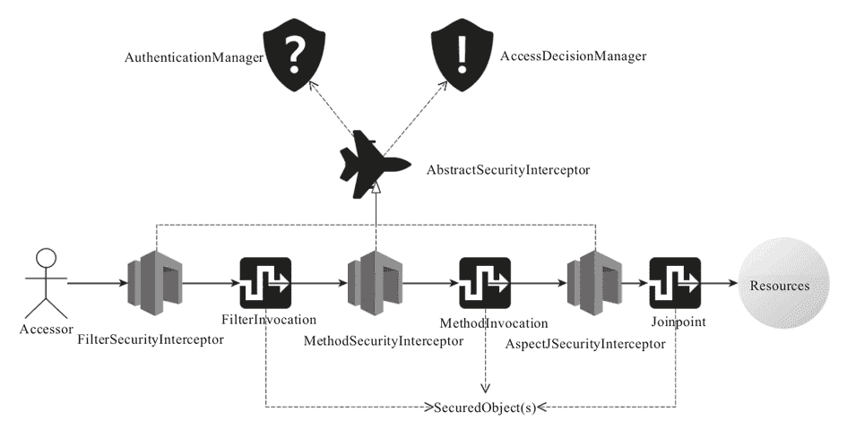
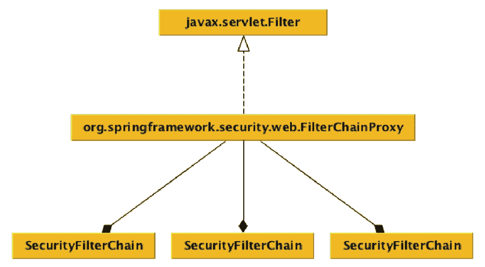

# spring-boot-starter-security 与应用安全

> 原文：[`c.biancheng.net/view/4665.html`](http://c.biancheng.net/view/4665.html)

应用安全属于安全防护体系中的重要一环，但也是最薄弱的一环，究其原因，或许是应用的核心职责是完成业务和产品的功能需求，而安全确实非功能性需求，在资源有限的情况下，企业一定是更加注重将有限的资源投入到“开疆扩土”上去，否则，穷家破瓦的，也真没有什么值得安全防护的。

大部分应用开发者对应用安全知之甚少，而且安全一般属于一个企业或者业界秘而不宣的信息，所以，在没有一个专职的安全团队负责推动整个安全防护体系落实的情况下，零零散散和线上落实的一些应用安全防护已经算很不错的了。

“树大招风”，树不大的时候，那些“风”通常也不会来找你麻烦，所以，大部分中小企业，除非应用了一些业界广泛应用的软件或者方案被连带性地伤害到，大部分情况下，这些中小企业并不知道这类潜在风险，或者是他们自身不会为黑客们（cracker）带来太大的利用价值。

好在 Java 开发者生活在 Spring 框架营造的生态圈之中，所以，关于应用安全这种头疼的问题，Spring 生态圈里也有现成的解决方案，即从 Acegi 发展起来的 SpringSecurity。

但是说实话，SpringSecurity 在整个社区中的名声并不是太好，尤其是在开发者眼中，“复杂（Too Complicated），太重（Too Heavyweight）”，但实际上，如果大家真得去了解一个框架，就会发现，其实 SpringSecurity 框架本身的设计还是挺优秀的。

SpringSecurity 可以任意裁剪，而且还提供了丰富的开箱即用的安全特性支持。这里其实存在一个常见的设计取舍，我们到底应该为了良好的扩展和组合型而将组件拆分的精细一些，还是应该为了使用的便利，适度忽略定制化的需求，提供一个功能简化的一站式方案？

不管 SpringSecurity 团队当时是如何选择的，既然已经成为了事实，给使用者的感受不好，那么，我们就要想办法改善这种现状，spring-boot-starter-security 就是一种答案。

spring-boot-starter-security 主要面向 Web 应用安全，配合 spring-boot-starter-web，要使用 SpringBoot 构建一个安全的对外提供服务的 Web 应用简直太容易了，代码如下所示：

```

<?xml version="1.0" encoding="UTF-8"?>
<project xmlns="http://maven.apache.org/POM/4.0.0"
    xmlns:xsi="http://www.w3.org/2001/XMLSchema-instance"
    xsi:schemaLocation="http://maven.apache.org/POM/4.0.0
        http://maven.apache.org/xsd/maven-4.0.0.xsd">
    <modelVersion>4.0.0</modelVersion>
    <groupId>com.keevol.unveilspring.chapter3</groupId>
    <artifactId>web-security-demo</artifactId>
    <version>0.0.1-SNAPSHOT</version>
    <packaging>jar</packaging>
    <name>web-security-demo</name>
    <description>web security demo project for Spring Boot</description>
    <parent>
        <groupId>org.springframework.boot</groupId>
        <artifactId>spring-boot-starter-parent</artifactId>
        <version>1.3.1.RELEASE</version>
        <relativePath /> <!-- lookup parent from repository -->
    </parent>
    <properties>
        <project.build.sourceEncoding>UTF-8</project.build.sourceEncoding>
        <java.version>1.8</java.version>
    </properties>
    <dependencies>
        <dependency>
            <groupId>org.springframework.boot</groupId>
            <artifactId>spring-boot-starter-security</artifactId>
        </dependency>
        <dependency>
            <groupId>org.springframework.boot</groupId>
            <artifactId>spring-boot-starter-web</artifactId>
        </dependency> <!--其他依赖 -->
    </dependencies>
    <build>
        <plugins>
            <plugin>
                <groupId>org.springframework.boot</groupId>
                <artifactId>spring-boot-maven-plugin</artifactId>
            </plugin>
        </plugins>
    </build>
</project> 
```

在当前项目中只要添加需要的 Controller 实现，一个添加了基本安全防护的 Web 应用就诞生了。spring-boot-starter-security 默认会提供一个基于 HTTP Basic 认证的安全防护策略，默认用户名为 user，访问密码则在当前 Web 应用启动的时候，打印到控制台，类似于：

2017-01-01 13:57:00.596 INFO 17966 --- [ost-startStop-1] b.a.s.Au-thenticationManagerConfiguration : Using default security password: 560ff91b-0ae7-492c-ad16-603e1adec54c 

如果我们希望对 HTTP Basic 认证的用户名和密码进行定制，可以通过如下配置项进行：

security.user.name={个人希望设置的用户名}
security.user.password={个人希望使用的访问密码} 

除此之外，spring-boot-starter-security 还会默认启用一些必要的 Web 安全防护，比如针对 XSS、CSRF 等常见针对 Web 应用的攻击，同时，也会将一些常见的静态资源路径排除在安全防护之外。

但是，说实话，spring-boot-starter-security 提供的默认安全策略相对于真正的生产环境来说，还是太弱了。但也没办法，既要安全，又要便利，spring-boot-starter-security 默认情况下已经尽量做到够好了。

不过好在 SpringSecurity 扩展性不错，要在其上构建一套真正严谨有效的 Web 应用安全防护体系也并非难事，只不过，需要我们先能够从其架构设计上理解并把握它，然后再在 SpringSecurity 和 SpringBoot 的基础上构建一套符合自身需要的 Web 应用安全方案。

## 了解 SpringSecurity 基本设计

SpringSecurity 框架不但囊括了基本的认证和授权功能，而且还提供了加密解密、统一登录等一系列相关支持，本教程中只是对框架比较核心的设计进行简单介绍，即基本的认证和授权为核心的设计。

我们可以将 Spring Security 的几个核心概念按照图 1 所示勾勒在一起：

图 1  SpringSecurity 核心概念示意图
访问者（Accessor）需要访问某个资源（Resources）是这个场景中最原始的需求，但并不是谁都可以访问资源，也不是任何资源都允许任何人来访问，所以，中间我们要加入一些检查和防护。

在访问资源的所经之路上，可能需要上山、过桥、下海行船，不管怎么样，这些所经之路对于我们要防护的资源来说都是比较好的设置关卡点，对应上图就是 FilterInvocation（对应 Web 应用场景）、MethodInvocation 以及 Joinpoint，这些在 Spring Security 框架中统称 Secured Object（s）。

我们知道了在哪里设置关卡最合适，下一步就是设置关卡，对应不同的所经之路，我们分别设置类似 FilterSecurityInterceptor、Method-SecurityInterceptor 以及 AspectJSecurityInterceptor 这样的关卡来负责拦截非法资源访问的闯入者们。

而在 Spring Security 框架的设计中，关卡的概念统一抽象为 AbstractSecurityInterceptor，而 FilterSecurity-Interceptor、MethodSecurityInterceptor 以及 AspectJSecurityInterceptor 都是它的具体实现类。

现在把门儿的倒是有了，可是他们不知道该拦谁，不该拦谁，所以，我们需要有类似神盾局（S.H.I.E.L.D）这样的机构，由这个机构来决定谁可以放行，谁必须阻截，而在 SpringSecurity 框架中 AccessDecisionManager 就是这个控制机构，AccessDecisionManager 将决定谁可以访问哪些资源。

现在剩下最后一个问题，这个谁怎么定义？我们总得知道当前这个访问者是谁才能告知 AccessDecisionManager 阻截还是放行，所以，SpringSecurity 框架中的 AuthenticationManager 将解决的是访问者身份认证的问题，只有确定你在册了，才可以给你授权访问（除非匿名访问某些公共资源）。

AuthenticationManager、AccessDecisionManager 和 AbstractSecurityInterceptor 属于 Spring Security 框架的基础铁三角。AuthenticationManager 和 Access-DecisionManager 负责制定规则，AbstractSecurityInterceptor 负责执行。

所有针对不同应用场景的安全方案，基本上都是在这个基础核心的基础上衍生出来的，比如，Web 安全。

Spring Security 的 Web 安全方案基于 Java 的 Servlet API 规范进行构建，所以，像 Play Framework 这种脱离 Servlet 规范的 Web 框架，则无法享受到 SpringSecurity 提供的默认的 Web 安全方案（当然，依然可以基于基本模型实现扩展方案）。

既然是基于 Servlet API 规范，那么，要实现关卡的“特效”，则非 javax.servlet.Filter 莫属了。在使用 Spring 框架开发 Filter 的时候，为了让 Filter 可以享受到依赖注入的好处，我们一般是实现 GenericFilterBean 并注册到 IoC 容器。

为了能够启用这些注册到 IoC 容器的 Filter，我们一般要在 web.xml 或者相应的 JavaConfig 的配置中声明一个 org.springframework.web.filter.DelegatingFilterProxy，使其 filter-name 与 IoC 容器中我们希望启用的 Filter 对应“挂钩”，SpringSecurity 的 Web 安全方案的启用也是这个原理。

SpringSecurity 默认会需要声明一个默认名称为“springSecurityFilterChain”的 org.springframework.web.filter.DelegatingFilterProxy（web.xml 方式或者 JavaConfig 方式），然后指向 IoC 容器中注册的一个 org.springframework.security.web.FilterChainProxy 实例。

FilterChainProxy 通过扩展 GenericFilterBean 间接实现了 Filter 接口，同时持有一组 SecurityFilterChain，使它可以针对不同的 Web 资源进行特定的防护，这些“角儿”之间的关系大体上如图 2 所示。
图 2  FilterChainProxy 相关组件关系示意图
当然，这些还只是“骨架”，真正执行防护任务的其实是一个个 org.springframework.security.web.SecurityFilterChain 中定义的一系列 Filter：

```

public interface SecurityFilterChain {
    boolean matches(HttpServletRequest request);
    List<Filter> getFilters();
}
```

当我们经常看到如下的 xml schema 形式的配置格式的时候：

```

<http auto-config='true'>
    <intercept-url pattern="/login.jsp*" access="IS_AUTHENTICATED_ANONYMOUSLY"/>
    <intercept-url pattern="/**" access="ROLE_USER" />
    <form-login login-page='/login.jsp'/>
</http>
```

其实一个个 http 元素背后对应的就是一个个 SecurityFilterChain 实例，而 http 元素的那些子元素，比如 intercept-url，则对应的就是一个个 Filter。

默认情况下，Spring Security 为 SecurityFilterChain 中的 Filter 序列设定了一个注册框架，以 100 为间隔步长，按照一个合理的顺序来规划和排布常用的 Filter 实现（代码参考 FilterComparator）：

```

int order = 100;
put(ChannelProcessingFilter.class, order);
order += STEP;
put(ConcurrentSessionFilter.class, order);
order += STEP;
put(WebAsyncManagerIntegrationFilter.class, order);
order += STEP;
put(SecurityContextPersistenceFilter.class, order);
order += STEP;
put(HeaderWriterFilter.class, order);
order += STEP;
put(CsrfFilter.class, order);
order += STEP;
put(LogoutFilter.class, order);
order += STEP;
put(X509AuthenticationFilter.class, order);
order += STEP;
put(AbstractPreAuthenticatedProcessingFilter.class, order);
order += STEP;
filterToOrder.put("org.springframework.security.cas.web.CasAuthenticationFilter", order);
order += STEP;
put(UsernamePasswordAuthenticationFilter.class, order);
order += STEP;
put(ConcurrentSessionFilter.class, order);
order += STEP;
filterToOrder.put("org.springframework.security.openid.OpenIDAuthenticationFilter", order);
order += STEP;
put(DefaultLoginPageGeneratingFilter.class, order);
order += STEP;
put(ConcurrentSessionFilter.class, order);
order += STEP;
put(DigestAuthenticationFilter.class, order);
order += STEP;
put(BasicAuthenticationFilter.class, order);
order += STEP;
put(RequestCacheAwareFilter.class, order);
order += STEP;
put(SecurityContextHolderAwareRequestFilter.class, order);
order += STEP;
put(JaasApiIntegrationFilter.class, order);
order += STEP;
put(RememberMeAuthenticationFilter.class, order);
order += STEP;
put(AnonymousAuthenticationFilter.class, order);
order += STEP;
put(SessionManagementFilter.class, order);
order += STEP;
put(ExceptionTranslationFilter.class, order);
order += STEP;
put(FilterSecurityInterceptor.class, order);
order += STEP;
put(SwitchUserFilter.class, order); 
```

这些 Filter 虽然很多，但可以简单划分为几类，除个别 Filter 在每个 SecurityFilterChain 都需要，其他可以根据需要选用并添加：

1.  可以认为是信道与状态管理，比如 ChannelProcessingFilter 用于处理 http 或者 https 之间的切换，而 SecurityContextPersistenceFilter 用于重建或者销毁必要的 SecurityContext 状态。
2.  是常见 Web 安全防护类，比如 CsrfFilter。
3.  是认证和授权，比如 BasicAuthenticationFilter、CasAuthen-ticationFilter 等。

最需要重点关注的是 FilterSecurityInterceptor，还记得我们前面说到的 secured object 吧。FilterSecurityInterceptor 就属于放在 Web 访问路径上的那道“关卡”，现在，它的真实位置和效能终于浮出水面了。

ExceptionTranslationFilter 属于另一个需要关注的核心类，它负责接待或者送客，如果访客来访，对方没有报上名来，那么，它会让访客去登记认证（去找 AuthenticationManager 做认证），如果对方报上名了，但认证失败，那么不好意思，请重新认证或者走人。当然，它拒绝访客的方式是抛出相应的 Exception，所以名字叫 ExceptionTranslationFilter。

最后，这个 Filter 序列因为间隔了 100 的步长，所以，我们可以在其中穿插自己的 Filter 实现类，为定制和扩展 SpringSecurity 的防护体系提供了机会。

以上就是关于 Spring Security 以及其 Web 安全相关的基础介绍，这些内容足以帮助我们理解并扩展 spring-boot-starter-security。

## 进一步定制 spring-boot-starter-security

除了使用 SecurityProperties 暴露的配置项（以 security.* 开头）对 spring-boot-starter-security 进行简单的配置，我们还可以通过给出一个继承了 WebSecurityConfigurerAdapter 的 JavaConfig 配置类对 spring-boot-starter-security 的行为进行更深一级的定制。

使用 WebSecurityConfigurerAdapter 的好处在于，我们依然可以使用 spring-boot-starter-security 默认约定的一些行为，只需要对必要的行为进行调整，比如：

*   使用其他的 AuthenticationManager 实例。
*   对默认 HttpSecurity 定义的资源访问的规则进行重新定义。
*   对默认提供的 WebSecurity 行为进行调整。

为了能够让这些调整生效，我们定义的 WebSecurityConfigurerAdapter 实现类一般在顺序上需要先于 spring-boot-starter-security 默认提供的配置，故此，一般配合@Order（SecurityProperties.ACCESS_OVERRIDE_ORDER）进行标注，代码如下所示：

```

@Configuration
@Order(SecurityProperties.ACCESS_OVERRIDE_ORDER)
public class DemoSecurityConfiguration extends WebSecurity-ConfigurerAdapter {
    protected DemoSecurityConfiguration() {
        super(true); // 取消默认提供的安全相关 Filters 配置
    }
    @Override
    public void configure(WebSecurity web) throws Exception {
        // ...
    }
    @Override
    protected void configure(HttpSecurity http) throws Exception {
        // ...
    }
    // 通过 Override 其他方法实现对 web 安全的定制
}
```

WebSecurityConfigurerAdapter 其实是为我们预先设定了一个框架，并开放了有限的一些扩展点允许我们对 Web 安全相关的设定进行定制，某些场景下还是会感觉“掣肘”，或者，某些有“洁癖”的开发者，往往不想使用在某些场景下显得并非必要的默认设定。

这个时候，我们可以直接实现并注册一个标注了 @EnableWebSecurity 的 JavaConfig 配置类到 IoC 容器，从而实现一种“颠覆性”的定制，即跟 spring-boot-starter-security 默认提供的 Web 安全相关配置一刀两断，完全自建：

```

@Configuration
@EnableWebSecurity
public class OverhaulSecurityConfiguration {
    @Bean
    public AuthenticationManager authenticationManager() {
        // ...
    }

    @Bean
    public AccessDecisionManager accessDecisionManager() {
        // ...
    }

    @Bean
    public SecurityFilterChain mySecurityFilterChain() {
        // ...
    }
    // 其他 web 安全相关组件和依赖配置}
}
```

这种方案需要开发者对 Spring Security 框架本身以及 Web 安全本身有很深的理解，不到迫不得已，最好不要这么做，威力大，风险也大。