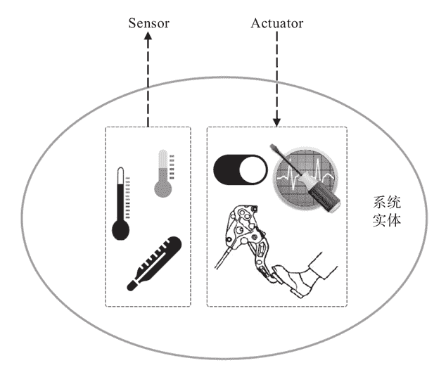
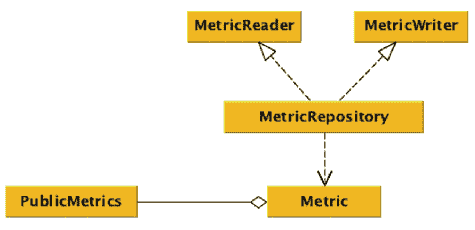
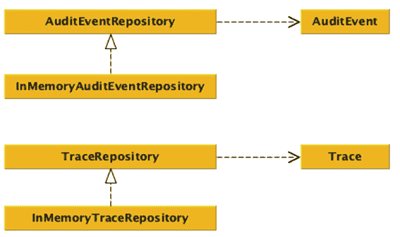

# spring-boot-starter-actuator 与应用监控

> 原文：[`c.biancheng.net/view/4666.html`](http://c.biancheng.net/view/4666.html)

所有的应用开发完成之后，其最终目的都是为了上线运行，SpringBoot 应用也不例外，而在应用运行的漫长生命周期内，为了保障其可以持续稳定的服务，我们通常需要对其进行监控，从而可以了解应用的运行状态，并根据情况决定是否需要对其运行状态进行调整。

顺应需求，SpringBoot 框架提供了 spring-boot-starter-actuator 自动配置模块用于支持 SpringBoot 应用的监控。Actuator 这个词即使翻译过来也不是很容易理解（比如翻译成“制动器；传动装置；执行机构”等）。

如图 1 所示，形象的描述了 Actuator 是什么。
图 1  Sensor 和 Actuator 示意图
为了能够感知应用的运行状态，我们通常会设置一些监控指标并采集分析，这些监控指标的采集需要在应用内部设置相应的监控点，这类监控点一般只是读取状态数据，我们通常称它们为 Sensor，即中文一般称为“传感器”的东西。

应用的运行状态数据通过 Sensors 采集上来之后，我们通常会有专门的系统对这些数据进行分析和判断，一旦某个指标数据超出了预定的阈值，这往往意味着应用的运行状态在这个指标上出现了“不健康”的现象，我们希望对这个指标进行调整，而为了能够执行调整，我们需要预先在应用内部设置对应的执行调整逻辑的控制器。

比如，直接关闭的开关，或者可以执行微调甚至像刹车一样直接快速拉低某个指标值的装置，这些控制器就称为 Actuator。虽然我们日常天天在说“监控，监控”，但实际上“监”跟“控”是两个概念，Sensor 更多服务于“监”的场景，而 Actuator 则服务于“控”的场景。

spring-boot-starter-actuator 自动配置模块默认提供了很多 endpoint，虽然自动配置模块名为 spring-boot-starter-actuator，但实际上这些 endpoint 可以按照“监”和“控”划分为两类：

#### 1\. Sensor 类 endpoints

| 名称 | 说明 |
| autoconfig | 这个 endpoint 会为我们提供一份 SpringBoot 的自动配置报告，告诉我们哪些自动配置模块生效了，以及哪些没有生效，原因是什么。 |
| beans | 给出当前应用的容器中所有 bean 的信息。 |
| configprops | 对现有容器中的 ConfigurationProperties 提供的信息进行“消毒”处理后给出汇总信息。 |
| info | 提供当前 SpringBoot 应用的任意信息，我们可以通过 Environment 或者 application.properties 等形式提供以 info. 为前缀的任何配置项，然后 info 这个 endpoint 就会将这些配置项的值作为信息的一部分展示出来。 |
| health | 针对当前 SpringBoot 应用的健康检查用的 endpoint。 |
| env | 关于当前 SpringBoot 应用对应的 Environment 信息。 |
| metrics | 当前 SprinBoot 应用的 metrics 信息。 |
| trace | 当前 SpringBoot 应用的 trace 信息。 |
| mapping | 如果是基于 SpringMVC 的 Web 应用，mapping 这个 endpoint 将给出 @RequestMapping 相关信息。 |

#### 2\. Actuator 类 endpoints

*   shutdown：用于关闭当前 SpringBoot 应用的 endpoint。
*   dump：用于执行线程的 dump 操作。

默认情况下，除了 shutdown 这个 endpoint（因为比较危险，如果没有安全防护，谁都可以访问它，然后关闭应用），其他 endpoints 都是默认启用的。

生产环境下，如果没有启用安全防护（比如没有依赖 spring-boot-starter-security），那么，建议遵循 Deny By Default 原则，将所有的 endpoints 都关掉，然后根据具体情况单独启用某些 endpoint：

endpoints.enabled=falseendpoints.info.enabled=trueendpoints.health.enabled=true...

所有配置项以 endpoints. 为前缀，然后根据 endpoint 名称划分具体配置项。大部分 endpoints 都是开箱即用，但依然有些 endpoint 提供给我们进一步扩展的权利，比如健康状态检查相关的 endpoint（health endpoint）。

## 自定义应用的健康状态检查

应用的健康状态检查是很普遍的监控需求，SpringBoot 也预先通过 org.springframework.boot.actuate.autoconfigure.HealthIndicatorAutoConfiguration 为我们提供了一些常见服务的监控检查支持，比如：

*   DataSourceHealthIndicator
*   DiskSpaceHealthIndicator
*   RedisHealthIndicator
*   SolrHealthIndicator
*   MongoHealthIndicator

如果这些默认提供的健康检查支持依然无法满足我们的需要，SpringBoot 还允许我们提供更多的 HealthIndicator 实现，只要将这些 HealthIndicator 实现类注册到 IoC 容器，SpringBoot 会自动发现并使用它们。

假设需要检查依赖的 dubbo 服务是否处于健康状态，我们可以实现一个 DubboHealthIndicator：

```

import com.alibaba.dubbo.config.spring.ReferenceBean;
import com.alibaba.dubbo.rpc.service.EchoService;
import org.springframework.boot.actuate.health.AbstractHealthIndicator;
import org.springframework.boot.actuate.health.Health;

public class DubboHealthIndicator extends AbstractHealthIndicator {
    private final ReferenceBean bean;

    public DubboHealthIndicator(ReferenceBean bean) {
        this.bean = bean;
    }

    @Override
    protected void doHealthCheck(Health.Builder builder) throws Exception {
        builder.withDetail("interface", bean.getObjectType());
        final EchoService service = (EchoService) bean.getObject();
        service.$echo("hi");
        builder.up();
    }
}
```

要实现一个自定义的 HealthIndicator，一般我们不会直接实现（Implements）HealthIndicator 接口，而是继承 AbstractHealthIndicator：

```

public abstract class AbstractHealthIndicator implements HealthIndicator {
    @Override
    public final Health health() {
        Health.Builder builder = new Health.Builder();
        try {
            doHealthCheck(builder);
        } catch (Exception ex) {
            builder.down(ex);
        }
        return builder.build();
    }

    protected abstract void doHealthCheck(Health.Builder builder)
            throws Exception;
}
```

好处就是，我们只需实现 doHealthCheck，在其中实现我们面向的具体服务的健康检查逻辑就可以了，因此，在 DubboHealthIndicator 实现类中，我们通过 dubbo 框架提供的 EchoService 直接检查相应的 dubbo 服务健康状态即可，只要没有任何异常抛出，我们就认为检查的 dubbo 服务是状态健康的，所以，最后会通过 Health.Builder 的 up() 方法标记服务状态为正常运行。

为了完成对 dubbo 服务的健康检查，只实现一个 DubboHealthIndicator 是不够的，我们还需要将其注册到 IoC 容器中，但是一个一个单独注册太费劲了，而且还要自己提供针对某个 dubbo 服务的 ReferenceBean 依赖实例。

所以，为了一劳永逸，也为了其他人能够同样方便地使用针对 dubbo 服务的健康检查支持，我们可以在 DubboHealthIndicator 的基础上实现一个 spring-boot-starter-dubbo-health-indicator 自动配置模块，即：

```

@Configuration
@ConditionalOnClass(name = { "com.alibaba.dubbo.rpc.Exporter" })
public class DubboHealthIndicatorConfiguration {
    @Autowired
    HealthAggregator healthAggregator;
    @Autowired(required = false)
    Map<String, ReferenceBean> references;

    @Bean
    public HealthIndicator dubboHealthIndicator() {
        Map<String, HealthIndicator> indicators = new HashMap<>();
        for (String key : references.keySet()) {
            final ReferenceBean bean = references.get(key);
            indicators.put(key.startsWith("&") ? key.replaceFirst("&", "")
                    : key, new DubboHealthIndicator(bean));
        }
        return new CompositeHealthIndicator(healthAggregator, indicators);
    }
}
```

然后我们在 spring-boot-starter-dubbo-health-indicator 的 META-INF/spring.factories 文件中添加如下配置：

org.springframework.boot.autoconfigure.EnableAutoConfiguration=\com.keevol...DubboHealthIndicatorConfiguration 

现在，发布 spring-boot-starter-dubbo-health-indicator 并依赖它就可以自动享受到针对当前应用引用的所有 dubbo 服务进行健康检查的服务。

那么针对 Map<String，ReferenceBean>references 的依赖注入是从哪里来的？

其实 Spring 框架支持依赖注入 Key 的类型为 String 的 Map，遇到这种类型的 Map 声明（Map），Spring 框架将扫描容器中所有类型为 T 的 bean，然后以该 bean 的 name 作为 Map 的 Key，以 bean 实例作为对应的 Value，从而构建一个 Map 并注入到依赖处。

## 开放的 endpoints 才真正“有用”

不管是 spring-boot-starter-actuator 默认提供的 endpoint 实现，还是我们自己给出的 endpoint 实现，如果只是实现了放在 SpringBoot 应用的“身体内部”，那么它们不会发挥任何作用，只有将它们采集的信息暴露开放给外部监控者，或者允许外部监控者访问它们，这些 endpoints 才会真正发挥出它们的最大“功效”。

首先，spring-boot-starter-actuator 会通过 org.springframework.boot.actuate.autoconfigure.EndpointMBeanExportAutoConfiguration 将所有的 org.springframework.boot.actuate.endpoint.Endpoint 实例以 JMX MBean 的形式开放给外部监控者使用。

默认情况下，这些 Endpoint 对应的 JMX MBean 会放在 org.springframework.boot 命名空间下面，不过可以通过 endpoints.jmx.domain 配置项进行更改，比如 endpoints.jmx.domain=com.keevol.management。

EndpointMBeanExportAutoConfiguration 为我们提供了一条很好的应用监控实践之路，既然它会把所有的 org.springframework.boot.actuate.endpoint.Endpoint 实例都作为 JMX Mbean 开放出去，那么，我们就可以提供一批用于某些场景下的自定义 Endpoint 实现类，比如：

```

public class HelloEndpoint extends AbstractEndpoint<String> {
    public HelloEndpoint(String id) {
        super(id, false);
    }
    @Override
    public String invoke() {
        return "Hello, SpringBoot";
    }
}
```

然后，将像 HelloEndpoint 这样的实现类注册到 SpringBoot 应用的 IoC 容器，就可以扩展 SpringBoot 的 endpoints 功能了。

Endpoint 其实更适合简单的 Sensor 场景（即用于读取或者提供信息），或者简单功能的 actuator 场景（不需要行为参数），如果需要对 SpringBoot 进行更细粒度的监控，可以考虑直接使用 Spring 框架的 JMX 支持。

除了可以使用 JMX 将 spring-boot-starter-actuator 提供的（或者我们自己提供的）endpoints 开放访问，如果当前 SpringBoot 应用恰好又是一个 Web 应用。那么，这些 endpoints 还会通过 HTTP 协议开放给外部访问，与一般的 Web 请求处理一样，使用的也是 Web 应用使用的 HTTP 服务器和地址端口。

因为每个 Endpoint 都有一个 id 作为唯一标识，所以，这些 endpoints 的默认访问路径其实就是它们的 id，比如 info 这个 endpoint 的 HTTP 访问路径就是 /info，而 beans 这个 endpoint 的 HTTP 访问路径则是 /beans，以此类推。

SpringBoot 允许我们通过 management. 为前缀的配置项对 endpoints 的 HTTP 开放行为进行调整：

*   使用 management.context-path=设置自定义的 endpoints 访问上下文路径，默认直接根路径，即 /info，/beans 等形式。
*   使用 management.address= 配置单独的 HTTP 服务监听地址，比如只允许本地访问。

management.address=127.0.0.1 使用 management.port=设置单独的监听端口，默认与 web 应用的对外服务端口相同。

我们可以通过 management.port=8888 将管理接口的 HTTP 对外监听端口设置为 8888，但如果 management.port=-1，则意味着我们将关闭管理接口的 HTTP 对外服务。

JMX 和 HTTP 是 endpoints 对外开放访问最常用的方式，鉴于 Java 的序列化漏洞以及 JMX 的远程访问防火墙问题，建议用 HTTP 并配合安全防护将 SpringBoot 应用的 endpoints 开放给外部监控者使用。

## 用还是不用，这是个问题

endpoints 属于 spring-boot-starter-actuator 提供的主要功能之一，除此之外，spring-boot-starter-actuator 还提供了更多针对应用监控的支持和实现方案。

#### 1\. CrshAutoConfiguration 与 spring-boot-starter-remote-shell

spring-boot-starter-actuator 提供了基于 CRaSH（[`www.crashub.org/`](http://www.crashub.org/)）的远程 Shell（Remote Shell）支持，从笔者角度来看，这是一把双刃剑，不建议在生产环境使用，因为提供给自己便利的同时，也为黑客朋友们提供了便利。如果实在要用，请加强安全认证和防护。

不过，这里我们还是会为大家分析一下 spring-boot-starter-actuator 是如何提供针对 CRaSH 的支持的。

spring-boot-starter-actuator 提供了 org.springframework.boot.actuate.autoconfigure.CrshAutoConfiguration 自动配置类，该类会在 org.crsh.plugin.PluginLifeCycle 出现在 classpath 中的时候生效。

所以，只要将 CRaSH 作为依赖加入应用的 classpath 依赖就可以了，最简单直接的做法是让需要启用 CRaSH 的 SpringBoot 应用依赖 spring-boot-starter-remote-shell 自动配置模块，spring-boot-starter-remote-shell 的主要功效就是提供了针对 CRaSH 的各项依赖。

#### 2\. SpringBoot 的 Metrics 与 Dropwizard 的 Metrics

SpringBoot 提供了一套自己的针对系统指标的度量框架，这个框架的核心设计如图 2 所示。
图 2  SpringBoot 框架的 Metrics 核心类设计示意图
基本上，我们只需关注 org.springframework.boot.actuate.endpoint.PublicMetrics 即可，它可以理解为提供一组 Metric 的集合，我们既可以通过 PublicMetrics 来汇总和管理 Metric，也可以通过 MetricRepository 来存储和管理 Metric。

一旦使用了 spring-boot-starter-actuator，只要当前 SpringBoot 应用的 ApplicationContext 中存在任何 PublicMetrics 实例，EndpointAutoConfiguration 就会将这些 PublicMetrics 采集汇总到一起，然后通过 MetricsEndpoint 将它们开放出去。

spring-boot-starter-actuator 提供的 org.springframework.boot.actuate.autoconfigure.PublicMetricsAutoConfiguration 默认会把一个 SystemPublicMetrics 开放出来，用于提供系统各项指标的度量和状态采集，另外一个就是会把当前 SpringBoot 应用的 ApplicationContext 的 org.springframework.boot.actuate.metrics.repository.MetricRepository 实例中的所有 Metric 汇总并开放出去。

默认如果用户没有给出任何自定义的 MetricRepository，spring-boot-starter-actuator 会提供一个 InMemoryMetricRepository 实现，如果我们将 Dropwizard 的 Metrics 类库作为依赖加入 classpath，那么，Dropwizard Metrics 的 MetricRegistry 中所有的度量指标项也会通过 PublicMetrics 的形式开发暴露出来。

虽然 SpringBoot 提供的 metrics 框架也能帮助我们完成系统和应用指标的度量，但笔者更倾向于使用 Dropwizard 这种特定场景下比较完善的方案，从 metrics 的类型，到外围系统的集成，Dropwizard metrics 都更加成熟和完备。

#### 3\. Auditing 与 Trace

SpringBoot 的 Auditing 和 Trace 支持都遵循数据/事件+Repository 的设计（如图 3 所示）。
图 3  SpringBoot 框架 Audit 和 Trace 功能支持核心类示意图
从设计上来说是很简单清晰的，也有很好的统一性，但实际应用过程中，我们依然会更加倾向于特定场景的方案选型，比如 Auditing。

我们可能只是通过打印日志时候的 Logger 名称来区分并记录 Audit 事件，然后通过日志采集通道汇总分析就可以了，而不用非要实现一个 LogFileBasedAuditEventRepository 或者 ElasticSearchBasedAuditEventRepository 之类的实现，否则看起来难免有些“学究”气。对于 Trace 来说也是同样道理，我们可能直接使用完备的 APM 方案而不是单一或者少量 Trace 事件的记录。