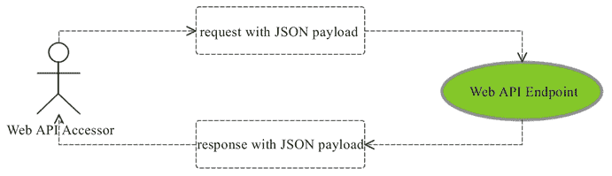
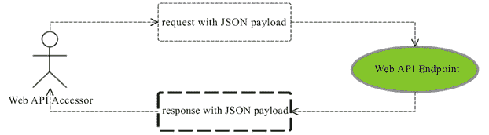

# 使用 SpringBoot 快速构建 Web API

> 原文：[`c.biancheng.net/view/4670.html`](http://c.biancheng.net/view/4670.html)

Dubbo 框架现在在国内的中小企业当中已经成为 Java 生态下服务化的事实标准，出现这种状态的原因很多，比如 Dubbo 框架设计优秀、文档和资料丰富、配置灵活、特性丰富等，但最主要的，我认为是 Java 开发人员对速度这一因素的痴迷。

不可否认，Dubbo 框架设计和实现之初就将其自身定位为一款基于 TCP 长连接通信的高性能服务治理框架，但是，对于很多中小企业来说，不管从速度还是并发度，根本就没有到非要使用像 Dubbo 这样基于 TCP 长连接服务框架的程度。

笔者认为，不分场景和现状盲目选型 Dubbo 框架，或许就是 Dubbo 框架成为 java 生态下服务治理框架事实标准的原因。

Dubbo 框架虽然有很多优点，也确实面向高强度的互联网应用场景，且在多家知名的互联网企业的生产环境得到验证，但也并非没有缺点：

*   只限于 Java 应用之间的服务调用。
*   服务访问方需要依赖 API 以及关联依赖，在很多场景下导致依赖管理混乱的问题。
*   核心项目人员转岗或者离职之后，项目不再有人专职投入维护和升级，虽然功能够用，但任何一个开源项目无推动者，无活跃社区的情况下，其生命走向只有一个，而这几乎是国内开源项目的共同宿命。

作为一名理性的研发人员，在项目技术选型的时候，需要综合考虑多种方案的优缺点，并根据现状进行权衡，实际上，对于大部分项目来说，性能可能并非技术选型的核心因素，开放和互通或许才是。

是要以互通性作为核心因素进行技术选型并构建一套开放繁荣的生态体系，还是以性能为核心因素进行技术选型构建一套封闭高效的生态体系，需要大家灵活把握，而本节我们将更多以 Web API 的形式，向大家展示如何基于 SpringBoot 构建一套开放、互通、稳定的 Web API 微服务体系。

使用 SpringBoot 构建 Web API 有几种选择，要么使用 spring-boot-starter-jersey 构建 RESTful 风格的 Web API，要么选择 spring-boot-starter-hateoas 构建更加有关联性和相对“智能”的 Web API，但笔者认为这些都有点儿“阳春白雪”。

对于大部分开发人员来说，HTTP 协议的 GET 和 POST 是直觉上最自然的选择，所以，我们选择使用最“下里巴人”的方式来构建 Web API。

Web API 强调统一和互通，所以，首先我们需要定义一套内外认知一致的 Web API 开发和访问规范，在 JSON 盛行、社群庞大的背景下，我们的 Web API 方案采用 JSON 作为数据交互格式并定义统一的协议格式，然后通过 HTTP 以及周边支持完成微服务的对外服务和开放访问。

#### 1\. 定义 Web API 规范

首先从服务访问的交互上来说，我们可以选择较为纯粹的 JSON RPC Over HTTP 的方式，如图 1 所示。
图 1  JSON RPC Over HTTP 示意图
也可以选择约束相对松一些的 RPC Over HTTP 方式，如图 2 所示。
图 2  一般意义上基于 HTTP 的 RPC 交互示意图
相对于纯粹的 JSON RPC Over HTTP 方案，后者对请求格式不做任何限制（所以也同样支持纯粹 JSON 形式的请求格式），只对响应（Response）做 JSON 格式上的统一规定。

好处是，客户端各种工具都能够很好的支持，服务器端 SpringMVC 也可以少做 HttpMessage 转换，给服务的开发者和访问者都提供了比较灵活的操作余地，至于请求的类型差异，我们可以通过配套生成的 API 文档进行补足。

不管怎么样，我们选择基于后一种方案进行说明，现在剩下的主要工作就是定义服务响应格式，只有规范和统一了服务的响应格式，才能让内部和外部的服务访问者形成统一的认知。

以上面同样的方式“复制”对我们提供的任何 Web API 的访问行为，减少用户的接入成本，所以，姑且我们简单规定一个服务的响应格式如下：

{ "code" : 1, "error" : "XXXXX", "data" : { ... }}

其中，code 表示调用结果的状态，0 表示成功，非 0 表示失败，并且失败情况下 error 字段将提供对应的错误信息描述，data 字段用于规范定义特定于 Web API 的响应内容。

有了这样的规范定义，不同的开发者就可以根据情况选择打造对应的工具或者 SDK 了。而 Web API 的服务提供者也同样可以根据该规范考虑如何简化 Web API 的开发，或者通过约束减少规范认知不足可能导致的问题。

既然是使用 SpringBoot 构建 Web API，那么显然我们现在更加关注后者。

#### 2\. 根据规范构建 Web API

针对同样的汇率查询服务，这回我们采用 Web API 的形式对外提供服务。

使用 [`start.spring.io`](http://start.spring.io) 构建新的 SpringBoot 项目，使其依赖 spring-boot-starter-web 模块：

```

<?xml version="1.0" encoding="UTF-8"?>
<project xmlns="http://maven.apache.org/POM/4.0.0"
    xmlns:xsi="http://www.w3.org/2001/XMLSchema-instance"
    xsi:schemaLocation="http://maven.apache.org/POM/4.0.0 http://maven.apache.org/xsd/maven-4.0.0.xsd">
    <modelVersion>4.0.0</modelVersion>
    <groupId>com.keevol.springboot.chapter4</groupId>
    <artifactId>currency-webapi</artifactId>
    <version>0.0.1-SNAPSHOT</version>
    <packaging>jar</packaging>
    <name>currency-webapi</name>
    <description>Demo project for Spring Boot</description>
    <parent>
        <groupId>org.springframework.boot</groupId>
        <artifactId>spring-boot-starter-parent</artifactId>
        <version>1.3.1.RELEASE</version>
        <relativePath /> <!-- lookup parent from repository -->
    </parent>
    <properties>
        <project.build.sourceEncoding>UTF-8</project.build.sourceEncoding>
        <java.version>1.8</java.version>
    </properties>
    <dependencies>
        <dependency>
            <groupId>org.springframework.boot</groupId>
            <artifactId>spring-boot-starter-web</artifactId>
        </dependency>
        <dependency>
            <groupId>com.keevol.springboot</groupId>
            <artifactId>currency-rates-service</artifactId>
            <version>1.0-SNAPSHOT</version>
        </dependency>
    </dependencies>
    <build>
        <plugins>
            <plugin>
                <groupId>org.springframework.boot</groupId>
                <artifactId>spring-boot-maven-plugin</artifactId>
            </plugin>
        </plugins>
    </build>
</project>
```

因为我们已经实现了 CurrencyRateService，所以，可以直接将其作为项目依赖的一部分（当然，这样也让我们的 Web API 看起来更像一个适配网关了）。

我们直接使用 SpringMVC 构建对应的 Controller 对外提供 Web API 的访问如下：

```

@Controller
public class CurrencyRateQueryController {
    @Autowired
    private CurrencyRateService currencyRateService;

    @RequestMapping(value = "/", method = RequestMethod.GET)
    @ResponseBody
    public ExchangeRate quote(String symbol) throws IOException {
        return currencyRateService.quote(CurrencyPair.from(symbol));
    }
}
```

spring-boot-starter-web 默认会提供一系列的 HttpMessageConverter 用于对请求参数和响应结果做类型转换。所以，ExchangeRate 类型将通过默认 HttpMessageConverter 序列中的 MappingJackson2HttpMessageConverter 转换成对应的 JSON 响应结果，类似于：

{ currencyPair: { symbol: “USD/CNY” }, bidPrice: 6.67, askPrice: 6.56} 

整个 Web API 的功能流程算是跑通了，但跟我们之前定义的 Web API 规范却没有关系，所以，下一步我们要做的事情就是在此基础上规范 HTTP 响应格式，使其遵循我们之前定义的 Web API 规范，从而任何访问我们提供的 Web API 访问者都可以相同的认知使用这些 Web API，进而也可以打造和沉淀相应的工具或者类库。

我们定义的 Web API 规范并非最优，也并非必要，如果团队成员的认知差不多，那么直接使用 HTTP Status Code 结合直接的值类型响应就可以了，我们给出的 Web API 规范考虑了更多因素后做出的一个折中方案，但任何方案设计是否完美并非最主要的，执行才是。

要开发符合我们的 Web API 规范的 Web API，最少有两种方案可以选择：

*   显式的强类型封装方式（explicit type wrapper）
*   隐式的自动转换方式（implicit conversion）

显式的强类型封装方式的出发点是说，既然 spring-boot-starter-web 已经提供了 MappingJackson2HttpMessageConverter 用于对象类型到 JSON 的类型转换，那么，我们只要提供针对 Web API 规范的 Java 对象类型作为所有 Web API 处理方法的返回值就可以了，比如：

```

public class WebApiResponse<T> {
    public static final int SUCCESS_CODE = 0;
    public static final int ERROR_CODE = 1;
    private int code;
    private String error;
    private T data;
    // getters, setters, toString(), etc.
}
```

然后，所有的 Web API 的处理方法统一定义为返回 WebApiResponse 作为结果类型：

```

@RequestMapping(value = "/", method = RequestMethod.GET)
@ResponseBody
public WebApiResponse<ExchangeRate> quote(String symbol) throws IOException {
    WebApiResponse<ExchangeRate> response = new WebApiResponse<>();
    response.setCode(WebApiResponse.SUCCESS_CODE);
    response.setData(currencyRateService.quote(CurrencyPair.from(symbol)));
    return response;
}
```

不过，这种模式过于强调规范的管控，对开发者来说不是太友好，即使我们通过 Builder 模式来简化 WebApiResponse 的构造过程，比如：

```

public class WebApiResponse<T> {
    public static final int SUCCESS_CODE = 0;
    public static final int ERROR_CODE = 1;
    private int code;
    private String error;
    private T data;

    public static <T> WebApiResponse<T> success(T data) {
        WebApiResponse<T> response = new WebApiResponse<>();
        response.setCode(SUCCESS_CODE);
        response.setData(data);
        return response;
    }

    public static <T> WebApiResponse<T> error(String errorMessage) {
        return WebApiResponse.<T>error(errorMessage, ERROR_CODE);
    }

    // ...
    @RequestMapping(value = "/", method = RequestMethod.GET)
    @ResponseBody
    public WebApiResponse<ExchangeRate> quote(String symbol) throws IOException {
        return WebApiResponse.success(currencyRateService.quote(CurrencyPair.from(symbol)));
    }
}
```

但从 API 的使用者角度来看，这种设计并非最优，最好的方式其实应该是隐式的自动转换方式。在隐式的自动转换方式下，用户的 Web API 处理方法定义保持不变，直接返回最原始的值类型（比如 ExchangeRate）：

```

@RequestMapping(value = "/", method = RequestMethod.GET)
@ResponseBody
public ExchangeRate quote(String symbol) throws IOException {
    return currencyRateService.quote(CurrencyPair.from(symbol));
}
```

通过在框架层面对原始的值类型进行符合规范行为的封装，最终返回给用户的响应结果“自动”的或者说以“不打扰 API 开发者”的形式变成了符合我们 Web API 规范的响应结果形式。

要达到隐式的自动转换方式的效果，最简单粗暴的做法就是完全覆盖 Web 应用的配置，只配置一个自定义处理 JSON 转换的 HttpMessageConverter 实现，比如：

```

public class JsonHttpMessageConverter extends AbstractHttpMessage-Converter<Object> {
    @Override
    protected boolean supports(Class<?> clazz) {
        return !clazz.isPrimitive();
    }
    @Override
    protected Object readInternal(Class<?> aClass, HttpInputMessage httpInputMessage) throws IOException, HttpMessageNotReadableException {
        return null;
    }
    @Override
    protected void writeInternal(Object o, HttpOutputMessage httpOutputMessage) throws IOException, HttpMessageNotWritableException {
        httpOutputMessage.getHeaders().add("Content-Type", "application/json");
        // 其他 header 设置
        // toJson()方法中可以使用 jackson 或者 fastjson 等类库完成对象到 json 的转换
        httpOutputMessage.getBody().write(toJson(o));
        httpOutputMessage.getBody().flush();
    }
}
```

但是，这会导致一些问题或者不便：
1）打破了 SpringBoot 对 SpringMVC 的完备支持，对于大部分已经很熟悉 SpringMVC 框架中各种功能和类库使用的读者来说，这些可能不再有效；

2）SpringBoot 提供的 spring-boot-starter-web 模块的默认配置项都不再有效，比如 SpringBoot 参考文档中的 spring.jackson.serialization.indent_output=true 之类的配置项，这显然是在舍弃已有的良好文档和功能支持；

3）因为现在只有一个 HttpMessageConverter 处理单一类型的 Web 请求和响应，如果同一项目中有类似视图渲染的需求，则无法满足需求。

所以，为了能够不打破开发者对 SpringMVC 框架以及 SpringBoot 提供的 Web 应用各项功能支持的认知，最稳妥的做法是，在 SpringBoot 原有 Web 应用默认配置的基础上增加新的 HttpMessageConverter，专门处理 Web API 响应结果使其符合我们的 Web API 规范形式。

要达到这个目的，我们可以提供自定义的配置：

```

@Configuration
public class WebApiConfiguration extends WebMvcConfigurerAdapter {
    @Override
    public void extendMessageConverters(List<HttpMessageConvert-er<?>> converters) {
        // 添加或者插入我们自定义的 HttpMessageConverter 实现类
        // converters.add(converter)或者 converters.add(0, converter)
    }
}
```

extendMessageConverters 属于已经添加过默认 HttpMessageConverter 序列的参数（比如针对 String 的 HttpMessageConverter，或者针对 byte[] 的 Http-MessageConverter 等），所以，我们只要在其基础上添加或者插入我们的 HttpMessageConverter 实现类就可以了。

不过，这里有一个比较尴尬的地方，这可能也是 Spring 框架多处设计中都存在的尴尬，即循环条件判断应用哪个类的时候，条件判断 API 开放不足：

```

for(HttpMessageConverter converter: converters){
    if(converter.canWrite(clazz, media)) {
        converter.write(..);
    }
}
```

在 HttpMessageConverter 的场景中就是，我们只能根据目标对象的类型以及 mediaType 来判断是否应该使用当前这个 HttpMessageConverter，如果需要在这两种判断条件都相同的情况下，还要根据其他条件来判定是否应该使用当前 HttpMessageConverter，此时这种设计显然就无法满足需求了。尴尬之处就在于此。

对于我们的 Web API 规范这个实现场景来说，如果想继续享受原有的 MappingJackson2HttpMessageConverter 提供的功能和配置，就不得不继承并覆写（Override）相应方法，而不是略过 MappingJackson2HttpMessageConverter，然后在另一个 HttpMessageConverter 中只是必要的时候引用它（组合优于继承）。

不管怎么样，我们推荐使用隐式的自动转换方式为用户提供透明的 Web API 规范行为。

#### 3\. Web API 的短板和补足

相对于 Dubbo 这种强类型的服务框架，Web API 有强类型支持（Not Typesafe），在开发过程中，自然也无法享受到像 IDE 自动提示之类的功能，所以，对于 Web API 的使用者来说，需要与 Web API 的提供者沟通之后才能知道如何访问 Web API 的详细信息，比如应该传哪些参数，返回的响应结果又应该是什么格式的。

为了缓解这个问题，我们可以使用自动根据代码元信息生成 API 文档的方式来补足这块短板，像 [Swagger](http://swagger.io/) 这样的项目，已经是比较成熟的 API 文档方案了。

不过，让每一个 Web API 项目都自己去初始化 API 文档相关的设置显然并不是很好的用户体验，为了服务到位，我们可以遵循 SpringBoot 的行事风格，新建一个 spring-boot-starter-webapi 这样的自动配置模块，其提供的主要特性包括但不限于：

*   提供针对我们 Web API 规范的功能支持，即提供显式的强类型封装方式或者隐式的自动转换方式的功能实现。
*   提供 API 文档相关功能的配置和设置。
*   提供统一的 Web API 访问错误处理逻辑。

这样，任何 Web API 的开发者和提供者只要新建 SpringBoot 应用，然后依赖 spring-boot-starter-webapi，就可以自动享有以上所有特性支持了。

以下是一个 spring-boot-starter-webapi 原型项目的 pom.xml 定义：

```

<?xml version="1.0" encoding="UTF-8"?>
<project xmlns="http://maven.apache.org/POM/4.0.0"
    xmlns:xsi="http://www.w3.org/2001/XMLSchema-instance"
    xsi:schemaLocation="http://maven.apache.org/POM/4.0.0 http://maven.apache.org/xsd/maven-4.0.0.xsd">
    <modelVersion>4.0.0</modelVersion>
    <parent>
        <groupId>org.springframework.boot</groupId>
        <artifactId>spring-boot-starters</artifactId>
        <version>1.2.5.RELEASE</version>
    </parent>
    <groupId>com.keevol.springboot</groupId>
    <artifactId>spring-boot-starter-webapi</artifactId>
    <version>1.0.0-SNAPSHOT</version>
    <packaging>jar</packaging>
    <name>spring-boot-starter-webapi</name>
    <url></url>
    <properties>
        <java.version>1.8</java.version>
        <file.encoding>UTF-8</file.encoding>
    </properties>
    <build>
        <plugins>
            <plugin>
                <groupId>org.apache.maven.plugins</groupId>
                <artifactId>maven-compiler-plugin</artifactId>
                <version>3.2</version>
                <configuration>
                    <source>${java.version}</source>
                    <target>${java.version}</target>
                    <encoding>${file.encoding}</encoding>
                </configuration>
            </plugin>
        </plugins>
    </build>
    <dependencies>
        <dependency>
            <groupId>org.springframework.boot</groupId>
            <artifactId>spring-boot-starter-web</artifactId>
        </dependency>
        <dependency>
            <groupId>io.springfox</groupId>
            <artifactId>springfox-swagger2</artifactId>
            <version>2.1.2</version>
        </dependency>
        <dependency>
            <groupId>io.springfox</groupId>
            <artifactId>springfox-swagger-ui</artifactId>
            <version>2.1.2</version>
        </dependency>
        <dependency>
            <groupId>javax.servlet</groupId>
            <artifactId>javax.servlet-api</artifactId>
            <version>${servlet-api.version}</version>
        </dependency>
    </dependencies>
</project>
```

以及对应的 JavaConfig 配置类示例：

```

@Configuration
@EnableSwagger2
@ComponentScan("com.wacai.springboot.webapi.errors")
@AutoConfigureAfter(WebMvcAutoConfiguration.class)
public class WebApiAutoConfiguration extends WebMvcConfigurerAdapter {
    protected Logger logger = LoggerFactory.getLogger(WebApiAuto - Configuration.class);
    @Value("${springfox.api.group:[your api group name]}")
    private String apiGroupName;
    @Value("${springfox.api.title:[set a api title via 'springfox.api.title']}")
    private String title;
    @Value("${springfox.api.description:[add your api description via 'springfox.api.description'}]")
    private String desc;
    @Value("${springfox.api.version:[set specific api version via 'springfox.api.version'}]")
    private String version;
    @Value("${springfox.api.termsOfServiceUrl:[set termsOf-ServiceUrl via 'springfox.api.termsOfServiceUrl']}")
    private String termsOfServiceUrl;
    @Value("${springfox.api.contact:[set contact via 'springfox.api.contact'}]")
    private String contact;
    @Value("${springfox.api.license:Your WebAPI License}")
    private String license;
    @Value("${springfox.api.licenseUrl:http://keevol.com}")
    private String licenseUrl;
    @Autowired
    private TypeResolver typeResolver;

    @Bean
    public Docket api() {
        return new Docket(DocumentationType.SWAGGER_2).groupName(apiGroupName)
                .apiInfo(new ApiInfo(title, desc, version, termsOf - ServiceUrl, contact, license, licenseUrl)).select()
                .apis(RequestHandlerSelectors.any()).paths(excludedPathSelector()).build().pathMapping("/")
                .directModelSubstitute(Date.class, String.class).genericModelSubstitutes(ResponseEntity.class)
                .alternateTypeRules(newRule(
                        typeResolver.resolve(DeferredResult.class,
                                typeResolver.resolve(ResponseEntity.class, WildcardType.class)),
                        typeResolver.resolve(WildcardType.class)))
                .useDefaultResponseMessages(false)
                .globalResponseMessage(RequestMethod.GET, newArrayList(new ResponseMessageBuilder().code(500)
                        .message("服务出错啦~").responseModel(new ModelRef("Error")).build()))
                .forCodeGeneration(true);
    }
    // ...
}
```

关于如何将 WebApiAutoConfiguration 配置到 META-INF/spring.factories 并发布项目则不再赘述。有了 spring-boot-starter-webapi 之后，Web API 形式的微服务开发者所要做的仅仅是把它加为项目依赖：

```

<dependency>
    <groupId>com.keevol.springboot</groupId>
    <artifactId>spring-boot-starter-webapi</artifactId>
    <version>1.0.0-SNAPSHOT</version>
</dependency>
```

然后像往常那样写 SpringMVC 的 @Controller 或者 @RestController 就可以了，现在，我们可以直接享受 API 文档的自动生成。