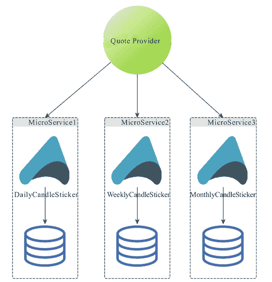

# 使用 SpringBoot 构建其他形式的微服务

> 原文：[`c.biancheng.net/view/4671.html`](http://c.biancheng.net/view/4671.html)

目前为止，我们介绍了使用 SpringBoot 开发基于 Dubbo 框架的微服务，以及使用 SpringBoot 开发 Web API 形式的微服务，貌似两种都是 RPC 形式的微服务形式，但并非所有微服务都应该是 RPC 形式的。

而且 SpringBoot 也并没有对微服务的具体服务形式进行严格规定，正如我们之前所说的那样，SpringBoot 只是提供了一种微服务的标准化实践方式而已。

区别于 RPC 形式对外提供服务的微服务，这次我们尝试开发另一种微服务，这种微服务只响应外部事件并做处理，比如在外汇交易系统或者股票交易系统中，我们可以设置一个个独立的微服务，在接收到市场行情事件或者数据的时候，构建和归档蜡烛图数据，架构设计如图 1 所示。

图 1  基于 Actor 的蜡烛图数据计算微服务示意图
不考虑泛型以及服务的通用性，我们尝试使用 akka 框架的 Actor 模型来开发一个生成日线蜡烛图的 SpringBoot 微服务。

为了简化原型实现，我们将日线蜡烛图微服务（DailyCandleSticker）抽象为两部分。

第一部分是针对市场数据来源的抽象，我们将从上游供应商处获得市场数据的行为抽象为：

```

public interface MarketDataEventSource {
    void start() throws Throwable;

    void addListner(MarketDataEventListener listner);

    void shutdown() throws Throwable;
}
```

然后根据不同的供应商以及他们使用的不同交互协议类型，提供不同的实现类，比如：

```

public class ToyMarketDataEventSource implements MarketDataEventSource {
    protected AtomicBoolean running = new AtomicBoolean(false);
    protected CopyOnWriteArrayList<MarketDataEventListener> listeners = new CopyOnWriteArrayList<>();

    @Override
    public void start() throws Throwable {
        if (running.compareAndSet(false, true)) {
            Quote quote = new Quote();
            // get quote from remote source in real situations
            for (MarketDataEventListener listener : listeners) {
                listener.onMarketData(quote) } } }

    @Override
    public void addListner(MarketDataEventListener listener) {
        listeners.add(listener);
    }

    @Override
    public void shutdown() throws Throwable {
        if (running.compareAndSet(true, false)) {
            System.out.println("clean up");
        }
    }
}
```

MarketDataEventSource 在被 start() 之前，可以向其添加一系列的市场数据监听器，用于处理市场数据，一旦 MarketDataEventSource 被 start（），则通过特定技术（比如 Server Sent Event，或者特定消息中间件，比如 Kafka）获取到的市场数据就可以传递给相应的 MarketDataEventListener 进行处理：

```

public interface MarketDataEventListener {
    void onMarketData(Quote quote) throws Throwable;
} 
```

该微服务原型代码的第二部分才是我们要演示的核心，即针对获取到的市场数据构建日线蜡烛图。我们使用 Akka 的 Actor 来构建处理单元，一个简单的定义如下：

```

class CandleSticker(symbol: String, context: ApplicationContext) extends ActorwithActorLogging {
    val candleStickRepository = context.getBean(classOf[CandleStickRepository])
    var openPrice: Option[BigDecimal] = None
    var closePrice: Option[BigDecimal] = None
    var highestPrice: Option[BigDecimal] = None
    var lowestPrice: Option[BigDecimal] = None
    override def receive = {
            case MarketOpen => {
                // do sth. on market open event if necessary
            }
            case MarketClose => {
                val candleStick = new CandleStick
                candleStick.openPrice = openPrice.get
                candleStick.closePrice = closePrice.get
                candleStick.highestPrice = highestPrice.get
                candleStick.lowestPrice = lowestPrice.get
                candleStickRepository.store(candleStick)
                resetCandleSticker()
            }
            case quote: Quote => {
                if (openPrice.isEmpty) {
                    openPrice = Some(quote.price)
                    highestPrice = openPrice lowestPrice = openPrice
                } else if (quote.price > highestPrice.get) {
                    highestPrice = Some(quote.price)
                } else {
                    // more compare and set
                }
            case _ =>
                // handle unexpected conditions
            }
            def resetCandleSticker(): Unit = ???
        }
    }
}
```

可以看到 CandleSticker 会根据接收到的不同类型的市场数据（比如 MarketOpen 和 Quote 等）做出相应的处理，并在市场关闭事件（MarketClose）到达之后，构建并存储当日的日线蜡烛图数据。

如果我们想同时使用 Actor 以及 Spring IoC，那么，我建议所有 Actor 的定义都像以上 CandleSticker 定义那样，传递 ApplicationContext 给 Actor 定义，让其使用 DL（Dependency Lookup）的模式来使用容器中提供的各种服务依赖，类似上例代码中的“val candleStickRepository=context.getBean(classOf[CandleStickRepository]))”。

主要原因在于 Actor 的生命周期是短暂而易变的，而 ApplicationContext 以及其中的各项依赖服务则不然，如果硬要使用依赖注入的方式（DI-Dependency Injection），难免有点儿“削足适履”之嫌。

当以上两部分抽象和实现都完成之后，剩下要做的，就是将这两部分通过 SpringBoot 封装到一起，下面就是我们的 SpringBoot 应用启动类：

```

@Configuration
public class CandleStickerBootstrap {
    @Bean
    public CandleStickRepository candleStickRepository() {
        return ...;
    }

    // other dependency configurations if any
    public static void main(String[] args) throws Throwable {
        ApplicationContext context = SpringApplication.run (CandleStickerBootstrap.class, args);
        final ActorSystem actorSystem = ActorSystem.apply();
        List<Object> actorArgs = new ArrayList<>();
        actorArgs.add("USD/CNY");
        actorArgs.add(context);
        final ActorRef candleSticker = actorSystem.actorOf (Props.apply(CandleSticker.class, JavaConversions.asScalaBuffer(actorArgs)));
        final MarketDataEventSource eventSource = new Market-DataEventSourceImpl();
        eventSource.addListner((Quote quote) -> candleSticker.tell(quote, ActorRef.noSender()));
        Runtime.getRuntime().addShutdownHook(new Thread() {
            @Override
            public void run() {
                try {
                    eventSource.shutdown();
                } catch (Throwable throwable) {
                    // log warnings
                }
                candleSticker.tell(PoisonPill.getInstance(), ActorRef. noSender());
                actorSystem.terminate();
            }
        });
        eventSource.start();
    }
}
```

虽然用 Java 代码来写 Akka Actor 看起来有些繁琐（使用 Scala 编写和使用 Akka Actor 要简洁的多），但不会掩盖一个标准的 SpringBoot 应用启动类的常见逻辑，我们依然是通过 SpringApplication.run 来启动当前的 SpringBoot 应用。

只不过，在日线蜡烛图微服务的场景下，SpringApplication.run 给予的唯一功能，其实只是帮忙构建了一个包含了必要服务依赖的 ApplicationContext，拿到 ApplicationContext 实例引用之后，我们要继续构建相应的 CandleSticker Actor。

然后将其作为一个 MarketDataEventListener 的处理逻辑单元与 MarketDataEventSource 挂接。然后启动 MarketDataEventSource，从而完成整个日线蜡烛图微服务的启动工作。

假如我们发现使用 Akka Actor 和 SpringBoot 的应用在 SpringApplication.run 之后存在一些共性的逻辑，也可以提供一个 CommandLineRunner 对共性逻辑进行封装，然后构建一个 spring-boot-starter-akka-actor 自动配置模块，从而造福一方。

至此，我们介绍了三种基于不同框架和技术的 SpringBoot 微服务实现，希望大家可以通过对比学习，对如何使用 SpringBoot 构建微服务有更深入的理解并付诸实践。