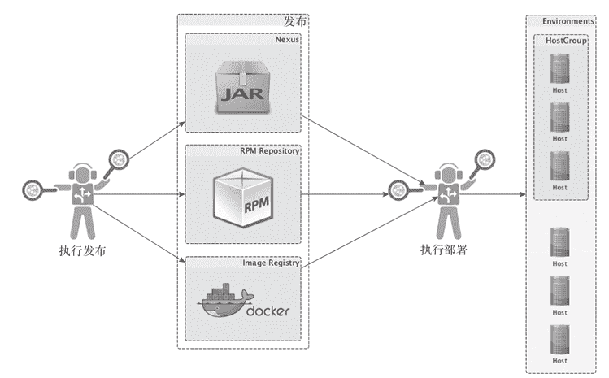
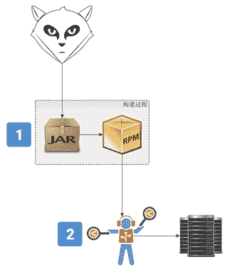
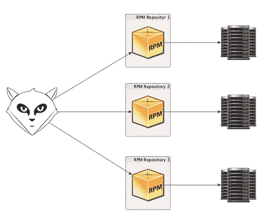
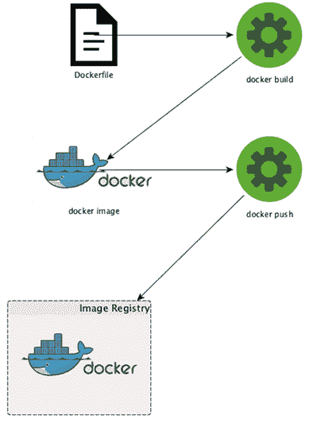
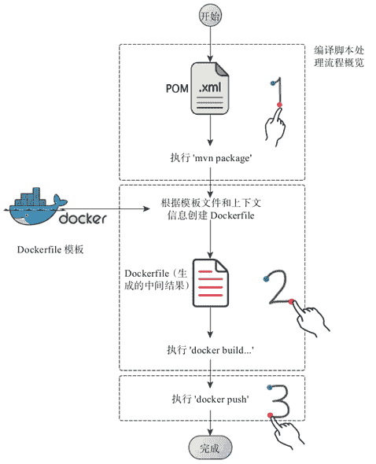

# SpringBoot 微服务的发布与部署（3 种方式）

> 原文：[`c.biancheng.net/view/4673.html`](http://c.biancheng.net/view/4673.html)

基于 SpringBoot 的微服务开发完成之后，现在到了把它们发布并部署到相应的环境去运行的时候了。

SpringBoot 框架只提供了一套基于可执行 jar 包（executable jar）格式的标准发布形式，但并没有对部署做过多的界定，而且为了简化可执行 jar 包的生成，SpringBoot 提供了相应的 Maven 项目插件：

```

<build>
    <plugins>
        <plugin>
            <groupId>org.springframework.boot</groupId>
            <artifactId>spring-boot-maven-plugin</artifactId>
        </plugin> <!-- 其他插件定义 -->
    </plugins>
</build> 
```

然后只要我们运行 mvn package，当前 SpringBoot 项目就会被打包成一个包含了其所有项目依赖以及该项目本身的可执行 jar 包，通过 scp 或者 rsync 等方式将这个可执行 jar 包部署到目标环境的服务器之后，就可以通过 java-jar your-project.jar 启动 SpringBoot 应用了。

整个流程看起来很简单，也很符合大部分开发人员的认知，但是，相对于一套较为严谨的软件交付流程来说，以上流程则难免过于粗糙了。

软件的发布和部署可以有多种不同的形式，这更多由软件项目的属性决定，比如：

*   这个项目使用的是什么语言？
*   这个项目属于类库项目还是可独立运行的项目？
*   这个项目是面向什么平台和环境的项目？

此外，我们希望使用什么样的形式进行软件的交付，这里则涉及生态管理以及技术选型的喜好等因素，所以，为了降低讲解的复杂度，我们还是先将发布和部署分开来说吧。

首先，大家应该都知道，发布并不等于部署，这是两个阶段的事情，如图 1 所示。
图 1  发布与部署示意图
发布一般是将项目以指定的格式打包成某种可直接交付的形式，然后放置到预先指定的交付地点。

比如对于 Java 类库（Java Library）来说，我们一般将其打包成 jar 包，然后 mvn deploy 到公司内部的 Maven 仓库中（Maven Repository），像 Nexus Repository Manager 或者 JFrog Artifactory 以及 Apache Archiva。

而对于可独立运行的程序，比如 SpringBoot 微服务或者一般的 Java Standalone 程序，我们既可以将它们打包成 RPM、DEB 等面向特定目标系统的发布形式，也可以将它们制作成一个个的 docker images，然后将制作完成的发布成品存储到相应的仓库中（Repository）去。

部署一般紧接着发布完成之后进行，它的主要职能就是将已经发布好的成品从仓库中拿出来，然后分发到目标环境的指定资源池（比如物理机结点，虚拟机结点，docker 宿主机等），并最终启动服务。

软件成品分发的手段和工具可以有很多种，从最常见的 scp、rsync，到 Chef、Puppet，进而再到最新的 saltstack、ansible 等，一般根据团队对这些工具的把控力度和喜好进行选型。

下面我们就几种典型的发布和部署形式跟大家一起探索相应的实践。

## spring-boot-starter 的发布与部署方式

spring-boot-starter（s）属于 Java 类库性质的组件，只被其他可独立运行的程序依赖使用，自身不可独立运行，对于这种性质的软件实体，我们一般将其发布到公司内部的软件仓库或者以开源形式发布到 Maven 的中央仓库（Maven Central Repository）。

下面我们就以 spring-boot-starter-metrics 为例，向大家展示如何将类似 spring-boot-starter-metrics 这样的 Java 类库发布到自己公司内部搭建的 Nexus 服务器上。

首先，你要有一套已经搭建完成并运行的 Nexus 服务器，然后我们需要对 spring-boot-starter-metrics 的 pom.xml 附加一点儿发布相关的内容：

```

<?xml version="1.0" encoding="UTF-8"?>
<project xmlns="http://maven.apache.org/POM/4.0.0"
    xmlns:xsi="http://www.w3.org/2001/XMLSchema-instance"
    xsi:schemaLocation="http://maven.apache.org/POM/4.0.0 http://maven.apache.org/xsd/maven-4.0.0.xsd">
    <modelVersion>4.0.0</modelVersion>
    <groupId>com.keevol</groupId>
    <artifactId>spring-boot-starter-metrics</artifactId>
    <version>0.0.1-SNAPSHOT</version>
    <packaging>jar</packaging>
    <name>spring-boot-starter-metrics</name>
    <description>auto configuration module for dropwizard metrics</description>
    <parent>
        <groupId>org.springframework.boot</groupId>
        <artifactId>spring-boot-starter-parent</artifactId>
        <version>1.3.0.RELEASE</version>
        <relativePath /> <!-- lookup parent from repository -->
    </parent>
    <distributionManagement>
        <repository>
            <id>deployment</id>
            <name>internal repository for releases</name>
            <url>http://{内部 nexus 服务器地址}/nexus/content/repositories/ releases/</url>
        </repository>
        <snapshotRepository>
            <id>deployment</id>
            <name>internal repository for snapshots</name>
            <url>http://{内部 nexus 服务器地址}/nexus/content/repositories/ snapshots/</url>
        </snapshotRepository>
    </distributionManagement>
    <properties>
        <project.build.sourceEncoding>UTF-8</project.build.sourceEncoding>
        <java.version>1.8</java.version>
        <metrics.version>3.1.2</metrics.version>
    </properties> <!--其他配置 -->
    <dependencies>
        <dependency>
            <groupId>org.springframework.boot</groupId>
            <artifactId>spring-boot-starter</artifactId>
        </dependency>
        <dependency>
            <groupId>org.springframework.boot</groupId>
            <artifactId>spring-boot-starter-aop</artifactId>
        </dependency>
        <dependency>
            <groupId>org.springframework.boot</groupId>
            <artifactId>spring-boot-starter-actuator</artifactId>
        </dependency>
        <dependency>
            <groupId>io.dropwizard.metrics</groupId>
            <artifactId>metrics-core</artifactId>
            <version>${metrics.version}</version>
        </dependency>
        <dependency>
            <groupId>io.dropwizard.metrics</groupId>
            <artifactId>metrics-annotation</artifactId>
            <version>${metrics.version}</version>
        </dependency>
        <dependency>
            <groupId>org.aspectj</groupId>
            <artifactId>aspectjrt</artifactId>
            <version>1.8.7</version>
        </dependency>
    </dependencies>
</project>
```

主要关注我们添加的 distributionManagement 相关内容，用于将我们的当前项目与内部的 Nexus 服务器进行关联，这样，就可以将当前项目不同阶段的成品（比如 SNAPSHOT 版本或者 RELEASE 版本）发布到特定的仓库路径下。

但是，只是在项目的 pom.xml 中添加 distributionManagement 相关内容还不够，对发布服务器的安全管控等敏感信息不能与 pom.xml 一同公开，所以，还需要在 ~/.m2/settings.xml 配置文件中添加 Nexus 服务器访问和认证信息：

```

<server>
    <id>deployment</id>
    <username>deployment</username>
    <password>********</password>
</server>
```

因为我们前面 distributionManagement 定义的 repository 和 snapshotRepository 的 id 都是 deployment，所以，这里的 server 的 id 也是匹配性地指定为 deployment，至于 username 和 password，则完全是我们内部的 nexus 服务器对应的安全认证用的用户名和密码啦。

将内部 Nexus 服务器的认证信息放到 maven 的 settings.xml 中并非什么好的实践，纯粹是为了便利性而牺牲安全性，二者之间需要根据情况做出权衡，如果对安全性要求比较高的公司或者组织，最好将这些认证信息移除，并只在管控的范围内使用。

比如将这些认证信息回收到发布和部署平台这一可控的小范围环境中，而所有开发人员使用的 settings.xml 属于“消毒”后无安全认证等敏感信息的版本。

当 pom.xml 中的 distributionManagement 以及 settings.xml 中对应的 server 设定都准备好之后，我们就可以直接 mvn deploy 将 spring-boot-starter-metrics 或者类似的 Java Library 项目发布到内部 Nexus 仓库了。

对于 Java 类库类型的项目来说，并无明确的部署过程，如果说有，也是存在于可独立运行项目的开发过程中，比如使用 lib 目录或者结合 Ant“部署”为项目的依赖，或者直接享受 maven、gradle、sbt 等编译工具提供的“透明”的依赖部署过程。

## 基于 RPM 的发布与部署方式

部署的目标服务器从硬件到系统软件，一般情况下都应该是尽量相同，这与软件的标准化目的相同，一个是可以减少应对不同类型实体的复杂度，另一个就是标准化硬件和软件之后，就可以通过工具批量化以“边际成本递减”近乎为 0 的做法来提升效率，减少成本。

所以，对于大部分互联网公司来说，在硬件标准化的基础上，还会使操作系统尽量统一，比如大多数都是使用稳定性和可靠性经过长期验证过的 Red Hat CentOS 系统，而 CentOS 本身经过长期的沉淀也有一套自己的系统管理工具，比如像 YUM 或者 RPM 这样的系统包依赖管理器（Debian/Ubuntu 等 Linux 发行版也有对应的 deb 形式的包管理器）。

像 RPM 这样的包管理器对系统软件包的依赖和配置提供了很好的支持，如果我们的微服务等可独立执行实体要部署到像 CentOS 这样的目标环境中，使用 RPM 完成微服务的发布和部署，对于运维人员来说几乎就是无缝衔接的。

而且，对于 SpringBoot 微服务来说，单单一个可执行的 jar 包实际上是远远无法达到发布和部署要求的，如果只是发布一个可执行的 jar 包，那就意味着在部署阶段，运维要做更多的事情来弥补某些缺失，比如：

*   启动参数是否调整？
*   配置文件是否修改？
*   安装部署结构如何规范？
*   资源的对接和映射要不要做？

但是，如果我们能够将整个软件交付体系标准化和规范化，然后通过 RPM 这样的发布形式将这些标注和规范固化到发布包中，那么，整个部署过程就可以简化为一条命令，这其实也是使用 RPM 这种系统原生包管理工具完成交付部署的好处：自动化的 orcherstration，减少不必要的人工干预中间环节。

使用 RPM 发布 SpringBoot 微服务，我们简单将这一个过程划分为几步，如图 2 所示。
图 2  使用 RPM 交付的 SpringBoot 微服务发布流程图
首先，我们需要有一个特定的编译和项目构建环境，可以不管这个编译和项目构建环境是搭建在本地（比如你的开发机上），还是搭建在特定的一台服务器上，但这个编译和项目构建环境需要安装 rpmbuild，用来构建 rpm 包。

其次，我们不推荐 RPM 编译和构建的过程使用某些定义在项目编译脚本中的插件来完成，这样会让一些通用的逻辑散落在所有需要发布的项目中而不好治理。所以，我们建议使用一个外部化的独立的编译服务器完成整个 SpringBoot 微服务的 RPM 发布和部署。

SpringBoot 微服务的 rpmbuild 脚本构建过程主要分几个主要步骤（如图 2 中 1 所标注）：

1）调用标准的 mvn package 完成可执行 jar 包的打包。

2）根据软件交付规范，构建标准发布格式的 rpm 包，如下所示：

*   使用 bin 目录存放根据脚本模板以及环境变量生成的启停脚本。
*   使用 config 目录（SpringBoot 默认文件系统中的配置目录名）或者 conf 目录存放特定的配置文件。
*   使用 docs 目录存放文档。
*   使用 agents 目录存放某些 javaagent。
*   ……

3）在标准发布格式的基础上，生成从标准发布格式到具体目标环境的映射。

比如原来应用的日志是默认打印到当前项目部署目录，而根据要求，我们希望打印到 /var/logs/{projectId}/ 或者其他服务器磁盘容量分配更大的分区，这个时候，可以在 rpmbuild 过程中指定安装类似的安装规则。

下面是一个简化的 SpringBoot 微服务的 rpmbuild 脚本定义：

Summary: metrics autoconfigure module for spring boot
applicationName: spring-boot-starter-metricsVersion: {version}Release: 1Copyright: ...Group: Applications/ProductivitySource: ...URL: ...Distribution: Vendor: KEEp eVOLution, Inc.Packager: Darren <afoo@keevol.com>%description%prep%buildgit clone ....
# 检出代码到本地 cd {project folder}mvn package ...%install%clean%files/{install_location}/{projectId}/bin/start.sh/{install_location}
/{projectId}/bin/stop.sh/{install_location}/{projectId}/agents/jolokia-jvm-1.3.1-agent.jar...%attr(755, user, group) /{install_location}/{projectId}/agents/jolokia-jvm-1.3.1-agent.jar...%doc%changelog

然后需要调用 rpmbuild 的 spec 定义完成最终 rpm 包的构建：

rpmbuild -bb {projectId}.spec#

然后 scp or sftp 生成的 rpm 包到指定的 rpm 仓库 我们可以像上面那样直接执行 rpmbuild 命令完成最终的 rpm 包构建，也可以将这些逻辑纳入编译构建脚本并部署到像 Jenkins 这样现成的持续集成服务器上，总之，执行完成后，打包好的 rpm 就发布到目标环境对应的 rpm 仓库了。

rpm 包发布到 rpm 仓库之后，就可以执行部署，比如通过 Salt 或者 ansible 在目标环境执行 rpm 或者 yum 命令，但具体的部署行为可能因为不同开发者的习惯和理念而有所不同。

有的开发者喜欢将不同目标环境的配置都一股脑地打包到发布包中，然后通过配置文件的命名和启动程序时单独指定一个环境变量来决定如何启用哪一个配置文件，对于这种做法，只需要打一个 rpm 包，同时也只需要搭建一个内部的 rpm 仓库，部署的时候，则需要运维人员根据具体的操作环境传递相应的环境变量来启停程序。

有的开发者则认为，一个软件实体发布的时候就应该是针对目标环境“装配”完备的，rpm 包中的各项配置都是针对特定目标环境配置好的，只要将 rpm 包部署到目标环境，就可以直接启动，启停完全无差别操作，唯一的差别是，rpm 包分别是根据目标环境发布和部署到不同的 rpm 仓库的，如图 3 所示。

图 3   “根据不同交付目标环境，设置不同 RPM 仓库作为交付地点”示意图
以上两种策略并无优劣之分，但却有各自适合的场景：

1）在团队小，以人为本的时候，前者更适合，原因在于，整个软件交付链路更多是通过开发人员来协调和完成的。所以，开发、测试、运维一把抓，即使是不同环境的配置文件，也都是为了开发人员方便，直接放到了项目目录下一起管理和修改。

当到了线上，开发人员同时担当运维人员的角色，启停程序的可控性也很高，所以，可以在熟知自身程序的前提下，很好地完成整个链路的工作。

2）随着团队规模的扩张，职能更加明确，交付链路要承担的关注点也更多的时候，为了保证整个软件的交付质量，需要引入规范化的流程来关联和约束整个链路上各个环节和团队之间的工作。

这个时候，开发人员的职责范围将缩小到明确的范围，测试团队、安全团队、应用运维团队等也将加入并根据流程各司其职，每个团队之间的工作需要横向关联的同时，又需要垂直隔离。

这个时候，我们就需要从交付的源头一直到发布和部署，根据环境进行隔离，每个人即使只关注自己负责的事情，也可以让整个软件交付链路很好地工作，这考虑的是规范和流程对整体粒度上的把控和支撑。

对于小团队来说，微服务并不是什么太好的选择，高内聚的应用开发和部署单元，对整个交付链路的要求没那么高，也不需要更多自动化和平台化层面的投入和支持。

而一旦你选择了微服务的软件交付策略，数量庞大的微服务治理将耗费更多资源在支撑整个交付链路的自动化和平台化建设层面。否则，如此数量上的差异化的实体管理，单纯还靠人工拼苦劳是“捞不着好果子吃的”。

所以，我们要标准化和规范化微服务的开发、交付、部署以及运维，从而收敛整条链路的治理复杂度，以近乎无差别的方式，完成各个环节上的工作。这个时候，规范、流程、平台是核心，对人的要求则适当降低。

说了这么多，其实就一点，如果团队要转向微服务的交付策略，那么，标准化、单一化的微服务发布和部署行为是大家努力的方向，虽然我们在说基于 RPM 这种特定的微服务发布和部署形式，但并不意味着我们只应该关注这一点或者这单一环节，只有系统的从整体的微服务交付链路和体系层面考虑，才能够在各个单一环节落地的时候选择合适的方案。

基于 RPM 的发布与部署方式就说这么多，希望对大家有所启发。

## 基于 Docker 的发布与部署方式

随着资源虚拟化技术的持续精进，一种基于容器（container）的方式开始风行，Docker 就属于当下这个风口上最耀眼的明星，而且，很多微服务相关的文章也是言必提 Docker，好像没有 Docker 的微服务就不是正宗的微服务了，所以，我们自然也要适当提及一下如何结合 Docker 发布和部署我们的 SpringBoot 微服务。

我们知道，RPM 包的构建是使用系统的 rpmbuild 工具完成的，该工具需要一个构建描述文件，即 .spec 文件，rpmbuild 工具读取 .spec 构建描述文件之后，根据构建描述文件生成一个 rpm 包，然后我们就可以把 rpm 包发布到相应的 RPM 仓库（RPM Repository）。

使用 Docker 其实也是类似的过程，如图 4 所示。
图 4  基于 Docker 的 SpringBoot 微服务发布流程图
我们需要提供一个 Dockerfile 用于描述 Docker 发布成品的构建过程，这类似于 rpmbuild 需要的 .spec 文件。

在编写好要使用的 Dockerfile 之后，我们使用 docker build 命令读取 Dockerfile 开始构建一个 Docker 的 image，docker build 完成 rpmbuild 类似的功能，Docker 的 image 则类似于 rpm 包，即 Docker 的软件发布成品。

有了 docker image 之后，我们就可以将其发布到一个 Docker 的 image registry，这里的 image registry 就类似于 RPM 仓库（RPM Repository），而将 docker image 发布到 image registry 的过程，可以通过 docker push 完成。

所以，假设要以 Docker 的形式发布我们的汇率查询 SpringBoot 微服务，首先需要编写一个对应的 Dockerfile 来构建相应的 docker image：

FROM java:8MAINTAINER AFOO <afoo@afoo.me>LABEL
groupId=...LABEL artifactId=...LABEL
version=...LABEL ...USER deployerEXPOSE 8080ENV
{key}={value}...VOLUME ...RUN mkdir /{group}/{projectId}/configRUN mkdir /{group}/{projectId}/agentRUN mkdir /{group}/{projectId}/docsRUN mkdir /{group}/{projectId}/libCOPY target/docker-springboot-chapter4-0.0.1-SNAPSHOT.jar /{group}/{projectId}/lib/docker-springboot-chapter4-0.0.1-SNAPSHOT.jarCOPY conf/application.properties /{group}/{projectId}/config/application.propertiesCOPY agent/jolokia-jvm-1.3.3-agent.jar /{group}/{projectId}/jolokia-jvm-1.3.3-agent.jar...ENTRYPOINT ["java", "...", "-jar", "lib/docker-springboot-chapter4-0.0.1-SNAPSHOT.jar"] 

之后，我们就可以使用这个 dockerfile 来进行构建并发布了：

$ docker build . -t "{groupId}/{artifactId}:{version}

$ docker push 基于 Docker 的微服务部署与 RPM 类似，都是从发布仓库中拉取发布的成品，并在目标环境安装部署，一般情况下我们也同样是使用 Salt 或者 Ansible 之类的工具执行如下类似的命令完成基于 Docker 的微服务的部署：

$ ansible {cluster} -m shell -a "cd /microservices/{groupId}/{artifactId}; docker pull"

为了简化基于 Docker 的发布和部署流程，实际上，以上演示的只是单人单微服务项目的方法，在讲究集团军作战的微服务场景下，我们希望的是能够快速、批量且标准化的形式完成数量巨大的微服务发布和部署。

这就要求不能只盯着单一项目内部去思考如何实现发布和部署，而应该将视线从单一项目内部抽取出来，以更高的视角来审视如何快速地完成批量微服务的发布和部署。

笔者建议的一个思路是适当地弱化 Docker 属性，将发布和部署逻辑外部化到发布脚本中。

外部化后的发布脚本将集中协调 Docker 基础设施，要发布的微服务上下文信息以及其他中间步骤，将微服务项目与 Docker 挂钩的唯一纽带也仅仅是一个模板化、标注化后的 Dockerfile，整个过程如图 5 所示。

图 5  外部化的基于 Docker 的 SpringBoot 微服务发布脚步逻辑流程图
如此一来，对于所有希望以 Docker 形式发布的标准化的微服务来说，一套发布脚本即可完成所有微服务的发布和部署，而不需要每一个微服务自己去编写 Dockerfile 甚至发布脚本。

上面的 Docker 实践并非 Docker 社区建议的最佳实践方式，这里更多只是为了简化说明和对比，Docker 背后是一套更为庞大完备的体系，比如 Docker 容器的注册和发现，容器的编排及调度等功能和系统，限于篇幅和内容定位，这里不再赘述。

总的来说，其实基于 Docker 的微服务发布和部署与其他形式从本质上来说没有太大差别，唯一的差别只是各自方案特定的实现不同而已。

大部分人选择和认同 Docker 方案，更多是从系统资源利用率以及 Docker 对整个软件交付链路的支撑体系比较完备这些角度考虑的，而微服务自身的很多特点以及需求（比如隔离、轻量），恰好与 Docker 能提供的相互吻合，或许这就是二者经常被“相提并论”的原因。

不过，对于 Java 应用和微服务来说，Docker 能给予的好处可能没有想象的那么多。