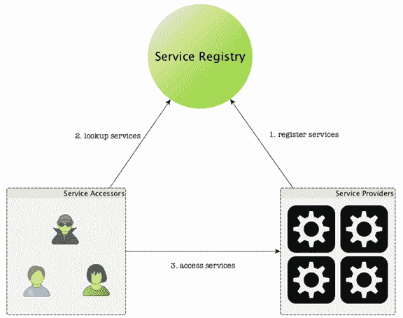
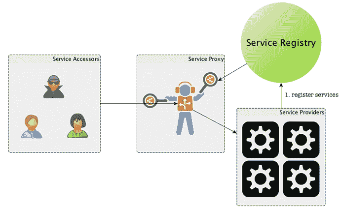

# SpringBoot 微服务的注册与发现

> 原文：[`c.biancheng.net/view/4675.html`](http://c.biancheng.net/view/4675.html)

SpringBoot 微服务部署到相应环境之后，即开始启动并对外服务。既然选择了微服务，那么就意味着很少会让某个微服务单兵作战，而是同一个微服务启动多个实例形成服务集群。

然后让服务集群作为一个逻辑服务主体提供对外服务，而构建这个逻辑服务主体的过程，就是微服务的注册过程，服务的访问者如何访问到这个逻辑服务主体的过程，则是服务发现的过程。

服务的注册与发现从结构上来说是很简单的三角关系，如图 1 所示。

图 1  服务注册与发现功能实现的典型结构图
其中，提供服务注册的服务是整个三角关系的核心，它负责登记和保存哪些服务是可以对外提供服务的，当服务访问者（Service Accessors）想要访问某个服务的时候，需要先向服务注册服务（Service Registry）询问一下：“我想访问服务 A，请问现在都有哪些服务结点提供在线的 A 服务？”，然后服务注册服务就会返回服务 A 在线的服务结点，这样服务访问者就可以根据这些服务结点的信息直接访问相应的服务了。

SpringBoot 微服务的注册与发现由 SpringBoot 微服务提供服务的方式来决定，比如，如果我们使用的是基于 Dubbo 框架的微服务实现方式，那么，我们的 SpringBoot 微服务可能采用的是基于 Redis 或者 Zookeeper 的注册与发现机制。

如果我们提供的是 Web API 形式的微服务，那么，我们的 SpringBoot 微服务采用的则更多可能是基于 DNS 的服务注册与发现机制。

虽然服务注册与发现的机制从原理上来说都是相同的，但具体实施的时候，方案上可以进行一些微调，这种微调主要以服务的发现者与服务的访问者角色和位置是否分离来区分。

一般情况下，服务的访问者同时也是服务的发现者，这通常以分布式系统的客户端为典型代表，比如 HBase 的客户端，以及 Dubbo 的客户端代理。

这种模式的典型拓扑结构是，服务的访问者同时需要了解或者持有服务发现的逻辑，从而需要根据服务的发现逻辑首先去请求注册服务获得服务提供方的相应信息，然后再使用这些信息去访问服务提供者，这种模式很常见，但从服务访问者角度来看（实际上也是产品的用户角度），这不会带来最好的产品体验。

如果我们将提供的服务也看成一种（技术）产品，那么，一种好的产品设计应该是尽量减少用户的学习成本。也就是说，服务的访问者就是产品的使用者，他们不应该也不需要了解服务端有多少服务实例，这些服务实例又是使用什么方式实现注册的。

注册之后又是通过什么方式发现这些实例并使用的，服务的访问者原始需求就一个，给我一个服务接口，我直接调用，不管你接口之后结点如何增减，部署结构如何复杂，都不需要关注，如果遵循这样的技术产品设计与实现理念，我们可以将服务的注册与发现完全屏蔽在服务端，这通常以一种服务代理的形式实现，如图 2 所示。

图 2  向用户屏蔽服务注册与发现实现细节的技术产品设计示意图
经过这样的微调之后，服务的访问者只需要与服务代理打交道，至于服务代理如何发现服务并路由服务的访问，对于服务的访问者来说都是透明的。

产品接口与产品实现要分得清楚，服务接口与服务实现也是同样的道理。原来将服务的访问与服务的发现都放在客户端的做法，我认为更多是一种偏工程师思维的实现方式，而如果我们稍微结合一些产品思维，我认为后者是一种更为合理的服务注册发现实践方式。

从这个角度来看，在服务器端，HTTP 配合 DNS 或者 DNS-SD 或许是当下最有产品“范儿”的普适方案了，像 [consul](https://www.consul.io/) 就是这种类型的服务注册与发现服务。

当然，SpringBoot 不会对任何一种服务注册与发现方案“挑食”，最终还是看大家选择的具体服务注册与发现方案是哪种，但尽量不要将实现逻辑外溢到服务、系统或者产品之外。