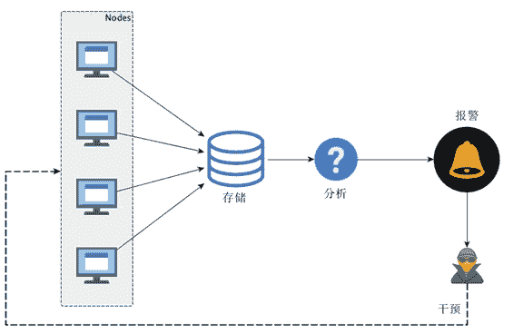
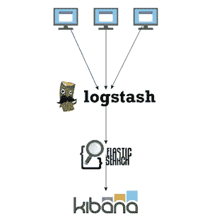
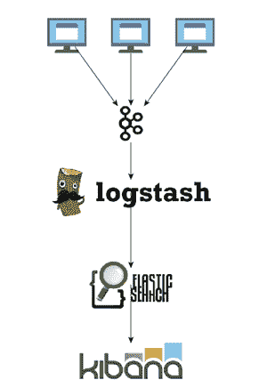
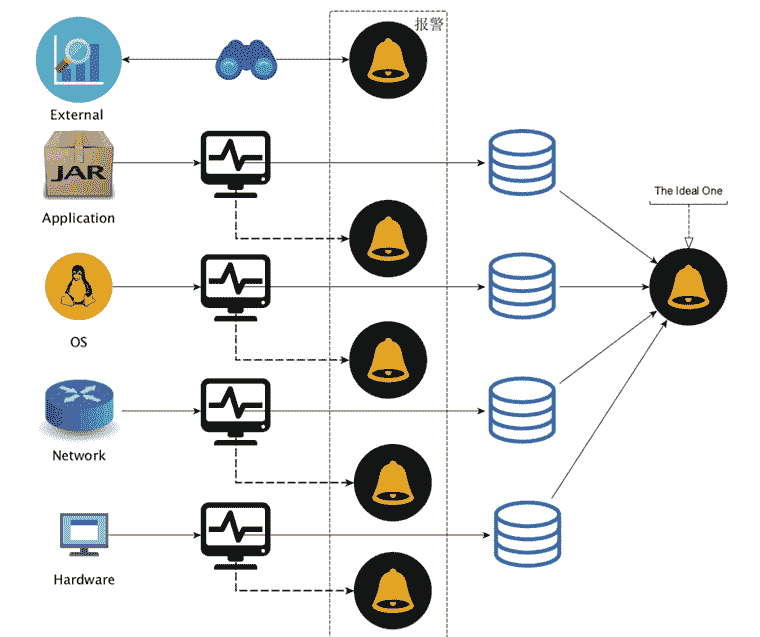

# SpringBoot 微服务的监控与运维

> 原文：[`c.biancheng.net/view/4676.html`](http://c.biancheng.net/view/4676.html)

与大部分应用和系统一样，SpringBoot 微服务的开发、发布与部署只占其生命周期的一小部分，应用和系统运维才是重中之重。而运维过程中，监控工作更是占据重要位置。

运维的目的之一是为了保证系统的平稳运行，进而保障公司业务能持续对外服务，为了达到这一目的，我们需要对系统的状态进行持续地观测，以期望一有风吹草动就能发现并作出应对，监控作为一种手段，就是以此为生。

我们会从以下多个层面对 SpringBoot 微服务进行监控：

*   硬件层面
*   网络层面
*   系统层面
*   SpringBoot 微服务的应用层面
*   服务访问层面

我们会从所有这些层面采集相应的状态数据，然后汇总，存储，并分析，一旦某项指标超出规定的阈值，则报警，在接收到报警通知之后，我们需要做出应对以改变现在系统状态不健康的局面，这一般通过预置的调控开关来调整应用状态，要么重启或者服务降级，也就是执行监控的“控”，整个过程如图 1 所示。

硬件、网络以及系统层面的监控，现有的一些监控系统和方案已经可以很好地提供支持，比如开源的 Zabbix 系统或者以报警为强项的 Nagios 系统。

本节不对这些层面的监控做过多介绍，我们将更多对 SpringBoot 微服务应用层面的监控进行实践方案的探索。SpringBoot 微服务的内部状态，通过多种方式或者渠道可以知道。

打印的应用日志是一种 SpringBoot 微服务运行状态的反映形式。

*   SpringBoot 微服务内部设置的一系列“传感器”可以为外界提供某些指标的状态数据。
*   SpringBoot 微服务内部追踪的一些 metrics 数据也是反映运行状态的一种方式。

图 1  微服务基本监控体系示意图
任何可以反映 SpringBoot 微服务运行状态的数据，对于监控来说都是十分重要的“财产”，都应该尽量采集上来进行分析，从而在分析的基础上谋求对 SpringBoot 微服务的改进。

对于应用日志来说，在单机单结点的年代，我们只要登录应用部署的服务器，然后使用 tail-f 之类的命令就可以实时地查看应用日志信息，并决定如何做出应对。

但对于 SpringBoot 微服务来说，数量上的特征已经决定了单机单结点的方法已经行不通了，如果还是一台台地去查看应用日志，我们不但会“疲于奔命”，而且还无法及时有效地发现微服务作为一个逻辑服务集群整体上的状态特征现在是什么样的，我们这时候需要的是一种集中式的日志采集、存储和分析平台。

对于 Java 开发者来说，ELK 技术栈正是为此而生的（E=ElasticSearch，L=Logstash，K=Kibana），整个功能链路如图 2 所示。
图 2  基本 ELK 技术栈功能链路示意图
不过，鉴于 ElasticSearch 对高频度的写入并没有很高的承受力，在正式的生产环境中，我们一般会采用如图 3 所示的部署结构。
图 3  生产环境典型 ELK 技术栈功能链路部署示意图
即我们使用 Kafka 作为数据采集的缓冲区，以便减轻从大量应用结点采集日志并写入 ElasticSearch 的负担。

除了应用日志，应用内置的“传感器”数据以及 metrics 度量数据也都是比较重要的状态数据，对于 Java 程序来说（当然也包括 SpringBoot 微服务），JMX 是一项标准的监控手段。

我们声称的应用内置“传感器”说白了就是一个个的 MBean。所以，我们要做的其实就是采集 SpringBoot 微服务的各种 MBean 的状态数据，然后分析或者报警。

要将集群中各个 SpringBoot 微服务的 MBean 状态数据集中采集上来，我们当然可以采用 JMX 默认的 JSR160 规范实现远程访问，而且像 Zabbix 这样的监控系统还默认提供了对 JMX 的访问支持。

但是鉴于 JMX 远程访问与防火墙之间的“纠葛”，以及 2015 年 Java 序列化漏洞暴露的不小危害，我更倾向于关闭 JMX 的远程访问，转而使用像 [Jolokia](https://jolokia.org/) 这样的方案。

Jolokia 的好处在于，它可以无侵入的方式提供一种基于 HTTP 的 JMX MBean 访问通道。而且，它的 JMX 访问协议是统一的 JSON 格式，任何遵循 Jolokia JSON 协议规范的工具都可以对 MBean 的访问结果进行处理。

对于 metrics 度量数据来说，也是一样的。我们建议使用 [dropwizard metrics](http://metrics.dropwizard.io) 来度量 SpringBoot 微服务的相应状态指标，然后通过 JMX+Jolokia 的方案统一采集并集中起来分析或者报警，从而避免多条处理链路上维护各自方案的资源投入和运维成本。

不管是应用日志，还是内置“传感器”，甚至 metrics 度量状态数据，这些反应的都是我们对 SpringBoot 微服务内部明确剖析后的感知，即以“白盒”的形式对 SpringBoot 微服务进行监控。

但是，从内部看没问题，不意味着从外部看也没有问题，毕竟，我们可以覆盖并设置很多内部指标，但永远无法通过覆盖所有的指标来反映 SpringBoot 微服务的运行状态。而且，SpringBoot 微服务并非孤立的存在，它的周边对其服务也有影响，比如网络是否通畅。

所以，要对 SpringBoot 微服务进行完备的监控，我们不但要从内部以“白盒”的形式进行监控，还需要从外部服务访问者的视角来对 SpringBoot 微服务进行模拟访问（即“黑盒”形式），从而内外兼修地构建一套针对 SpringBoot 微服务的应用监控体系。

实际上，SpringBoot 的 actuator 模块提供的健康检查（health check）功能就是一种允许以外部服务访问者的角度来监控微服务状态的现成方案。当然，更直接有效的方式则是直接发起对 SpringBoot 微服务的访问，从访问返回的结果来判断 SpringBoot 微服务整体上的运行状态是否良好。

## 推还是拉，这一直是个问题

我们发现，在各个监控层级各自的数据采集链路中，有些数据采集链路上采用数据客户端主动上报的方式（即 PUSH 方式），而有些则采用采集服务器端主动拉取的方式（即 PULL 方式）。

比如，基于 ELK 技术栈的应用日志采集采用的是基于 logstash agent 的主动推送上报应用日志到数据采集服务的方式，dropwizard metrics 库的 GraphiteReporter 或者 GangliaReporter 也是同样的道理。

而基于 JMX 或者 JMX+Jolokia 则是需要数据采集服务器端采用定时拉取（PULL）的方式采集状态或者 metrics 度量数据。至于 Zabbix，则是主动模式和被动模式都支持。

那么，到底哪一种方式更好呢？

实际上，可能这两种方式并没有好坏之分，只是两种不同的理念而已。只不过这两种理念散落到各个链路的不同地方，就会造成不小的困扰。好在，二者之间可以一定程度上适配，从而一定程度上减轻“脑裂”的痛苦。

比如，虽然 JMX 或者 JMX+Jolokia 使用采集服务器端主动拉取状态数据的方式最自然，但我们也可以在 JMX 应用端设置一个 agent，由这个 agent 来本地拉取数据并上报，从而将拉取模式（PULL）转变为推送上报模式（PUSH），进而统一各个链路的数据采集模式。

不过，在系统设计以及实现的时候，团队内部的理念最好统一，然后才能朝着一个方向使劲。其实，不管选择哪种模式，围绕这种模式构建系统和工具都能形成一套完备有效的方案，而一旦分散，则团队的技术生态体系中就会成长出实际上是完成同一目的，却要耗费双倍人力的方案。

前面我们以监控系统中服务于“监”目的的系统为例说明了两种理念下产出的不同方案，而秉承同样的两种理念，在服务于“控”目的的系统设计上，也会出现两种系统样貌。

比如，如果我们采用监控平台主动推送消息（PUSH）的方式对目标集群中的各个 SpringBoot 微服务进行行为干预，那么就需要我们的监控平台在主动推送消息这一功能上要有很强的并行执行能力，像 eBay 的 [parallec](https://github.com/eBay/parallec) 系统就是遵循这样的理念设计并实现的。

而如果我们采用 SpringBoot 微服务端自行拉取控制信息或者状态的方式来完成对 SpringBoot 微服务的控制行为，那么我们就会设计出像“配置中心”那样类似的共享状态的方案出来。

所以，推还是拉，其实一直是一个问题，这个问题不在于谁优谁劣，而在于二者无法互相理解。

## 从局部性触发式报警到系统性智能化报警

要为 SpringBoot 微服务构建一套行之有效的监控体系，报警的有效性在其中至关重要。

大部分情况下，监控体系中各个层次都各自为战，监控系统一旦接收到本层次关心的状态数据，并且发现超出了规定的阈值，就会即刻报警，如图 4 所示。

图 4  局部性触发式报警层次示意图
这种报警处理方式最大的问题就在于，它会生成很多的噪音：同一错误在多个 SpringBoot 微服务实例上报到监控系统之后，监控系统会无差别地悉数报警，而重复的报警往往会让运维或者应用负责人烦躁不已。

实际上，一种有效的报警体系应该是能够系统化地综合考虑所有监控层级的数据，然后汇总和分析，最终发出一个行之有效的报警。

我们称前一种为局部性触发式报警，而后一种叫系统性智能化报警。显然，系统性智能化报警应该是我们追求的最高目标。只有在条件有限的情况下，我们才会适当地容忍局部性触发式报警。