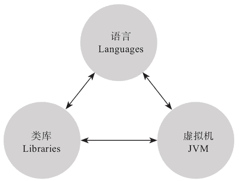

# SpringBoot 中使用 Scala 开发

> 原文：[`c.biancheng.net/view/4682.html`](http://c.biancheng.net/view/4682.html)

Java 平台拥有三驾强力马车，即语言，类库和虚拟机，如图 1 所示。
图 1  Java 平台“三驾马车”关系示意图
语言层面，Java 语言只是标配，像 Scala、Kotlin 等新生语言给了我们更多的选择，只要是可以跑在 Java 虚拟机上的语言，都可以享受到 Java 生态下的类库及框架等资源，SpringBoot 作为 Java 微服务框架，自然也可以为 Java 平台上其他语言带来微服务的暖风。

Scala 语言在业界的口碑相对比较复杂，但实际上，Scala 语言设计上的一些原则使得这门语言骨子里却是简单的，统一性的设计（Consistency Principle），使得任何一个概念实体都可以被快速复制理解和使用“学习一次，多处使用”。

比如 Collection 等对象的统一构建原则。综合了过往计算机语言设计上的思辨，Scala 语言在设计上拨开表象，直指本质，为开发者免去了很多不必要的麻烦，比如类型后置和类型推导的设计，在业界设计静态语言层面已经是蔚然趋势。

融合而不是排斥，适当妥协而不是追求纯粹，可以抓住 OOP 和 FP 的各自优势，又能够从语言的易用性和实现的复杂性上做适当的权衡，这也是这门语言让我们如此兴奋的原因之一。

接下来我们将以 Scala 语言为例，跟大家一起探索如何使用 Scala 语言和 SpringBoot 微框架来开发和交付相应的微服务。如果大家有自己更加心怡的基于 JVM 的语言，也希望大家可以举一反三，同时享受自己喜欢的语言和 SpringBoot 框架所带来的便利和乐趣。

要使用 Scala 语言开发 SpringBoot 服务，我们首先要决定的是使用什么构建工具，比如 Maven、Gradle 以及 Scala 生态下推荐的 SBT（Simple Build Tool）。

相对来说，使用 Maven 作为构建工具，使得整个 SpringBoot 微服务的开发看起来从 Java 迁移到 Scala 更为平滑，所以，我们不妨先从探索使用 Maven 构建和发布基于 SpringBoot 的 Scala 应用开始。

由于篇幅有限，我们分成以下几节对使用 Scala 语言开发 SpringBoot 服务进行详细讲解：

*   使用 Maven 构建和发布基于 SpringBoot 的 Scala 应用
*   使用 SBT 构建和发布基于 SpringBoot 的 Scala 应用