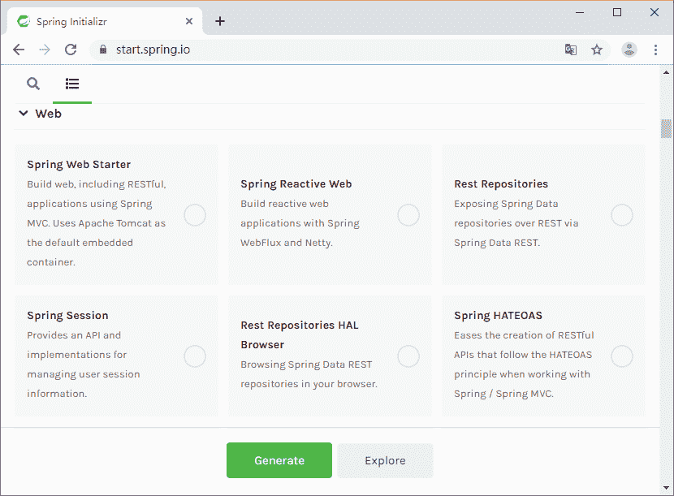

# 简化基于 Maven 的 Scala 项目创建详解

> 原文：[`c.biancheng.net/view/4684.html`](http://c.biancheng.net/view/4684.html)

使用 Maven 来构建 Scala 项目方便虽然方便，但依赖于每一个开发人员都去配置一遍项目的必要依赖，包括 Scala 插件的编译配置以及 Scala 的依赖类库，让每个人通过拷贝（Copy）之前的项目配置当然可以，但难免会出些纰漏。

而从头开始所有相关配置项都配置一遍，又略显繁琐，那么，我们可不可以想办法来进一步简化类似的基于 Maven 的 Scala 项目创建和配置？

## 使用代码片段管理工具

实际上，我们通常都会有收集的嗜好，尤其是作为一名软件开发者，都会有一套自己的代码片段管理工具或者套路，将一些常用的或者自己感觉经典的代码片段及配置内容进行摘录并保存。

现在有很多不错的代码片段管理工具，比如 Mac 系统上的 Dash（[`kapeli.com/dash`](https://kapeli.com/dash)），它可以帮助我们一站式索引技术文档并管理代码片段，有了像 Dash 这样的工具，我们就可以将基于 Maven 的 Scala 项目配置文件整理成一个代码片段（Snippet）进行管理。

然后在使用的时候直接在 Maven 的 pom.xml 中输入该代码片段的标志信息，mvn.scala.cfg`Dash 将会自动将我们配置的代码片段的内容展开并替换现有 pom.xml 的内容。

这种方法简单、快速、模板化、可重复，但只适合单一开发人员，如果一个团队或者组织内部所有人都使用这种方式，代码片段的内容同步，以及 Dash 等软件的授权等都是随之衍生出来需要进一步解决的问题。所以，为了能够使更大层面的开发者收益，我们需要寻找更加有效的方法。

## 创建 spring-boot-starter-scala 简化 Scala 依赖配置

对于基于 Maven 的 Scala 项目来说，以下依赖是必不可少的：

```

<dependency>
    <groupId>org.scala-lang</groupId>
    <artifactId>scala-library</artifactId>
    <version>${scala.version}</version>
</dependency>
<dependency>
    <groupId>org.scala-lang</groupId>
    <artifactId>scala-compiler</artifactId>
    <version>${scala.version}</version>
</dependency>
```

那么，我们可以先从这里进行简化，为了避免所有人都重复配置这部分依赖内容，可以构建一个 spring-boot-starter-scala 自动配置模块，这样，所有开发者只要在自己的项目中依赖这一个 spring-boot-starter-scala 自动配置模块就可以了。

我们依然可以通过 [`start.spring.io`](http://start.spring.io) 脚手架服务创建 spring-boot-starter-scala 项目，然后将最终的 pom.xml 配置如下：

```

<project xmlns="http://maven.apache.org/POM/4.0.0"
    xmlns:xsi="http://www.w3.org/2001/XMLSchema-instance"
    xsi:schemaLocation="http://maven.apache.org/POM/4.0.0 http://maven.apache.org/xsd/maven-4.0.0.xsd">
    <modelVersion>4.0.0</modelVersion>
    <groupId>com.keevol.springboot</groupId>
    <artifactId>spring-boot-starter-scala</artifactId>
    <version>1.0-SNAPSHOT</version>
    <packaging>jar</packaging>
    <name>spring-boot-starter-scala</name>
    <url>http://maven.apache.org</url>
    <properties>
        <project.build.sourceEncoding>UTF-8</project.build.sourceEncoding>
        <java.version>1.8</java.version>
        <scala.version>2.11.7</scala.version>
        <scala.maven.version>3.2.2</scala.maven.version>
    </properties>
    <build>
        <plugins>
            <plugin>
                <groupId>net.alchim31.maven</groupId>
                <artifactId>scala-maven-plugin</artifactId>
                <version>${scala.maven.version}</version>
                <executions>
                    <execution>
                        <id>compile-scala</id>
                        <phase>compile</phase>
                        <goals>
                            <goal>add-source</goal>
                            <goal>compile</goal>
                        </goals>
                    </execution>
                    <execution>
                        <id>test-compile-scala</id>
                        <phase>test-compile</phase>
                        <goals>
                            <goal>add-source</goal>
                            <goal>testCompile</goal>
                        </goals>
                    </execution>
                </executions>
                <configuration>
                    <recompileMode>incremental</recompileMode>
                    <scalaVersion>${scala.version}</scalaVersion>
                    <args>
                        <arg>-deprecation</arg>
                    </args>
                    <jvmArgs>
                        <jvmArg>-Xms64m</jvmArg>
                        <jvmArg>-Xmx1024m</jvmArg>
                    </jvmArgs>
                </configuration>
            </plugin>
        </plugins>
    </build>
    <dependencies>
        <dependency>
            <groupId>org.scala-lang</groupId>
            <artifactId>scala-library</artifactId>
            <version>${scala.version}</version>
        </dependency>
        <dependency>
            <groupId>org.scala-lang</groupId>
            <artifactId>scala-compiler</artifactId>
            <version>${scala.version}</version>
        </dependency>
    </dependencies>
</project>
```

然后通过 mvn install 或者 mvn deploy 将其发布。

现在，创建任何一个基于 Maven 的 Scala 项目时，pom.xml 配置内容就可以简化如下：

```

<project xmlns="http://maven.apache.org/POM/4.0.0"
    xmlns:xsi="http://www.w3.org/2001/XMLSchema-instance"
    xsi:schemaLocation="http://maven.apache.org/POM/4.0.0 http://maven.apache.org/xsd/maven-4.0.0.xsd">
    <modelVersion>4.0.0</modelVersion>
    <groupId>com.keevol.springboot</groupId>
    <artifactId>spring-boot-starter-scala-user</artifactId>
    <version>1.0-SNAPSHOT</version>
    <packaging>jar</packaging>
    <name>spring-boot-starter-scala-user</name>
    <url>http://maven.apache.org</url>
    <dependencies>
        <dependency>
            <groupId>com.keevol.springboot</groupId>
            <artifactId>spring-boot-starter-scala</artifactId>
            <version>1.0-SNAPSHOT</version>
        </dependency>
    </dependencies>
</project>
```

是不是更加简洁和方便了？但是，等一下，如果大家都这样认为，那就有问题了。

实际上，这样的做法是行不通的，Maven 项目的依赖可以传递依赖（Transitive dependency），但是插件（Plugin）却不行。如果我们真得在前面的项目配置上进行工作的话，spring-boot-starter-scala-user 可以编译成功，可以打包成功，可以发布成功，但是，在整个过程中 Maven 无法识别 Scala 代码。

所以，如果要让基于 spring-boot-starter-scala 的想法可以实现，我们需要将 scala-maven-plugin 从 spring-boot-starter-scala 项目中移到 spring-boot-starter-scala-user 项目。

spring-boot-starter-scala 项目的配置现如下：

```

<project xmlns="http://maven.apache.org/POM/4.0.0"
    xmlns:xsi="http://www.w3.org/2001/XMLSchema-instance"
    xsi:schemaLocation="http://maven.apache.org/POM/4.0.0 http://maven.apache.org/xsd/maven-4.0.0.xsd">
    <modelVersion>4.0.0</modelVersion>
    <groupId>com.keevol.springboot</groupId>
    <artifactId>spring-boot-starter-scala</artifactId>
    <version>1.0-SNAPSHOT</version>
    <packaging>jar</packaging>
    <name>spring-boot-starter-scala</name>
    <url>http://maven.apache.org</url>
    <properties>
        <scala.version>2.11.7</scala.version>
    </properties>
    <dependencies>
        <dependency>
            <groupId>org.scala-lang</groupId>
            <artifactId>scala-library</artifactId>
            <version>${scala.version}</version>
        </dependency>
        <dependency>
            <groupId>org.scala-lang</groupId>
            <artifactId>scala-compiler</artifactId>
            <version>${scala.version}</version>
        </dependency>
    </dependencies>
</project>
```

spring-boot-starter-scala-user 的项目配置则如下：

```

<project xmlns="http://maven.apache.org/POM/4.0.0"
    xmlns:xsi="http://www.w3.org/2001/XMLSchema-instance"
    xsi:schemaLocation="http://maven.apache.org/POM/4.0.0 http://maven.apache.org/xsd/maven-4.0.0.xsd">
    <modelVersion>4.0.0</modelVersion>
    <groupId>com.keevol.springboot</groupId>
    <artifactId>spring-boot-starter-scala-user</artifactId>
    <version>1.0-SNAPSHOT</version>
    <packaging>jar</packaging>
    <name>spring-boot-starter-scala-user</name>
    <url>http://maven.apache.org</url>
    <properties>
        <project.build.sourceEncoding>UTF-8</project.build.sourceEncoding>
        <java.version>1.8</java.version>
        <scala.version>2.11.7</scala.version>
        <scala.maven.version>3.2.2</scala.maven.version>
    </properties>
    <build>
        <plugins>
            <plugin>
                <groupId>net.alchim31.maven</groupId>
                <artifactId>scala-maven-plugin</artifactId>
                <version>${scala.maven.version}</version>
                <executions>
                    <execution>
                        <id>compile-scala</id>
                        <phase>compile</phase>
                        <goals>
                            <goal>add-source</goal>
                            <goal>compile</goal>
                        </goals>
                    </execution>
                    <execution>
                        <id>test-compile-scala</id>
                        <phase>test-compile</phase>
                        <goals>
                            <goal>add-source</goal>
                            <goal>testCompile</goal>
                        </goals>
                    </execution>
                </executions>
                <configuration>
                    <recompileMode>incremental</recompileMode>
                    <scalaVersion>${scala.version}</scalaVersion>
                    <args>
                        <arg>-deprecation</arg>
                    </args>
                    <jvmArgs>
                        <jvmArg>-Xms64m</jvmArg>
                        <jvmArg>-Xmx1024m</jvmArg>
                    </jvmArgs>
                </configuration>
            </plugin>
        </plugins>
    </build>
    <dependencies>
        <dependency>
            <groupId>com.keevol.springboot</groupId>
            <artifactId>spring-boot-starter-scala</artifactId>
            <version>1.0-SNAPSHOT</version>
        </dependency>
    </dependencies>
</project> 
```

现在看来，spring-boot-starter-scala 只是帮助我们简化了依赖管理，但对于 Scala 编译插件相关的简化则于事无补，像 spring-boot-starter-scala-user 这样的一大批基于 Maven 的 Scala 项目还是要一遍一遍地配置 Scala 编译插件相关内容。

不过，如果我们暂时能够忍受每个项目自己配置 Scala 编译插件的话（个人、小团队一般可以甚至也愿意），可以先进一步简化依赖 spring-boot-starter-scala 项目的 SpringBoot 微服务项目的创建。

我们经常用的 [`start.spring.io`](http://start.spring.io) 它罗列了很多现有的 spring-boot-starter 自动配置模块供我们在创建 SpringBoot 项目的时候使用，如图 1 所示。


图 1  SPRING INITIALIZR 自动配置模块可用列表示意图
如果将我们的 spring-boot-starter-scala 也加入进去，大家在创建项目的时候就可以不用配置 pom.xml 吗？

部署在 [`start.spring.io`](http://start.spring.io) 的 SPRING INITIALIZR 项目服务实例我们是无权变更的，不过，我们可以在自己的公司或者组织内部搭建一个私有的 SPRING INITIALIZR 服务实例。

教程前面也跟大家提到过，只要到 [`github.com/spring-io/initializr`](https://github.com/spring-io/initializr) 获取项目然后部署到自己的服务，然后根据 [`github.com/spring-io/initializr#running-your-own-instance`](https://github.com/spring-io/initializr#running-your-own-instance) 的说明启动服务即可。

要将我们的 spring-boot-starter-scala 加入 SPRING INITIALIZR 的自动配置模块选择列表，需要先对自有的 SPRING INITIALIZR 实例进行一定的配置。

使用任何自己喜欢的文本编辑器打开 application.yml 配置文件（位于 {SPRING INITIALIZR 根目录}/initializr-service/），然后在 dependencies 部分的末尾添加如下配置内容：

```

dependencies:
- name: Core content:
- name: Security id: security
description: Secure your application via
spring-security weight: 100
-name: AOP id: aop description: Aspect-oriented programming including
spring-aop and AspectJ ...
- name: Ops content:
- name: Actuator id:
actuator description: Production ready features to
help you monitor and
manage your application ...
- name: Scala content:
- name: Scala id: scala
description: API documentation for the Actuator
endpoints repository:
local-repo groupId: com.wacai.springboot
artifactId:
spring-boot-starter-scala version: 0.0.1-SNAPSHOT
```

我们添加了一个名为 Scala 的展示配置区块，然后将 spring-boot-starter-scala 作为配置内容配置其中。

但这还不够，我们还需要告诉 SPRING INITIALIZR，当用户选择了 spring-boot-starter-scala 之后，在生成项目时，需要到哪里获取这个依赖，既然我们明确指定了 repository：local-repo，那么，就要配置一下这个名字为 local-repo 的仓库，让 SPRING INITIALIZR 知道这个 local-repo。

在 application.yml 配置文件中的 initializr->env 部分添加一个 repositories 相关配置如下：

initializr: env: boms: vaadin-bom: groupId: com.vaadin artifactId: vaadin-bom
version: 7.5.5 cloud-bom: groupId: org.springframework.cloud ...
repositories: local-repo: name: local-maven-repo
url: file:///Users/fujohnwang/.m2 snapshotsEnabled: true 

我们添加了 local-repo 指向笔者工作机本地的 maven 仓库地址，大家也可以将自己公司或者组织内部私有 maven 仓库也添加进来。

实际上，在配置 dependenies 的时候，并不一定要配置 repository：local-repo，这里纯粹是为了让大家了解这部分配置的更多信息。

关于 SPRING INITIALIZR 的更多配置详细说明，可以参考 [`github.com/spring-io/initializr/wiki/Configuration-format`](https://github.com/spring-io/initializr/wiki/Configuration-format)。

以上所有配置完备后，直接在 {SPRING INITIALIZR 根目录}/initializr-service/ 下执行 spring run app.groovy 并最终启动 SPRING INITIALIZR，现在，访问 SPRING INITIALIZR 的服务地址就可以看到我们的最终成果了。

只要选择并单击生成项目之后，最终获得的项目配置中就已经自动获得了 spring-boot-starter-scala 的配置，配置代码如下所示。

<dependency>
    <groupId>com.wacai.springboot</groupId>
    <artifactId>spring-boot-starter-scala</artifactId>
    <version>0.0.1-SNAPSHOT</version>
</dependency>

关于基于 Maven 的 Scala 项目的依赖治理以及 spring-boot-starter-scala，我们暂时就介绍到这里。虽然我们在依赖治理和工具的覆盖度、易用度层面做出了很好的探索，但依然没有简化 Scala 编译插件配置的繁琐操作，大家还需要继续努力。

## 创建公司和组织级别的 Scala 项目的 parent pom

目前为止，Scala 相关的依赖管理已经比较令人满意了，现在，我们只要主攻如何简化 Scala 编译插件配置的简化就可以了。

好消息就是，Maven 的插件（Plugins）虽然不能通过组合的方式重用，但可以通过继承的方式搞定，所以，我们可以构建一个公司或者组织级别 Maven 项目的 parent pom 专门用于基于 Maven 的 Scala 项目。

下面是我们的示例项目，只有一个 pom.xml 定义：

```

<project xmlns="http://maven.apache.org/POM/4.0.0"
    xmlns:xsi="http://www.w3.org/2001/XMLSchema-instance"
    xsi:schemaLocation="http://maven.apache.org/POM/4.0.0 http://maven.apache.org/xsd/maven-4.0.0.xsd">
    <modelVersion>4.0.0</modelVersion>
    <parent>
        <groupId>org.springframework.boot</groupId>
        <artifactId>spring-boot-starter-parent</artifactId>
        <version>1.3.2.RELEASE</version>
        <relativePath />
    </parent>
    <groupId>com.keevol.maven</groupId>
    <artifactId>scala-parent</artifactId>
    <version>0.0.1-SNAPSHOT</version>
    <packaging>pom</packaging>
    <name>scala-parent</name>
    <url>http://maven.apache.org</url>
    <properties>
        <project.build.sourceEncoding>UTF-8</project.build.sourceEncoding>
        <java.version>1.8</java.version>
        <scala.version>2.11.7</scala.version>
        <scala.maven.version>3.2.2</scala.maven.version>
    </properties>
    <build>
        <plugins>
            <plugin>
                <groupId>net.alchim31.maven</groupId>
                <artifactId>scala-maven-plugin</artifactId>
                <version>${scala.maven.version}</version>
                <executions>
                    <execution>
                        <id>compile-scala</id>
                        <phase>compile</phase>
                        <goals>
                            <goal>add-source</goal>
                            <goal>compile</goal>
                        </goals>
                    </execution>
                    <execution>
                        <id>test-compile-scala</id>
                        <phase>test-compile</phase>
                        <goals>
                            <goal>add-source</goal>
                            <goal>testCompile</goal>
                        </goals>
                    </execution>
                </executions>
                <configuration>
                    <recompileMode>incremental</recompileMode>
                    <scalaVersion>${scala.version}</scalaVersion>
                    <args>
                        <arg>-deprecation</arg>
                    </args>
                    <jvmArgs>
                        <jvmArg>-Xms64m</jvmArg>
                        <jvmArg>-Xmx1024m</jvmArg>
                    </jvmArgs>
                </configuration>
            </plugin>
        </plugins>
    </build>
    <dependencies>
        <dependency>
            <groupId>org.scala-lang</groupId>
            <artifactId>scala-library</artifactId>
            <version>${scala.version}</version>
        </dependency>
        <dependency>
            <groupId>org.scala-lang</groupId>
            <artifactId>scala-compiler</artifactId>
            <version>${scala.version}</version>
        </dependency>
    </dependencies>
</project> 
```

这个用作父项目（parent）的 maven 项目，其 pom.xml 的定义中将 Scala 编译插件（scala-maven-plugin）的配置以及 Scala 相关类库的依赖配置都囊括在内，这样，所有继承了这个父项目的子项目就都可以直接享受这些配置，而不用自己再去一一进行配置了，比如：

```

<project xmlns="http://maven.apache.org/POM/4.0.0"
    xmlns:xsi="http://www.w3.org/2001/XMLSchema-instance"
    xsi:schemaLocation="http://maven.apache.org/POM/4.0.0 http://maven.apache.org/xsd/maven-4.0.0.xsd">
    <modelVersion>4.0.0</modelVersion>
    <parent>
        <groupId>com.keevol.maven</groupId>
        <artifactId>scala-parent</artifactId>
        <version>0.0.1-SNAPSHOT</version>
    </parent>
    <groupId>com.keevol.maven</groupId>
    <artifactId>scala-parent-user</artifactId>
    <version>1.0-SNAPSHOT</version>
    <packaging>jar</packaging>
    <name>scala-parent-user</name>
    <url>http://maven.apache.org</url>
    <properties>
        <project.build.sourceEncoding>UTF-8</project.build.sourceEncoding>
    </properties>
    <dependencies>
        <dependency>
            <groupId>junit</groupId>
            <artifactId>junit</artifactId>
            <version>3.8.1</version>
            <scope>test</scope>
        </dependency>
    </dependencies>
</project>
```

父项目的 packaging 类型为 pom，而不是一般的 jar 或者 war 等。

## 使用 Maven Archetype 简化项目创建

不管是使用什么语言开发，创建项目都是一个永恒的主题，作为一线的开发工程师和领导者们往往也会为团队内部创建项目的千差万别而头疼，所以，脚手架（Scaffording）工具就成了研发体系中必要的一员。

如果我们紧盯和继续挖掘 Maven 的潜力，除了使用前面提到的那些方法，Maven 的 Archetype 功能也是一种可以帮助我们简化 Scala 项目创建的方案。

我们可以遵循 Maven 的 Archetype 规范创建一个 Scala 的模板项目（其实就是一个脚手架项目），然后将所有 Scala 项目相关的配置以及代码等都放到这个模板项目中，当每个开发者希望创建一个 Scala 项目时，只要使用这个 Scala 的 Archetype 项目创建一个模板项目出来就可以直接开发了。

创建 Maven Archetype 项目有两种方式：

*   根据 Maven Archetype 项目规范从零开始创建项目。
*   在一个现有的项目的基础上创建 Maven Archetype 项目。

鉴于我们已经有了好几个可以作为规范或者“模范”使用的 Maven 的 Scala 项目，从零开始创建一个 Archetype 就没有必要了，我们选择第二种方式，即在现有项目的基础上创建我们的 Maven Archetype 项目。

我们选择 currency-webapi-with-scala 项目作为模板项目用来创建 Archetype，然后再在生成的 Archetype 项目的基础上进行裁剪，最终获得一个理想的 Archetype。

首先，到 currency-webapi-with-scala 项目下执行 mvn archetype：create-from-project 命令，这将在项目的 target/generated-sources/archetype/ 目录下生成一个“草稿”版的 Archetype 项目，我们将在这个“草稿”版的 Archetype 项目基础上进行一定的裁剪。

我们可以对项目根目录下的 pom.xml 中的必要信息进行修改，比如 groupId、artifactId、developers 等，这些都是将来我们引用这个 Archeteype 项目创建项目时所关心的信息。但使用 Archetype 项目创建出来的 Maven 项目会有哪些内容，则是由 Archetype 项目 src 下的内容决定的。

src/main/resources/archetype-resources 目录下的内容大体上认为就是生成目标项目的时候，生成的目标项目会拥有的东西，没做裁剪之前，这些内容都是根据 currency-webapi-with-scala 的内容“拷贝（Copy）”过来的，我们会对这个符合 Maven 项目结构目录下的内容进行裁剪。

比如删除 currency-webapi.iml 等 IDE 相关元信息文件，添加 .gitignore 等必要元信息文件等。src/main/resources/META-INF/maven/archetype-metadata.xml 文件是进一步细化裁剪规则的配置文件。

以上裁剪完成后，我们执行如下命令完成最终的 Archetype 项目的发布：

$ cd target/generated-sources/archetype/ $ mvn install 或者 mvn deploy 现在，要创建一个基于 Maven 的 Scala 项目，我们只要执行如下命令即可：

```

mvn archetype:generate -DarchetypeGroupId=com.mengma.springboot
-DarchetypeArtifactId=currency-webapi-with-scala-archetype
-DarchetypeVersion=0.0.1-SNAPSHOT
-DgroupId=com.keevol.springboot
-DartifactId=new-scala-project-name
-Dversion=0.0.1-SNAPSHOT
```

以上命令执行完成后，在当前目录下会创建一个 new-scala-project-name 的目录，这就是一个完整的符合我们之前裁剪设定的基于 Maven 的 Scala 项目。

现在，团队或者公司内任何一个开发者想要创建一个基于 Maven 的 Scala 项目，只要执行以上类似的一条 mvn archetype：generate 命令就可以了。