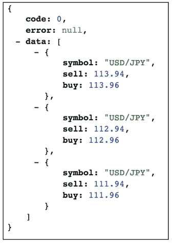

# 简化基于 Scala 的 Web API 开发

> 原文：[`c.biancheng.net/view/4690.html`](http://c.biancheng.net/view/4690.html)

虽然说使用 Scala 语言的语法来写 SpringBoot 微服务已经可以让 Scala 开发者们兴奋不已了，但说实话，这并没有很大程度上发挥二者各自的最大威力。

单向上来讲，从 SpringBoot 微框架出发，Java、Scala 等 Java 虚拟机上的语言都会收益，这只是发挥了 SpringBoot 微框架的最大效能。但反过来，从 Scala 出发，使用 SpringBoot 微框架又会让 Scala 开发者受到一些束缚。

比如像 case class 这样的 Scala 语言特性为了避免序列化兼容性等问题，我们一般不建议使用，但这确是 Scala 提供的最迷人的装备之一，另外，Scala 依赖 Java 的各项生态是很融洽的，但反过来又会因为二进制兼容性等问题感觉如芒在背。

不过，某些特殊的场景下，我们还是可以为 SpringBoot 和 Scala 找到比较恰当的契合点，Web API 就是这样的场景之一。

1）使用 SpringBoot 开发的 Web API 作为微服务独立部署，属于 Endpoints 类型的应用，这种类型的应用因为独立部署和运行，所以可以最大程度上容忍各种兼容性和复杂的“文化理念”，反正有冲突 Endpoint 内部解决，不会外溢到外面给别人带来麻烦。

这不同于类库之类的依赖型（Dependencies）软件实体，它们更多偏组件性质，不能独立“存活”，需要“寄人篱下”，所以，如果它们有一堆自己的关联依赖，那么，就会带来更多兼容性以及冲突解决的负担。所以，作为 Endpoint 类型软件实体的 Web API 微服务，使用 Scala 是可以容忍 Scala 在依赖重和兼容性层面的“缺点”。

2）Web API 对外提供给用户的 API 接口是弱类型的，所以，我们在实现 Web API 期间即使使用各种强类型的对象和语言，其实对用户来说是无感知的，只要做好强类型数据对象和弱类型 API 之间的适配和转换，使用 Scala 的各种语言特性必然无虞。

所以，基于以上两点考虑，我们可以在使用 SpringBoot 开发 Web API 的时候进一步深入使用 Scala 语言的一些特性。

鉴于我们已经实现了一个 spring-boot-starter-webapi 的自动配置模块用于简化 Web API 的开发，要进一步为 Scala 在此场景开辟捷径，只要在原有 spring-boot-starter-webapi 的基础上添加 Scala 特定的一些支持，就可以很大程度上简化基于 SpringBoot 和 Scala 的 Web API 开发。

所以，我们决定创建 spring-boot-starter-webapi-scala 自动配置模块项目，该项目在享有原来 Web API 规范以及 API 文档的支持的同时，将进一步强化在使用 Scala 开发 Web API 的过程中使用 Scala 原生类型（比如 case class）作为数据对象的支持，尤其是 Scala 原生类型的序列化以及 Java 和 Scala 混合类型的序列化。

因为我们的 Web API 最终都是以 JSON 的形式来提供 API 的数据交互，所以，spring-boot-starter-webapi-scala 自动配置模块的主要一个新加功能就是加强 Scala 原生类型和混合类型的 JSON 序列化支持。

基本上，我们会沿用 SpringBoot 在 Web 层 JSON 序列化默认方案上 Jackson 的选型，进一步依赖其 jackson-module-scala（[`github.com/FasterXML/jackson-module-scala`](https://github.com/FasterXML/jackson-module-scala)）来完成特定于 Scala 对象类型的 JSON 序列化工作。

依然基于 http://start.spring.io 创建我们的 spring-boot-starter-webapi-scala 项目，然后在原有脚手架项目的基础上进行配置裁剪和补足，最终完成项目的 pom.xml 内容类似于：

```

<?xml version="1.0" encoding="UTF-8"?>
<project xmlns="http://maven.apache.org/POM/4.0.0"
    xmlns:xsi="http://www.w3.org/2001/XMLSchema-instance"
    xsi:schemaLocation="http://maven.apache.org/POM/4.0.0 http://maven.apache.org/xsd/maven-4.0.0.xsd">
    <modelVersion>4.0.0</modelVersion>
    <groupId>com.keevol.springboot</groupId>
    <artifactId>spring-boot-starter-webapi-scala</artifactId>
    <version>0.0.1-SNAPSHOT</version>
    <packaging>jar</packaging>
    <name>spring-boot-starter-webapi-scala</name>
    <description>web api boot starter for scala</description>
    <parent>
        <groupId>org.springframework.boot</groupId>
        <artifactId>spring-boot-starter-parent</artifactId>
        <version>1.3.3.RELEASE</version>
        <relativePath /> <!-- lookup parent from repository -->
    </parent>
    <properties>
        <project.build.sourceEncoding>UTF-8</project.build.sourceEncoding>
        <java.version>1.8</java.version>
        <scala.version>2.11.7</scala.version>
        <scala.maven.version>3.2.2</scala.maven.version>
    </properties>
    <dependencies>
        <dependency>
            <groupId>org.springframework.boot</groupId>
            <artifactId>spring-boot-starter-web</artifactId>
        </dependency>
        <dependency>
            <groupId>com.keevol.springboot</groupId>
            <artifactId>spring-boot-starter-webapi</artifactId>
            <version>1.0.0</version>
        </dependency>
        <dependency>
            <groupId>org.scala-lang</groupId>
            <artifactId>scala-library</artifactId>
            <version>${scala.version}</version>
        </dependency>
        <dependency>
            <groupId>org.scala-lang</groupId>
            <artifactId>scala-compiler</artifactId>
            <version>${scala.version}</version>
        </dependency>
        <dependency>
            <groupId>com.fasterxml.jackson.module</groupId>
            <artifactId>jackson-module-scala_2.11</artifactId>
            <version>2.6.3</version>
        </dependency>
        <dependency>
            <groupId>com.fasterxml.jackson.module</groupId>
            <artifactId>jackson-module-paranamer</artifactId>
            <version>2.7.1</version>
        </dependency>
    </dependencies>
    <build>
        <plugins>
            <plugin>
                <groupId>org.springframework.boot</groupId>
                <artifactId>spring-boot-maven-plugin</artifactId>
            </plugin>
        </plugins>
    </build>
</project>
```

当前 pom.xml 中有几点内容需要大家重点关注：

*   添加了原来的 spring-boot-starter-webapi 自动配置模块依赖，目的是继续享有其对 Web API 规范以及 API 文档等功能的支持。
*   添加了针对 scala-library 和 scala-compiler 的依赖，毕竟这是为 Scala 项目服务的一个自动配置模块项目，这里配置了，所有使用 Scala 开发 Web API 的项目就不需要再逐一配置了。
*   添加了针对 jackson-module-scala 和 jackson-module-paranamer 的依赖，主要目的是强化针对 Scala 原生类型和混合数据类型到 JSON 序列化支持。

暂时我们不需要提供更多的功能支持，所以，只要通过 mvn install 或者 mvn deploy 将我们的 spring-boot-starter-webapi-scala 项目发布之后就可以供相关开发者使用了。

如果我们对原来实现汇率查询用的 Web API 进行重构，现在的 Maven 构建文件 pom.xml 可以直接简化成如下形式：

```

<?xml version="1.0" encoding="UTF-8"?>
<project xmlns="http://maven.apache.org/POM/4.0.0"
    xmlns:xsi="http://www.w3.org/2001/XMLSchema-instance"
    xsi:schemaLocation="http://maven.apache.org/POM/4.0.0 http://maven.apache.org/xsd/maven-4.0.0.xsd">
    <modelVersion>4.0.0</modelVersion>
    <groupId>com.keevol.springboot.chapter5</groupId>
    <artifactId>currency-webapi-with-scala</artifactId>
    <version>0.0.1-SNAPSHOT</version>
    <packaging>jar</packaging>
    <name>currency-webapi-with-scala</name>
    <description>Demo project for Spring Boot</description>
    <parent>
        <groupId>org.springframework.boot</groupId>
        <artifactId>spring-boot-starter-parent</artifactId>
        <version>1.3.1.RELEASE</version>
        <relativePath /> <!-- lookup parent from repository -->
    </parent>
    <properties>
        <project.build.sourceEncoding>UTF-8</project.build.sourceEncoding>
        <java.version>1.8</java.version>
        <scala.version>2.11.7</scala.version>
    </properties>
    <dependencies>
        <dependency>
            <groupId>com.keevol.springboot</groupId>
            <artifactId>currency-rates-service</artifactId>
            <version>1.0-SNAPSHOT</version>
        </dependency>
        <dependency>
            <groupId>com.keevol.springboot</groupId>
            <artifactId>spring-boot-starter-webapi-scala</artifactId>
            <version>0.0.1-SNAPSHOT</version>
        </dependency>
        <dependency>
            <groupId>org.springframework.boot</groupId>
            <artifactId>spring-boot-starter-test</artifactId>
            <scope>test</scope>
        </dependency>
    </dependencies>
    <build>
        <plugins>
            <plugin>
                <groupId>org.springframework.boot</groupId>
                <artifactId>spring-boot-maven-plugin</artifactId>
            </plugin>
            <plugin>
                <groupId>net.alchim31.maven</groupId>
                <artifactId>scala-maven-plugin</artifactId>
                <version>3.2.2</version>
                <executions>
                    <execution>
                        <id>compile-scala</id>
                        <phase>compile</phase>
                        <goals>
                            <goal>add-source</goal>
                            <goal>compile</goal>
                        </goals>
                    </execution>
                    <execution>
                        <id>test-compile-scala</id>
                        <phase>test-compile</phase>
                        <goals>
                            <goal>add-source</goal>
                            <goal>testCompile</goal>
                        </goals>
                    </execution>
                </executions>
                <configuration>
                    <recompileMode>incremental</recompileMode>
                    <scalaVersion>${scala.version}</scalaVersion>
                    <args>
                        <arg>-deprecation</arg>
                    </args>
                    <jvmArgs>
                        <jvmArg>-Xms64m</jvmArg>
                        <jvmArg>-Xmx1024m</jvmArg>
                    </jvmArgs>
                </configuration>
            </plugin>
        </plugins>
    </build>
</project> 
```

我们现在只要配置针对 spring-boot-starter-webapi-scala 自动配置模块的依赖就可以了，当然，Scala 编译插件 scala-maven-plugin 这里是直接配置当前项目，可以根据前面的思路进一步简化配置。

因为之前是使用 Java 来定义值对象（Value Object），所以，这次我们直接使用 Scala 的 case class 来完成同样目的：

package com.mengma.springboot..vocase class Quote(symbol: String, sell: BigDecimal, buy: BigDecimal)

然后为了演示混合类型到 JSON 序列化的目的，我们在原来的 API 基础上开放一个查询最近 n 条行情的 Web API 接口定义：

```

...
@RequestMapping(value = Array("/list"), method =
Array(RequestMethod.GET), produces = Array(APPLICATION_JSON_VALUE))
def listQuote(symbol: String, @RequestParam(required = false) lastN: Int =
10): WebApiResponse[List[Quote]] = {
    // Just a demo, you should retrieve the quotes from your counterparty serivces
    // as per the requested currenypair symbol
    val quotes = List(Quote("USD/JPY",
        BigDecimal("113.94"), BigDecimal("113.96")), Quote("USD/JPY",
        BigDecimal("112.94"), BigDecimal("112.96")), Quote("USD/JPY",
        BigDecimal("111.94"), BigDecimal("111.96")) )
    val
        response:WebApiResponse[List[Quote]] = new Web-ApiResponse[List[Quote]]
        response.setCode(WebApiResponse.SUCCESS_CODE) response.setData(quotes)
        response
} ... 
```

可以看到，我们的 Web API 返回结果混合了 Java 对象类型（WebApiResponse）以及 Scala 对象类型（List 和 Quote），当然，只是实例代码，我们只是构造了模拟的行情数据，实际情况下，大家需要根据上游外汇交易商提供的行情数据进行下发。

最后，为了序列化可以成功，我们需要将 com.fasterxml.jackson.module.scala.DefaultScalaModule 注入 SpringBoot 的应用容器中，从而完成 Scala 类型数据序列化的整个准备工作：

```

@SpringBootApplication
class ScalaCurrencyWebApiApplication {
// 其他 Bean 定义...
@Bean def jacksonModuleScala(): Module =
DefaultScalaModule}object ScalaCurrencyWebApiApplication{

    def main(args: Array[String]) {
        SpringApplication.run(classOf[ScalaCurrencyWebApiApplication], args: _*)
    }
}
```

通过 mvn spring-boot：run 启动我们的 Web API 微服务，访问 http://localhost：8080/list？symbol=USDJPY，即可得到如图 1 所示的结果。


图 1  汇率查询效果示意图