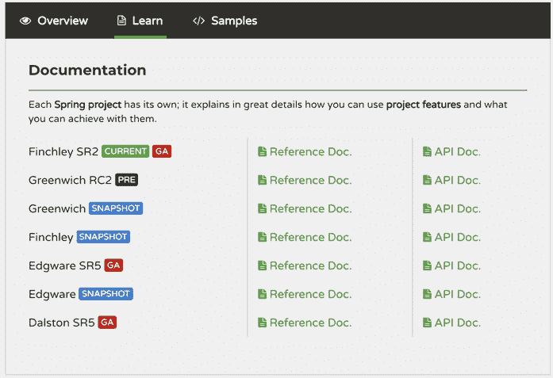

# Spring Cloud 是什么？Spring Cloud 版本介绍

> 原文：[`c.biancheng.net/view/5309.html`](http://c.biancheng.net/view/5309.html)

Spring Cloud 是一系列框架的有序集合。它利用 Spring Boot 的开发便利性，巧妙地简化了分布式系统基础设施的开发，如服务注册、服务发现、配置中心、消息总线、负载均衡、断路器、数据监控等，这些都可以用 Spring Boot 的开发风格做到一键启动和部署。

通俗地讲，Spring Cloud 就是用于构建微服务开发和治理的框架集合（并不是具体的一个框架），主要贡献来自 Netflix OSS。

## Spring Cloud 模块介绍

Spring Cloud 模块的相关介绍如下：

*   Eureka：服务注册中心，用于服务管理。
*   Ribbon：基于客户端的负载均衡组件。
*   Hystrix：容错框架，能够防止服务的雪崩效应。
*   Feign：Web 服务客户端，能够简化 HTTP 接口的调用。
*   Zuul：API 网关，提供路由转发、请求过滤等功能。
*   Config：分布式配置管理。
*   Sleuth：服务跟踪。
*   Stream：构建消息驱动的微服务应用程序的框架。
*   Bus：消息代理的集群消息总线。

除了上述模块，还有 Cli、Task 等。教程中只介绍一些常用的模块。

Spring Cloud 是一个非常好的框架集合，它包含的功能模块非常多，不可能一一讲解到，凡是在教程中出现的模块都是真实开发中用得到的。

## Spring Cloud 版本介绍

相信大家跟笔者一样，在第一次访问 Spring Cloud 官网时一定会有一个疑惑那就是版本太多了，到底哪个是稳定版本？哪个才是自己需要的版本？接下来就给大家简单介绍一下版本的问题。

访问官网 [`projects.spring.io/spring-cloud/#learn`](https://projects.spring.io/spring-cloud/#learn) 可以看到网页右侧的版本列表，如图 1 所示。

图 1  Spring Cloud 版本
从图 1 中可以看到 Spring Cloud 不是像别的项目那样，版本号采用 1.1、1.2、1.3 这种的格式。因为 Spring Cloud 是一个拥有诸多子项目的大型综合项目，可以说是对微服务架构解决方案的综合套件组件，其中包含的各个子项目都独立进行着内容的迭代与更新，各自维护着自己的发布版本号。

至于怎么选择适合自己的版本，笔者认为，大家可以在接触的时候直接选最新的稳定版本。新版本中的 Bug 肯定要少，并且更稳定。

本教程的案例都是基于 Finchley SR2 进行讲解的。不同的版本有不同的功能，对应的每个子模块的版本也不一样，那么如何知道每个大版本下面具体的子模块是什么版本呢？

答案就在官网的首页上面，在页面的最下方有一个表格（见表 1 ），通过这个表格我们可以清楚地知道 Finchley SR2 对应的 Spring Boot 版本是 2.0.6.RELEASE，Spring-Cloud-Bus 是 2.0.0.RELEASE。

表 1 Spring Cloud 版本列表

| Component | Edgware.SR5 | Finchley.SR2 | Finchley.BUILD-SNAPSHOT |
| spring-cloud-aws | 1.2.3RELEASE | 2.0.1.RELEASE | 2.0.1.BUILD-SNAPSHOT |
| spring-cloud-bus | 1.3.3.RELEASE | 2.0.0.RELEASE | 2.0.1.BUILD-SNAPSHOT |
| spring-cloud-cli | 1.4.1.RELEASE | 2.0.0.RELEASE | 2.0.1.BUILD-SNAPSHOT |
| spring-cloud-commons | 1.3.5.RELEASE | 2.0.2.RELEASE | 2.0.2.BUILD-SNAPSHOT |
| spring-cloud-contract | 1.2.6.RELEASE | 2.0.2.RELEASE | 2.0.2.BUILD-SNAPSHOT |
| spring-cloud-config | 1.4.5.RELEASE | 2.0.2.RELEASE | 2.0.2.BUILD-SNAPSHOT |
| spring-cloud-netflix  | 1.4.6.RELEASE  | 2.0.2.RELEASE | 2.0.2.BUILD-SNAPSHOT |
| spring-cloud-security | 1.2.3.RELEASE | 2.0.1.RELEASE | 2.0.1.BUILD-SNAPSHOT |
| spring-cloud-cloudfoundry | 1.1.2.RELEASE | 2.0.1.RELEASE | 2.0.1.BUILD-SNAPSHOT |
| spring-cloud-consul  | 1.3.5.RELEASE | 2.0.1.RELEASE | 2.0.2.BUILD-SNAPSHOT |
| spring-cloud-sleuth  | 1.3.5.RELEASE | 2.0.2.RELEASE | 2.0.2.BUILD-SNAPSHOT |
| spring-cloud-stream  | Ditmars.SR4 | Elmhurst.SRI | Elmhurst. BUILD-SNAPSHOT |
| spring-cloud-zookeeper | 1.2.2.RELEASE | 2.0.0.RELEASE | 2.0.1.BUILD-SNAPSHOT |
| spring-boot | 1.5.16.RELEASE | 2.0.6.RELEASE  | 2.0.7.BUILD-SNAPSHOT |
| spring-cloud-task | 1.2.3.RELEASE | 2.0.0.RELEASE | 2.0.1.BUILD-SNAPSHOT |
| spring-cloud-vault | 1.1.2.RELEASE  | 2.0.2.RELEASE | 2.0.2.BUILD-SNAPSHOT |
| spring-cloud-gateway | 1.0.2.RELEASE | 2.0.2.RELEASE  | 2.0.2.BUILD-SNAPSHOT |