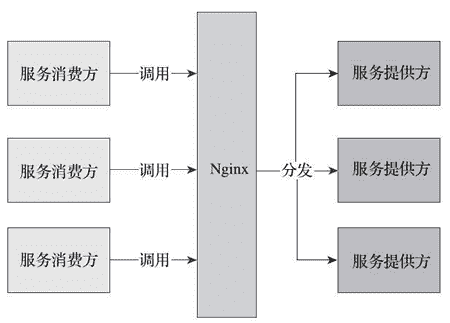
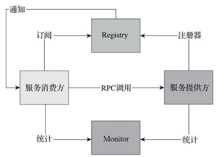

# Spring Cloud 和 Dubbo 的区别及各自的优缺点

> 原文：[`c.biancheng.net/view/5310.html`](http://c.biancheng.net/view/5310.html)

我们先从 Nginx 说起，了解为什么需要微服务。最初的服务化解决方案是给相同服务提供一个统一的域名，然后服务调用者向这个域发送 HTTP 请求，由 Nginx 负责请求的分发和跳转。

这种架构存在很多问题：Nginx 作为中间层，在配置文件中耦合了服务调用的逻辑，这削弱了微服务的完整性，也使得 Nginx 在一定程度上变成了一个重量级的 ESB。图 1 标识出了 Nginx 的转发信息流走向。
图 1  Nginx 转发的信息流
服务的信息分散在各个系统，无法统一管理和维护。每一次的服务调用都是一次尝试，服务消费方并不知道有哪些实例在给他们提供服务。这带来了一些问题：

*   无法直观地看到服务提供方和服务消费方当前的运行状况与通信频率；
*   消费方的失败重发、负载均衡等都没有统一策略，这加大了开发每个服务的难度，不利于快速演化。

为了解决上面的问题，我们需要一个现成的中心组件对服务进行整合，将每个服务的信息汇总，包括服务的组件名称、地址、数量等。

服务的调用方在请求某项服务时首先通过中心组件获取提供服务的实例信息（IP、端口等），再通过默认或自定义的策略选择该服务的某一提供方直接进行访问，所以考虑引入 Dubbo。

Dubbo 是阿里开源的一个 SOA 服务治理解决方案，文档丰富，在国内的使用度非常高。图 2 为 Dubbo 的基本架构图，使用 Dubbo 构建的微服务已经可以较好地解决上面提到的问题。

图 2  Dubbo 的基本架构图
从图 2 中，可以看出以下几点：

*   调用中间层变成了可选组件，消费方可以直接访问服务提供方；
*   服务信息被集中到 Registry 中，形成了服务治理的中心组件；
*   通过 Monitor 监控系统，可以直观地展示服务调用的统计信息；
*   服务消费者可以进行负载均衡、服务降级的选择。

但是对于微服务架构而言，Dubbo 并不是十全十美的，也有一些缺陷，比如：

*   Registry 严重依赖第三方组件（ZooKeeper 或者 Redis），当这些组件出现问题时，服务调用很快就会中断。
*   Dubbo 只支持 RPC 调用。这使得服务提供方与调用方在代码上产生了强依赖，服务提供方需要不断将包含公共代码的 Jar 包打包出来供消费方使用。一旦打包出现问题，就会导致服务调用出错。

笔者认为，Dubbo 和 Spring Cloud 并不是完全的竞争关系，两者所解决的问题域并不一样。

Dubbo 的定位始终是一款 RPC 框架，而 Spring Cloud 的目标是微服务架构下的一站式解决方案。如果非要比较的话，Dubbo 可以类比到 Netflix OSS 技术栈，而 Spring Cloud 集成了 Netflix OSS 作为分布式服务治理解决方案，但除此之外 Spring Cloud 还提供了配置、消息、安全、调用链跟踪等分布式问题解决方案。

当前由于 RPC 协议、注册中心元数据不匹配等问题，在面临微服务基础框架选型时 Dubbo 与 Spring Cloud 只能二选一，这也是大家总是拿 Dubbo 和 Spring Cloud 做对比的原因之一。

Dubbo 已经适配到 Spring Cloud 生态，比如作为 Spring Cloud 的二进制通信方案来发挥 Dubbo 的性能优势，Dubbo 通过模块化以及对 HTTP 的支持适配到 Spring Cloud。

## Spring Cloud 好在哪里

作为新一代的服务框架，Spring Cloud 提出的口号是开发“面向云的应用程序”，它为微服务架构提供了更加全面的技术支持。结合我们一开始提到的微服务的诉求，参见表 1，把 Spring Cloud 与 Dubbo 进行一番对比。

表 1 Spring Cloud 与 Dubbo 功能对比

| 功能名称 | Dubbo  | Spring Cloud |
| 服务注册中心 | ZooKeeper | Spring Cloud Netflix Eureka |
| 服务调用方式 | RPC | REST API |
| 服务网关 | 无 | Spring Cloud Netflix Zuul |
| 断路器 | 不完善 | Spring Cloud Netflix Hystrix |
| 分布式配置 | 无 | Spring Cloud Config |
| 服务跟踪 | 无 | Spring Cloud Sleuth |
| 消息总线 | 无 | Spring Cloud Bus |
| 数据流 | 无 | Spring Cloud Stream |
| 批量任务 | 无 | Spring Cloud Task |

Spring Cloud 抛弃了 Dubbo 的 RPC 通信，采用的是基于 HTTP 的 REST 方式。严格来说，这两种方式各有优劣。虽然从一定程度上来说，后者牺牲了服务调用的性能，但也避免了上面提到的原生 RPC 带来的问题。而且 REST 相比 RPC 更为灵活，服务提供方和调用方，不存在代码级别的强依赖，这在强调快速演化的微服务环境下显得更加合适。

很明显，Spring Cloud 的功能比 Dubbo 更加强大，涵盖面更广，而且作为 Spring 的拳头项目，它也能够与 Spring Framework、Spring Boot、Spring Data、Spring Batch 等其他 Spring 项目完美融合，这些对于微服务而言是至关重要的。

前面提到，微服务背后一个重要的理念就是持续集成、快速交付，而在服务内部使用一个统一的技术框架，显然比将分散的技术组合到一起更有效率。

更重要的是，相比于 Dubbo，它是一个正在持续维护的、社区更加火热的开源项目，这就可以保证使用它构建的系统持续地得到开源力量的支持。

下面列举 Spring Cloud 的几个优势。

*   Spring Cloud 来源于 Spring，质量、稳定性、持续性都可以得到保证。
*   Spirng Cloud 天然支持 Spring Boot，更加便于业务落地。
*   Spring Cloud 发展得非常快，从开始接触时的相关组件版本为 1.x，到现在将要发布 2.x 系列。
*   Spring Cloud 是 Java 领域最适合做微服务的框架。

相比于其他框架，Spring Cloud 对微服务周边环境的支持力度最大。对于中小企业来讲，使用门槛较低。