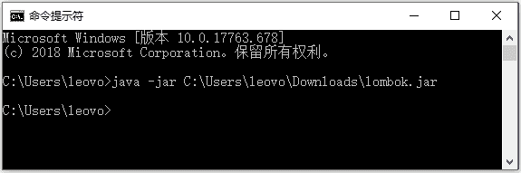

# Spring Cloud 开发环境的准备和 Lombok 安装步骤

> 原文：[`c.biancheng.net/view/5312.html`](http://c.biancheng.net/view/5312.html)

开发环境的准备主要涉及三个方面：JDK、Maven、Spring Tools 4 for Eclipse。

#### 1\. JDK

JDK 的版本用 1.8 即可，环境变量大家自行去配置。配置好环境变量，在命令行中输入“java–version”能够显示出版本信息即可，如图 1 所示。

图 1  cmd 查询 JDK 版本

#### 2\. Maven

Maven 是用于项目构建的，教程所用的版本是 3.6。安装完之后也需要配置环境变量，配置好后同样需要在命令行中输入“mvn–version”进行检测。

图 2  cmd 查询 Maven 版本

#### 3\. Spring Tools 4 for Eclipse

大家可以选择自己熟悉的开发工具，不一定要用 Spring Tools 4 for Eclipse，Spring Tools 4 for Eclipse 下载的地址：[`spring.io/tools`](http://spring.io/tools)。

## Lombok 安装步骤

下载完成后，还需要安装 Lombok 插件，本教程的示例代码会采用 Lombok 来简化 get，set 方法。

1）官网下载 lombok.jar（[`projectlombok.org/index.html`](https://projectlombok.org/index.html)）。

2）直接运行 jar（java -jar lombok.jar 包的绝对路径），如图 3 所示。

图 3  运行 jar 包
然后会显示一个界面，如图 4 所示。

图 4  lombok 显示页面
点击 Install/Update 按钮即可安装成功，重启 IDE 即可使用。