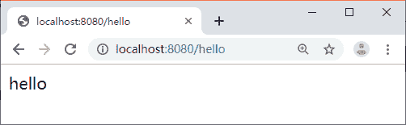

# Spring Boot 项目搭建步骤（超详细）

> 原文：[`c.biancheng.net/view/5316.html`](http://c.biancheng.net/view/5316.html)

在 Spring Tools 4 for Eclipse 中依次选择 File->New->Maven Project，然后在出现的界面中按图 1 所示增加相关信息。


图 1  创建 maven 项目
完了上述操作之后，在 pom.xml 中添加 Spring Boot 的依赖，代码如下所示。

```

<parent>
    <groupId>org.springframework.boot</groupId>
    <artifactId>spring-boot-starter-parent</artifactId>
    <version>2.0.6.RELEASE</version>
</parent>

<dependencies>
    <dependency>
        <groupId>org.springframework.boot</groupId>
        <artifactId>spring-boot-starter-web</artifactId>
    </dependency>
</dependencies>
```

编写启动类，代码如下所示。

```

@SpringBootApplication
public class App {

    public static void main(String[] args) {
        SpringApplication.run(App.class, args);
    }
}
```

启动类使用了 @SpringBootApplication 注解，这个注解表示该类是一个 Spring Boot 应用。直接运行 App 类即可启动，启动成功后在控制台输出信息，默认端口是 8080，如图 2 所示。


图 2  Spring Boot 启动成功
可以看到，我们只在 pom.xml 中引入了一个 Web 的 Starter，然后创建一个普通的 Java 类，一个 Main 方法就可以启动一个 Web 项目。

与之前的使用方式相比，这种方式简单很多。以前需要配置各种 Spring 相关的包，还需要配置 web.xml 文件，还需要将项目放入 Tomcat 中去执行，搭建项目的过程还特别容易出错，会出现各种 jar 包冲突。有了 Spring Boot 后这些问题都解决了。

我们之所以能够通过一个 Main 方法启动一个 Web 服务，是因为 Sprig Boot 中内嵌了 Tomcat，然后通过内嵌的 Tomcat 来提供服务。当然，我们也可以使用别的容器来替换 Tomcat，比如 Undertow 或 Jetty。

Spring Tools 4 for Eclipse 还为我们提供了更加便捷的项目创建方式，在 File->New 选项中有 Spring Starter Project，可以直接选择 Spring Boot 的版本以及需要依赖的第三方包，直接生成 Spring Boot 项目，不用再去手动配置 Maven 依赖。

这个功能和 [`start.spring.io/`](https://start.spring.io/) 提供的是同一个功能，方便快速搭建 Spring Boot 项目脚手架。

## 编写第一个 REST 接口

本节将创建一个控制器，编写第一个 REST 接口，访问地址使用 /hello，代码如下所示。

```

@RestController
public class HelloController {

    @GetMapping("/hello")
    public String hello() {
        return "hello";
    }
}
```

@RestController 是 @Controller 和 @ResponseBody 的组合注解，可以直接返回 Json 格式数据。

@GetMapping 其实就是 @RequestMapping（method=RequestMethod.GET），通过访问 http://localhost:8080/hello 可以看到输出的结果“hello”，如图 3 所示。


图 3  运行结果

## 读取配置文件

在以前的项目中我们主要在 XML 文件中进行框架配置，业务的相关配置会放在属性文件中，然后通过一个属性读取的工具类来读取配置信息。

在 Spring Boot 中我们不再需要使用这种方式去读取数据了。Spring Boot 中的配置通常放在 application.properties 中，读取配置信息非常方便，总共分为 3 种方式。

#### 1）Environment

可以通过 Environment 的 getProperty 方法来获取想要的配置信息，代码如下所示。

```

@RestController
public class HelloController {

    // 注入对象
    @Autowired
    private Environment env;

    @GetMapping("/hello")
    public String hello() {
        // 读取配置
        String port = env.getProperty("server.port");
        return port;
    }
}
```

#### 2）@Value

可以注入具体的配置信息，代码如下所示。

```

@RestController
public class HelloController {

    // 注入配置
    @Value("${server.port}")
    private String port;

    @GetMapping("/hello")
    public String hello() {
        return port;
    }
}
```

#### 3）自定义配置类

prefix 定义配置的前缀，代码如下所示。

```

@ConfigurationProperties(prefix = "net.biancheng")
@Component
public class MyConfig {

    private String name;

    public String getName() {
        return name;
    }

    public void setName(String name) {
        this.name = name;
    }

}
```

读取配置的方法代码如下所示。

```

@RestController
public class HelloController {

    @Autowired
    private MyConfig myConfig;

    @GetMapping("/hello")
    public String hello() {
        return myConfig.getName();
    }
}
```

定义配置 application.properties 的方法如下：

net.biancheng.name=zhangsan

## profiles 多环境配置

在平时的开发中，项目会被部署到测试环境、生产环境，但是每个环境的数据库地址等配置信息都是不一样的。通过 profile 来激活不同环境下的配置文件就能解决配置信息不一样的问题。在 Spring Boot 中可以通过 spring.profiles.active=dev 来激活不同环境下的配置。

可以定义多个配置文件，每个配置文件对应一个环境，格式为 application-环境.properties，如表 1 所示。

表 1 profile 多环境配置

| application.properties | 通用配置，不区分环境 |
| application-dev.properties | 开发环境 |
| application-test.properties | 测试环境 |
| application-prod.properties | 生产环境 |

在开发环境中，可以通过修改 application.properties 中的 spring.profiles.active 的值来激活对应环境的配置，在部署的时候可以通过 java–jar xxx.jar--spring.profiles.active=dev 来指定使用对应的配置。

## 热部署

开发过程中经常会改动代码，此时若想看下效果，就不得不停掉项目然后重启。

对于 Spring Boot 项目来说，启动时间是非常快的，在微服务的架构下，每个服务只关注自己的业务，代码量也非常小，这个启动时间是可以容忍的。

对于那些臃肿的单体老项目，启动时间简直是浪费生命。虽然 Spring Boot 启动很快，但是我们还是要自己去重启。能不能做到有改动，它就会悄无声息地自己把改动的地方重新加载一遍？答案是肯定的，通过 spring-boot-devtools 就可以实现。

只需要添加 spring-boot-devtools 的依赖即可实现热部署功能，代码如下所示。

<dependency>
    <groupId>org.springframework.boot</groupId>
    <artifactId>spring-boot-devtools</artifactId>
</dependency>

## actuator 监控

Spring Boot 提供了一个用于监控和管理自身应用信息的模块，它就是 spring-boot-starter-actuator。该模块使用起来非常简单，只需要加入依赖即可，代码如下所示。

<dependency>
    <groupId>org.springframework.boot</groupId>
    <artifactId>spring-boot-starter-actuator</artifactId>
</dependency>

启动项目我们会发现在控制台输出的内容中增加了图 4 所示的信息。

图 4 所示的这些信息是 Actuator 模块提供的端点信息，具体如表 2 所示，通过访问这些端点我们可以得到很多监控信息。

比如，我们访问 /actuator/health 可以得到下面的信息：

{
    "status": "UP"
}


图 4  Spring Boot 启动控制台输出

表 2 Actuator 端点信息

| Http 方法 | 路径 | 描述 | Http 默认暴露 |
| GET | /actuator/conflgprops | 查看配置属性，包含默认配置 | false |
| GET | /actuator/beans | 查看 bean 及其关系列表 | false |
| GET | /actuator/heapdump | 打印线程栈 | false |
| GET | /actuator/env | 查看所有环境变量 | false |
| GET | /actuator/env/ {name} | 查看具体变量值 | true |
| GET | /actuator/health | 查看应用健康指标 | true |
| GET | /actuator/info | 查看应用信息 | false |
| GET | /actuator/mappings | 查看所有 URL 映射 | false |
| GET | /actuator/metrics | 查看应用基本指标 | false |
| GET | /actuator/metrics/{name} | 查看具体指标 | false |
| POST | /actuator/shutdown | 关闭应用 | false |
| GET | /actuator/httptrace | 查看基本追踪信息 | false |
| GET | /actuator/loggers | 显示应用程序中 loggers 配置 | false |
| GET | /actuator/scheduledtasks | 显示定时任务 | false |

UP 表示当前应用处于健康状态，如果是 DOWN 就表示当前应用不健康。增加下面的配置可以让一些健康信息的详情也显示出来：

management.endpoint.health.show-details=ALWAYS

再次访问 /actuator/health，就可以得到健康状态的详细信息：

{
    "status": "UP",
    "diskSpace": {
        "status": "UP",
        "total": 491270434816,
        "free": 383870214144,
        "threshold": 10485760
    }
}

大部分端点默认都不暴露出来，我们可以手动配置需要暴露的端点。如果需要暴露多个端点，可以用逗号分隔，如下所示：

management.endpoints.web.exposure.include=configprops,beans

如果想全部端点都暴露的话直接配置成下面的方式：

management.endpoints.web.exposure.include=*

关于这些监控的信息不再赘述，大家可以自行了解。后面我们会介绍如何使用 Spring Boot Admin 在页面上更加直观地展示这些信息，目前都是 Json 格式的数据，不方便查看。

## 自定义 actuator 端点

在很多场景下，我们需要自定义一些规则来判断应用的状态是否健康，可以采用自定义端点的方式来满足多样性的需求。如果我们只是需要对应用的健康状态增加一些其他维度的数据，可以通过继承 AbstractHealthIndicator 来实现自己的业务逻辑。代码如下所示。

```

@Component
public class UserHealthIndicator extends AbstractHealthIndicator {
    @Override
    protected void doHealthCheck(Builder builder) throws Exception {
        builder.up().withDetail("status", true);
        // builder.down().withDetail("status", false);
    }
}
```

通过 up 方法指定应用的状态为健康，down 方法指定应用的状态为不健康。withDetail 方法用于添加一些详细信息。访问 /actuator/health，可以得到我们自定义的健康状态的详细信息：

{
    "status": "UP",
    "details": {
        "user": {
            "status": "UP",
            "details": {
                "status": true
            }
        },
        "diskSpace": {
            "status": "UP",
            "details": {
                "total":
                249795969024,
                "free": 7575375872,
                "threshold": 10485760
            }
        }
    }
}

上面我们是在框架自带的 health 端点中进行扩展，还有一种需求是完全开发一个全新的端点，比如查看当前登录的用户信息的端点。自定义全新的端点很简单，通过 @Endpoint 注解就可以实现。代码如下所示。

```

@Component
@Endpoint(id = "user")
public class UserEndpoint {

    @ReadOperation
    public List<Map<String, Object>> health() {
        List<Map<String, Object>> list = new ArrayList<>();
        Map<String, Object> map = new HashMap<>();
        map.put("userId", 1001);
        map.put("userName", "zhangsan");
        list.add(map);
        return list;
    }
}
```

访问 /actuator/user 可以看到返回的用户信息如下：

[
    {
        "userName": "zhangsan",
        "userId": 1001
    }
]

## 统一异常处理

对于接口的定义，我们通常会有一个固定的格式，比如：

{
    "status": true,
    "code": 200,
    "message": null,
    "data": [
        {
            "id": "101",
            "name": "jack"
        },
        {
            "id": "102",
            "name": "jason"
        }
    ]
}

但是，如果调用方在请求我们的 API 时把接口地址写错了，就会得到一个 404 错误：

{
    "timestamp": 1492063521109,
    "status": 404,
    "error": "Not Found",
    "message": "No message available",
    "path": "/rest11/auth"
}

后端服务会告诉我们哪个地址没找到，其实也挺友好。但是因为我们上面自定义的数据格式跟下面的不一致，所以当用户拿到这个返回的时候是无法识别的，其中最明显的是 status 字段。

我们自定义的是 boolean 类型，用来表示请求是否成功，这里返回的就是 Http 的状态码，所以我们需要在发生这种系统错误时也能返回我们自定义的那种格式，那就要定义一个异常处理类（代码如下所示），通过这个类既可以返回统一的格式，也可以统一记录异常日志。

```

@ControllerAdvice
public class GlobalExceptionHandler {
    private Logger logger = LoggerFactory.getLogger(GlobalExceptionHandler.class);

    @ExceptionHandler(value = Exception.class)
    @ResponseBody
    public ResponseData defaultErrorHandler(HttpServletRequest req, Exception e) throws Exception {
        logger.error("", e);
        ResponseData r = new ResponseData();
        r.setMessage(e.getMessage());
        if (e instanceof org.springframework.web.servlet.NoHandlerFoundException) {
            r.setCode(404);
        } else {
            r.setCode(500);
        }
        r.setData(null);
        r.setStatus(false);
        return r;
    }
}
```

ResponseData 是我们返回格式的实体类，其发生错误时也会被捕获到，然后封装好返回格式并返回给调用方。最后关键的一步是，在 Spring Boot 的配置文件中加上如下代码所示配置。

# 出现错误时, 直接抛出异常
spring.mvc.throw-exception-if-no-handler-found=true
# 不要为我们工程中的资源文件建立映射
spring.resources.add-mappings=false

然后当我们调用一个不存在的接口时，返回的错误信息就是我们自定义的那种格式了：

{
    "status": false, "code": 404,
    "message": "No handler found for GET /rest11/auth", "data": null
}

最后贴上 ResponseData 的定义，代码如下所示。

```

public class ResponseData {
    private Boolean status = true;
    private int code = 200;
    private String message;
    private Object data;
    // get set ...
}
```

## 异步执行

异步调用就是不用等待结果的返回就执行后面的逻辑；同步调用则需要等待结果再执行后面的逻辑。

通常我们使用异步操作时都会创建一个线程执行一段逻辑，然后把这个线程丢到线程池中去执行，代码如下所示。

```

ExecutorService executorService = Executors.newFixedThreadPool(10);
executorService.execute(() -> {
    try {
        // 业务逻辑
    } catch (Exception e) {
        e.printStackTrace();
    } finally {
    }
});
```

这种方式尽管使用了 Java 的 Lambda，但看起来没那么优雅。在 Spring 中有一种更简单的方式来执行异步操作，只需要一个 @Async 注解即可，代码如下所示。

```

@Async
public void saveLog() {
    System.err.println(Thread.currentThread().getName());
}
```

我们可以直接在 Controller 中调用这个业务方法，它就是异步执行的，会在默认的线程池中去执行。需要注意的是，一定要在外部的类中去调用这个方法，如果在本类调用则不起作用，比如 this.saveLog()。最后在启动类上开启异步任务的执行，添加 @EnableAsync 即可。

另外，关于执行异步任务的线程池我们也可以自定义，首先我们定义一个线程池的配置类，用来配置一些参数，具体代码如下所示。

```

@Configuration
@ConfigurationProperties(prefix = "spring.task.pool")
public class TaskThreadPoolConfig {
    // 核心线程数
    private int corePoolSize = 5;

    // 最大线程数
    private int maxPoolSize = 50;

    // 线程池维护线程所允许的空闲时间
    private int keepAliveSeconds = 60;

    // 队列长度
    private int queueCapacity = 10000;

    // 线程名称前缀
    private String threadNamePrefix = "FSH-AsyncTask-";
    // get set ...
}
```

然后我们重新定义线程池的配置，代码如下所示。

```

@Configuration
public class AsyncTaskExecutePool implements AsyncConfigurer {
    private Logger logger = LoggerFactory.getLogger(AsyncTaskExecutePool.class);
    @Autowired
    private TaskThreadPoolConfig config;

    @Override
    public Executor getAsyncExecutor() {
        ThreadPoolTaskExecutor executor = new ThreadPoolTaskExecutor();
        executor.setCorePoolSize(config.getCorePoolSize());
        executor.setMaxPoolSize(config.getMaxPoolSize());
        executor.setQueueCapacity(config.getQueueCapacity());
        executor.setKeepAliveSeconds(config.getKeepAliveSeconds());
        executor.setThreadNamePrefix(config.getThreadNamePrefix());
        executor.setRejectedExecutionHandler(new ThreadPoolExecutor.CallerRunsPolicy());
        executor.initia lize();
        return executor;
    }

    @Override
    public AsyncUncaughtExceptionHandler getAsyncUncaughtExceptionHandler() {
        // 异步任务中异常处理
        return new AsyncUncaughtExceptionHandler() {
            @Override
            public void handleUncaughtException(Throwable arg0, Method arg1, Object... arg2) {

                logger.error("==========================" + arg0.getMessage() + "=======================", arg0);
                logger.error("exception method:" + arg1.getName());
            }
        };
    }
}
```

配置完之后我们的异步任务执行的线程池就是我们自定义的了，我们可以在属性文件里面配置线程池的大小等信息，也可以使用默认的配置：

spring.task.pool.maxPoolSize=100

最后讲一下线程池配置的拒绝策略。当我们的线程数量高于线程池的处理速度时，任务会被缓存到本地的队列中。队列也是有大小的，如果超过了这个大小，就需要有拒绝的策略，不然就会出现内存溢出。目前支持两种拒绝策略：

*   AbortPolicy：直接抛出 java.util.concurrent.RejectedExecutionException 异常。
*   CallerRunsPolicy：主线程直接执行该任务，执行完之后尝试添加下一个任务到线程池中，这样可以有效降低向线程池内添加任务的速度。

建议大家用 CallerRunsPolicy 策略，因为当队列中的任务满了之后，如果直接抛异常，那么这个任务就会被丢弃。如果是 CallerRunsPolicy 策略，则会用主线程去执行，也就是同步执行，这样操作最起码任务不会被丢弃。

## 随机端口

在实际的开发过程中，每个项目的端口都是定好的，通过 server.port 可以指定端口。

当一个服务想要启动多个实例时，就需要改变端口，特别是在我们后面进行 Spring Cloud 学习的时候，服务都会注册到注册中心里去，为了能够让服务随时都可以扩容，在服务启动的时候能随机生成一个可以使用的端口是最好不过的。

在 Spring Boot 中，可以通过 ${random} 来生成随机数字，我们可以这样使用：

server.port=${random.int[2000,8000]}

通过 random.int 方法，指定随机数的访问，生成一个在 2000 到 8000 之间的数字，这样每次启动的端口就都不一样了。

其实上面的方法虽然能够达到预期的效果，但是也会存在一些问题：如果这个端口已经在使用了，那么启动必然会报错。所以我们可以通过代码的方式来随机生成一个端口，然后检测是否被使用，这样就能生成一个没有被使用的端口。

编写一个启动参数设置类，代码如下所示。

```

public class StartCommand {
    private Logger logger = LoggerFactory.getLogger(StartCommand.class);

    public StartCommand(String[] args) {
        Boolean isServerPort = false;
        String serverPort = "";
        if (args != null) {
            for (String arg : args) {
                if (StringUtils.hasText(arg) && arg.startsWith("--server.port")) {
                    isServerPort = true;
                    serverPort = arg;
                    break;
                }
            }
        }
        // 没有指定端口, 则随机生成一个可用的端口
        if (!isServerPort) {
            int port = ServerPortUtils.getAvailablePort();
            logger.info("current server.port=" + port);
            System.setProperty("server.port", String.valueOf(port));
        } else {
            logger.info("current server.port=" + serverPort.split("=")[1]);
            System.setProperty("server.port", serverPort.split("=")[1]);
        }
    }
}
```

通过对启动参数进行遍历判断，如果有指定启动端口，后续就不自动生成了；如果没有指定，就通过 ServerPortUtils 获取一个可以使用的端口，然后设置到环境变量中。在 application.properties 中通过下面的方式获取端口：

server.port=${server.port}

关于获取可用端口的代码如下所示。

```

public static int getAvailablePort() {
    int max = 65535;
    int min = 2000;
    Random random = new Random();
    int port = random.nextInt(max)%(max-min+1) + min;
    boolean using = NetUtils.isLoclePortUsing(port);
    if (using) {
        return getAvailablePort();
    } else {
        return port;
    }
}
```

获取可用端口的主要逻辑是指定一个范围，然后生成随机数字，最后通过 NetUtils 来检查端口是否可用。如果获取到可用的端口则直接返回，没有获取到可用的端口则执行回调逻辑，重新获取。检测端口是否可用主要是用 Socket 来判断这个端口是否可以被链接。

最后在启动类中调用端口即可使用，代码如下所示。

```

public class FshHouseServiceApplication {
    public static void main(String[] args) {
        // 启动参数设置, 比如自动生成端口
        new StartCommand(args);
        SpringApplication.run(FshHouseServiceApplication.class, args);
    }
}
```

## 编译打包

传统的 Web 项目在部署的时候，是编译出一个 war 包放到 Tomcat 的 webapps 目录下。而在 Spring Boot 构建的 Web 项目中则打破了这一传统部署的方式，它采用更加简单的内置容器方式来部署应用程序，只需要将应用编译打包成一个 jar 包，直接可以通过 java–jar 命令启动应用。

在项目的 pom.xml 中增加打包的 Maven 插件，代码如下所示。

```

<build>
    <plugins>
        <!-- 打包插件 -->
        <plugin>
            <groupId>org.springframework.boot</groupId>
            <artifactId>spring-boot-maven-plugin</artifactId>
            <configuration>
                <executable>true</executable>
                <mainClass>net.biancheng.spring_boot_example.App</mainClass>
            </configuration>
        </plugin>

        <!-- 编译插件, 指定 JDK 版本 -->
        <plugin>
            <groupId>org.apache.maven.plugins</groupId>
            <artifactId>maven-compiler-plugin</artifactId>
            <configuration>
                <source>1.8</source>
                <target>1.8</target>
            </configuration>
        </plugin>
    </plugins>
</build>
```

mainClass 配置的是我们的启动入口类，配置完成后可以通过 Maven 的 mvn clean package 命令进行编译打包操作。编译完成后在 target 目录下会生成对应的 jar 包，部署的时候直接调用 java–jar xx.jar 即可启动应用。