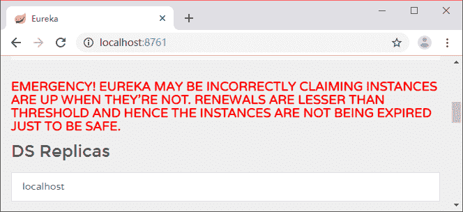
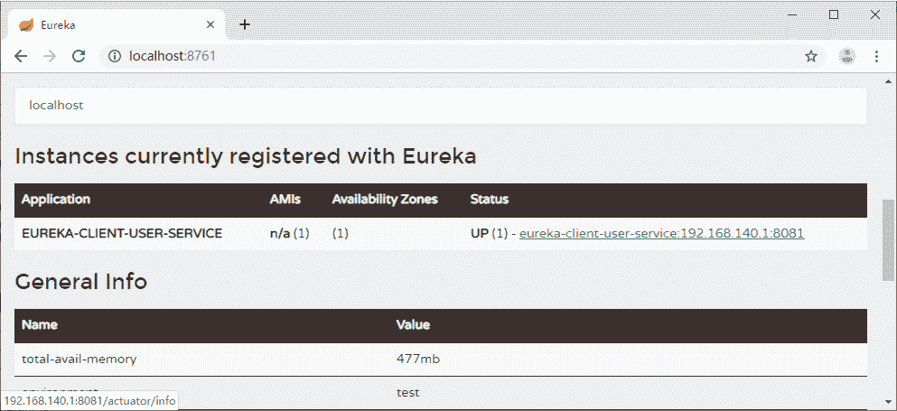
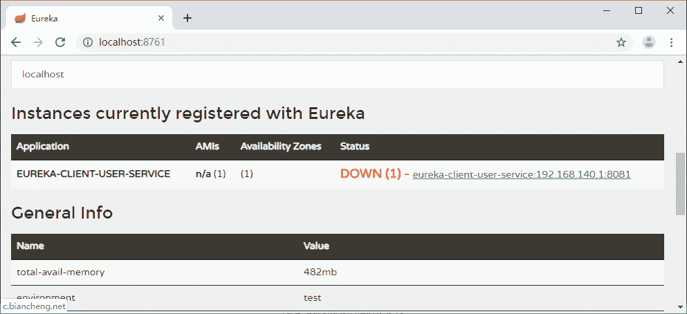

# Eureka 自我保护模式和 InstanceID 的配置

> 原文：[`c.biancheng.net/view/5334.html`](http://c.biancheng.net/view/5334.html)

本节我们主要介绍 Eureka 自我保护模式的开启和关闭和自定义 Eureka 的 InstanceID 的配置。

## 关闭自我保护

保护模式主要在一组客户端和 Eureka Server 之间存在网络分区场景时使用。一旦进入保护模式，Eureka Server 将会尝试保护其服务的注册表中的信息，不再删除服务注册表中的数据。当网络故障恢复后，该 Eureka Server 节点会自动退出保护模式。

如果在 Eureka 的 Web 控制台看到图 1 所示的内容，就证明 Eureka Server 进入保护模式了。

图 1  Eureka 自我保护
可以通过下面的配置将自我保护模式关闭，这个配置是在 eureka-server 中：

eureka.server.enableSelfPreservation=false

## 自定义 Eureka 的 InstanceID

客户端在注册时，服务的 Instance ID 的默认值的格式如下：

${spring.cloud.client.hostname}:${spring.application.name}:${spring.application. instance_id:${server.port}}

翻译过来就是“主机名：服务名称：服务端口”。当我们在 Eureka 的 Web 控制台查看服务注册信息的时候，就是这样的一个格式：

user-PC：eureka-client-user-service：8081

很多时候我们想把 IP 显示在上述格式中，此时，只要把主机名替换成 IP 就可以了，或者调整顺序也可以。可以改成下面的样子，用“服务名称：服务所在 IP：服务端口”的格式来定义：

eureka.instance.instance-id=${spring.application.name}:${spring.cloud.client.ip-address}:${server.port}

定义之后我们看到的就是 eureka-client-user-service：192.168.31.245：8081，一看就知道是哪个服务，在哪台机器上，端口是多少。

我们还可以点击服务的 Instance ID 进行跳转，这个时候显示的名称虽然变成了 IP，但是跳转的链接却还是主机名。

所以还需要加一个配置才能让跳转的链接变成我们想要的样子，使用 IP 进行注册，如图 2 所示：

eureka.instance.preferIpAddress=true

图 2  Eureka 实例信息 IP 链接

## 自定义实例跳转链接

刚刚我们通过配置实现了用 IP 进行注册，当点击 Instance ID 进行跳转的时候，就可以用 IP 跳转了，跳转的地址默认是 IP+Port/info。我们可以自定义这个跳转的地址：

eureka.instance.status-page-url=c.biancheng.net

效果如图 3 所示。

图 3  Eureka 实例信息自定义链接