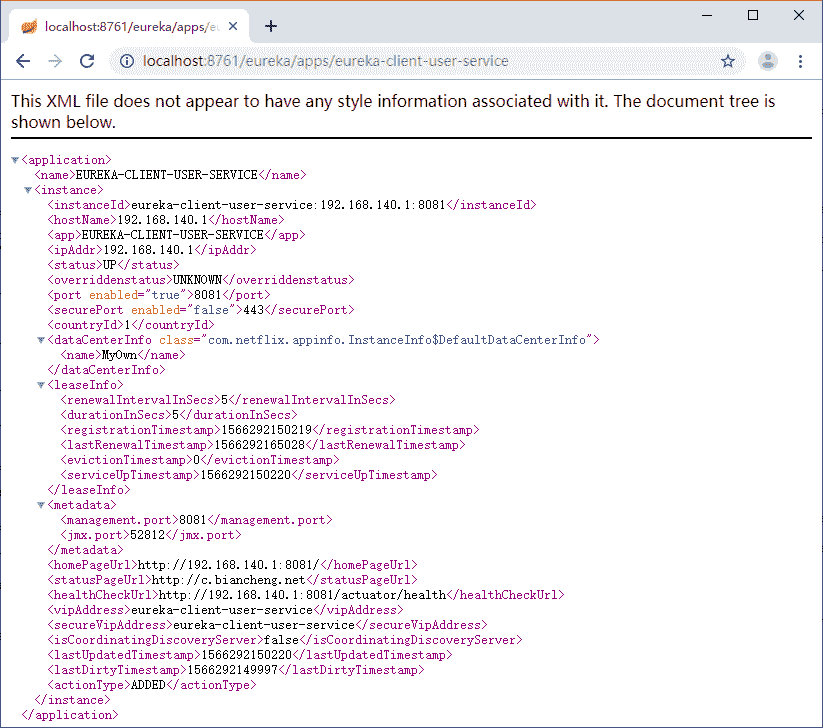
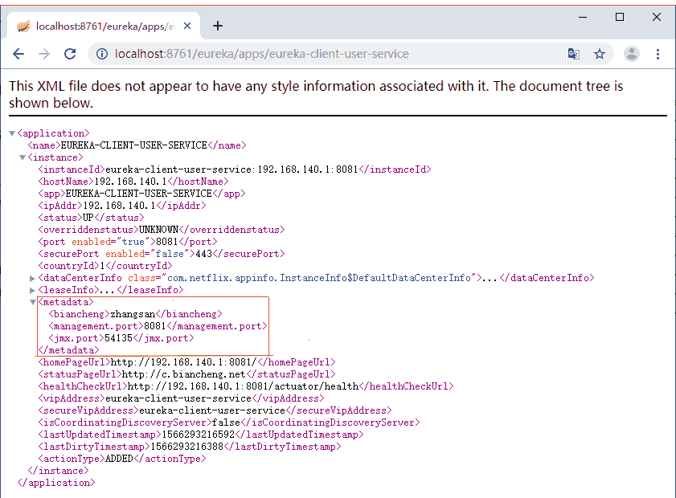
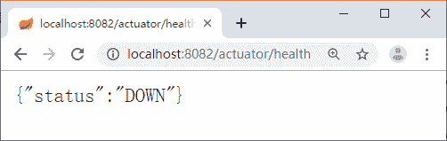

# Eureka 的 REST API 及 API 扩展

> 原文：[`c.biancheng.net/view/5336.html`](http://c.biancheng.net/view/5336.html)

本节我们讲解了一些经常用到的配置信息及 Eureka 的 REST API，通过 API 可以做一些扩展。

## Eureka REST API

Eureka 作为注册中心，其本质是存储了每个客户端的注册信息，Ribbon 在转发的时候会获取注册中心的服务列表，然后根据对应的路由规则来选择一个服务给 Feign 来进行调用。如果我们不是 Spring Cloud 技术选型，也想用 Eureka，可以吗？完全可以。

如果不是 Spring Cloud 技术栈，笔者推荐用 Zookeeper，这样会方便些，当然用 Eureka 也是可以的，这样的话就会涉及如何注册信息、如何获取注册信息等操作。其实 Eureka 也考虑到了这点，提供了很多 REST 接口来给我们调用。

我们举一个比较有用的案例来说明，比如对 Nginx 动态进行 upstream 的配置。

在架构变成微服务之后，微服务是没有依赖的，可以独立部署，端口也可以随机分配，反正会注册到注册中心里面，调用方也无须关心提供方的 IP 和 Port，这些都可以从注册中心拿到。

但是有一个问题：API 网关的部署能这样吗？API 网关大部分会用 Nginx 作为负载，那么 Nginx 就必须知道 API 网关有哪几个节点，这样网关服务就不能随便启动了，需要固定。

当然网关是不会经常变动的，也不会经常发布，这样其实也没什么大问题，唯一不好的就是不能自动扩容了。

其实利用 Eureka 提供的 API 我们可以获取某个服务的实例信息，也就是说我们可以根据 Eureka 中的数据来动态配置 Nginx 的 upstream。

这样就可以做到网关的自动部署和扩容了。网上也有很多的方案，结合 Lua 脚本来做，或者自己写 Sheel 脚本都可以。

下面举例说明如何获取 Eureka 中注册的信息。具体的接口信息请查看官方文档“[`github.com/Netflix/eureka/wiki/Eureka-REST-operations`](https://github.com/Netflix/eureka/wiki/Eureka-REST-operations)“。

获取某个服务的注册信息，可以直接 GET 请求：http://localhost：8761/eureka/apps/eureka-client-user-service。其中，eureka-client-user-service 是应用名称，也就是 spring.application.name。

在浏览器中，数据的显示格式默认是 XML 格式的，如图 1 所示。


图 1  Eureka 中的服务信息数据
如果想返回 Json 数据的格式，可以用一些接口测试工具来请求，比如 Postman，在请求头中添加下面两行代码即可。

Content-Type:application/json Accept:application/json

如果 Eureka 开启了认证，记得添加认证信息，用户名和密码必须是 Base64 编码过的 Authorization：Basic 用户名：密码，其余的接口就不做过多讲解了，大家可以自己去尝试。Postman 直接支持了 Basic 认证，将选项从 Headers 切换到 Authorization，选择认证方式为 Basic Auth 就可以填写用户信息了。

填写完之后，直接发起请求就可以了。我们切换到 Headers 选项中，就可以看到请求头中已经多了一个 Authorization 头。

## 元数据使用

Eureka 的元数据有两种类型，分别是框架定好了的标准元数据和用户自定义元数据。标准元数据指的是主机名、IP 地址、端口号、状态页和健康检查等信息，这些信息都会被发布在服务注册表中，用于服务之间的调用。自定义元数据可以使用 eureka.instance.metadataMap 进行配置。

自定义元数据说得通俗点就是自定义配置，我们可以为每个 Eureka Client 定义一些属于自己的配置，这个配置不会影响 Eureka 的功能。

自定义元数据可以用来做一些扩展信息，比如灰度发布之类的功能，可以用元数据来存储灰度发布的状态数据，Ribbon 转发的时候就可以根据服务的元数据来做一些处理。当不需要灰度发布的时候可以调用 Eureka 提供的 REST API 将元数据清除掉。

下面我们来自定义一个简单的元数据，在属性文件中配置如下：

eureka.instance.metadataMap.biancheng=zhangsan

上述代码定义了一个 key 为 biancheng 的配置，value 是 zhangsan。重启服务，然后通过 Eureka 提供的 REST API 来查看刚刚配置的元数据是否已经存在于 Eureka 中，如图 2 所示。
图 2  自定义元数据查看

## EurekaClient 使用

当我们的项目中集成了 Eureka 之后，可以通过 EurekaClient 来获取一些我们想要的数据，比如刚刚上面讲的元数据。我们就可以直接通过 EurekaClient 来获取（代码如下所示），不用再去调用 Eureka 提供的 REST API。

@Autowired
private EurekaClient eurekaClient;
@GetMapping("/article/infos")
public Object serviceUrl() {
    return eurekaClient.getInstancesByVipAddress( "eureka-client-user-service", false);
}

通过 PostMan 来调用接口看看有没有返回我们想要的数据。这时我们会发现，通过 EurekaClient 获取的数据跟我们自己去掉 API 获取的数据是一样的，从使用角度来说前者比较方便。

除了使用 EurekaClient，还可以使用 DiscoveryClient（代码如下所示），这个不是 Feign 自带的，是 Spring Cloud 重新封装的，类的路径为 org.springframework.cloud.client.discovery.DiscoveryClient。

@Autowired
private DiscoveryClient discoveryClient;
@GetMapping("/article/infos")
public Object serviceUrl() {
    return discoveryClient.getInstances("eureka-client-user-service");
}

## 健康检查

默认情况下，Eureka 客户端是使用心跳和服务端通信来判断客户端是否存活，在某些场景下，比如 MongoDB 出现了异常，但你的应用进程还是存在的，这就意味着应用可以继续通过心跳上报，保持应用自己的信息在 Eureka 中不被剔除掉。

Spring Boot Actuator 提供了 /actuator/health 端点，该端点可展示应用程序的健康信息，当 MongoDB 异常时，/actuator/health 端点的状态会变成 DOWN，由于应用本身确实处于存活状态，但是 MongoDB 的异常会影响某些功能，当请求到达应用之后会发生操作失败的情况。

在这种情况下，我们希望可以将健康信息传递给 Eureka 服务端。这样 Eureka 中就能及时将应用的实例信息下线，隔离正常请求，防止出错。通过配置如下内容开启健康检查：

eureka.client.healthcheck.enabled=true

我们可以通过扩展健康检查的端点来模拟异常情况，定义一个扩展端点，将状态设置为 DOWN，代码如下所示。

```

@Component
public class CustomHealthIndicator extends AbstractHealthIndicator {

    @Override
    protected void doHealthCheck(Builder builder) throws Exception {
        builder.down().withDetail("status", false);
    }
}
```

扩展好后我们访问 /actuator/health 可以看到当前的状态是 DOWN，如图 3 所示。


图 3  查看应用健康状态
Eureka 中的状态是 UP，这种情况下请求还是能转发到这个服务中，下面我们开启监控检查，再次查看 Eureka 中的状态，发现状态变为 DOWN(1)。

## 服务上下线监控

在某些特定的需求下，我们需要对服务的上下线进行监控，上线或下线都进行邮件通知，Eureka 中提供了事件监听的方式来扩展。

目前支持的事件如下：

*   EurekaInstanceCanceledEvent 服务下线事件。
*   EurekaInstanceRegisteredEvent 服务注册事件。
*   EurekaInstanceRenewedEvent 服务续约事件。
*   EurekaRegistryAvailableEvent Eureka 注册中心启动事件。
*   EurekaServerStartedEvent Eureka Server 启动事件。

基于 Eureka 提供的事件机制，可以监控服务的上下线过程，在过程发生中可以发送邮件来进行通知。下面代码只是演示了监控的过程，并未发送邮件。

```

@Component
public class EurekaStateChangeListener {

    @EventListener
    public void listen(EurekaInstanceCanceledEvent event) {
        System.err.println(event.getServerId() + "\t" + event.getAppName() + " 服务下线 ");
    }

    @EventListener
    public void listen(EurekaInstanceRegisteredEvent event) {
        InstanceInfo instanceInfo = event.getInstanceInfo();
        System.err.println(instanceInfo.getAppName() + " 进行注册 ");
    }

    @EventListener
    public void listen(EurekaInstanceRenewedEvent event) {
        System.err.println(event.getServerId() + "\t" + event.getAppName() + " 服务进行续约 ");
    }

    @EventListener
    public void listen(EurekaRegistryAvailableEvent event) {
        System.err.println(" 注册中心启动 ");
    }

    @EventListener
    public void listen(EurekaServerStartedEvent event) {
        System.err.println("Eureka Server 启动 ");
    }
}
```

注意：在 Eureka 集群环境下，每个节点都会触发事件，这个时候需要控制下发送通知的行为，不控制的话每个节点都会发送通知。