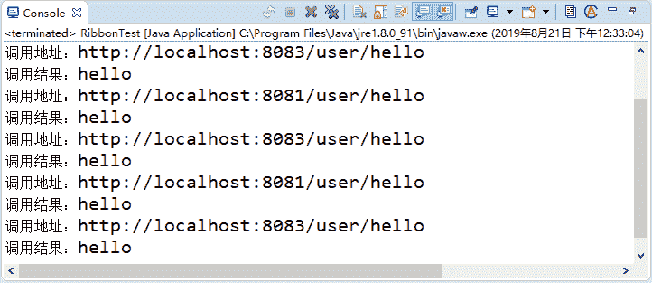

# Spring Cloud Ribbon（负载均衡器）介绍及使用

> 原文：[`c.biancheng.net/view/5347.html`](http://c.biancheng.net/view/5347.html)

目前主流的负载方案分为以下两种：

*   集中式负载均衡，在消费者和服务提供方中间使用独立的代理方式进行负载，有硬件的（比如 F5），也有软件的（比如 Nginx）。
*   客户端自己做负载均衡，根据自己的请求情况做负载，Ribbon 就属于客户端自己做负载。

Spring Cloud Ribbon 是一个基于 HTTP 和 TCP 的客户端负载均衡工具，它基于 Netflix Ribbon 实现。通过 Spring Cloud 的封装，可以让我们轻松地将面向服务的 REST 模版请求自动转换成客户端负载均衡的服务调用。

Spring Cloud Ribbon 虽然只是一个工具类框架，它不像服务注册中心、配置中心、API 网关那样需要独立部署，但是它几乎存在于每一个 Spring Cloud 构建的微服务和基础设施中。因为微服务间的调用，API 网关的请求转发等内容，实际上都是通过 Ribbon 来实现的（[`github.com/Netflix/ribbon`](https://github.com/Netflix/ribbon)）。

## Ribbon 模块

 Ribbon 模块介绍如下表 1 所示。

表 1 Ribbon 模块介绍

| 名  称 | 说    明 |
| ribbon-loadbalancer | 负载均衡模块，可独立使用，也可以和别的模块一起使用。 |
| Ribbon | 内置的负载均衡算法都实现在其中。 |
| ribbon-eureka | 基于 Eureka 封装的模块，能够快速、方便地集成 Eureka。 |
| ribbon-transport | 基于 Netty 实现多协议的支持，比如 HTTP、Tcp、Udp 等。 |
| ribbon-httpclient | 基于 Apache HttpClient 封装的 REST 客户端，集成了负载均衡模块，可以直接在项目中使用来调用接口。 |
| ribbon-example | Ribbon 使用代码示例，通过这些示例能够让你的学习事半功倍。 |
| ribbon-core | 一些比较核心且具有通用性的代码，客户端 API 的一些配置和其他 API 的定义。 |

## Ribbon 使用

我们使用 Ribbon 来实现一个最简单的负载均衡调用功能，接口就用《使用 Eureka 编写服务提供者》提供的 /user/hello 接口，需要启动两个服务，一个是 8081 的端口，一个是 8083 的端口。

然后创建一个新的 Maven 项目 ribbon-native-demo，在项目中集成 Ribbon，在 pom.xml 中添加如下代码所示的依赖。

```

<dependency>
    <groupId>com.netflix.ribbon</groupId>
    <artifactId>ribbon</artifactId>
    <version>2.2.2</version>
</dependency>
<dependency>
    <groupId>com.netflix.ribbon</groupId>
    <artifactId>ribbon-core</artifactId>
    <version>2.2.2</version>
</dependency>
<dependency>
    <groupId>com.netflix.ribbon</groupId>
    <artifactId>ribbon-loadbalancer</artifactId>
    <version>2.2.2</version>
</dependency>
<dependency>
    <groupId>io.reactivex</groupId>
    <artifactId>rxjava</artifactId>
    <version>1.0.10</version>
</dependency>
```

接下来我们编写一个客户端来调用接口，代码如下所示。

```

// 服务列表
List<Server> serverList = Lists.newArrayList(new Server("localhost", 8081), new Server("localhost", 8083));
// 构建负载实例
ILoadBalancer loadBalancer = LoadBalancerBuilder.newBuilder().buildFixedServerListLoadBalancer(serverList);
// 调用 5 次来测试效果
for (int i = 0; i < 5; i++) {
    String result = LoadBalancerCommand.<String>builder().withLoadBalancer(loadBalancer).build()
            .submit(new ServerOperation<String>() {
                public Observable<String> call(Server server) {
                    try {
                        String addr = "http://" + server.getHost() + ":" + server.getPort() + "/user/hello";
                        System.out.println(" 调用地址：" + addr);
                        URL url = new URL(addr);
                        HttpURLConnection conn = (HttpURLConnection) url.openConnection();
                        conn.setRequestMethod("GET");
                        conn.connect();
                        InputStream in = conn.getInputStream();
                        byte[] data = new byte[in.available()];
                        in.read(data);
                        return Observable.just(new String(data));
                    } catch (Exception e) {
                        return Observable.error(e);
                    }
                }
            }).toBlocking().first();
    System.out.println(" 调用结果：" + result);
}
```

上述这个例子主要演示了 Ribbon 如何去做负载操作，调用接口用的最底层的 HttpURLConnection。当然你也可以用别的客户端，或者直接用 RibbonClient 执行程序，可以看到控制台输出的结果如下：


图 1  控制台输出结果
从输出的结果中可以看到，负载起作用了，8083 调用了 3 次，8081 调用了 2 次。