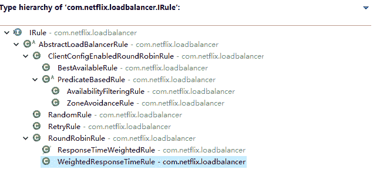

# Spring Cloud Ribbon 负载均衡策略介绍

> 原文：[`c.biancheng.net/view/5353.html`](http://c.biancheng.net/view/5353.html)

Ribbon 作为一款客户端负载均衡框架，默认的负载策略是轮询，同时也提供了很多其他的策略，能够让用户根据自身的业务需求进行选择。

整体策略代码实现类如图 1 所示。

图 1  Ribbon 自带负载策略
图中说明如下：

#### 1）BestAvailabl

选择一个最小的并发请求的 Server，逐个考察 Server，如果 Server 被标记为错误，则跳过，然后再选择 ActiveRequestCount 中最小的 Server。

#### 2）AvailabilityFilteringRule

过滤掉那些一直连接失败的且被标记为 circuit tripped 的后端 Server，并过滤掉那些高并发的后端 Server 或者使用一个 AvailabilityPredicate 来包含过滤 Server 的逻辑。其实就是检查 Status 里记录的各个 Server 的运行状态。

#### 3）ZoneAvoidanceRule

使用 ZoneAvoidancePredicate 和 AvailabilityPredicate 来判断是否选择某个 Server，前一个判断判定一个 Zone 的运行性能是否可用，剔除不可用的 Zone（的所有 Server），AvailabilityPredicate 用于过滤掉连接数过多的 Server。

#### 4）RandomRule

随机选择一个 Server。

#### 5）RoundRobinRule

轮询选择，轮询 index，选择 index 对应位置的 Server。

#### 6）RetryRule

对选定的负载均衡策略机上重试机制，也就是说当选定了某个策略进行请求负载时在一个配置时间段内若选择 Server 不成功，则一直尝试使用 subRule 的方式选择一个可用的 Server。

#### 7）ResponseTimeWeightedRule

作用同 WeightedResponseTimeRule，ResponseTime-Weighted Rule 后来改名为 WeightedResponseTimeRule。

#### 8）WeightedResponseTimeRule

根据响应时间分配一个 Weight（权重），响应时间越长，Weight 越小，被选中的可能性越低。