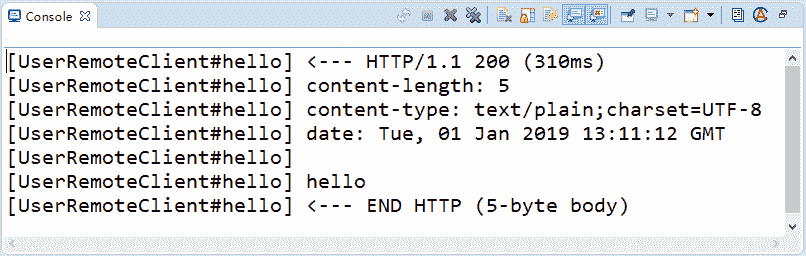

# Spring Cloud Feign 的自定义配置及使用

> 原文：[`c.biancheng.net/view/5362.html`](http://c.biancheng.net/view/5362.html)

Feign 提供了很多的扩展机制，让用户可以更加灵活的使用，这节我们来学习 Feign 的一些自定义配置。

## 日志配置

有时候我们遇到 Bug，比如接口调用失败、参数没收到等问题，或者想看看调用性能，就需要配置 Feign 的日志了，以此让 Feign 把请求信息输出来。

首先定义一个配置类，代码如下所示。

```

@Configuration
public class FeignConfiguration {
    /**
     * 日志级别
     *
     * @return
     */
    @Bean
    Logger.Level feignLoggerLevel() {
        return Logger.Level.FULL;
    }
}
```

通过源码可以看到日志等级有 4 种，分别是：

*   NONE：不输出日志。
*   BASIC：只输出请求方法的 URL 和响应的状态码以及接口执行的时间。
*   HEADERS：将 BASIC 信息和请求头信息输出。
*   FULL：输出完整的请求信息。

Feign 日志等级源码如下图所示：

public enum Level {
    NONE,
    BASIC,
    HEADERS,
    FULL
}

配置类建好后，我们需要在 Feign Client 中的 @FeignClient 注解中指定使用的配置类，代码如下所示。

@FeignClient(value = "eureka-client-user-service", configuration = FeignConfiguration. class)
public interface UserRemoteClient {
    // ...
}

在配置文件中执行 Client 的日志级别才能正常输出日志，格式是“logging.level.client 类地址=级别”。

logging.level.net.biancheng.feign_demo.remote.UserRemoteClient=DEBUG

最后通过 Feign 调用我们的 /user/hello 接口，就可以看到控制台输出的调用信息了，如图 1 所示。


图 1  调用信息

## 契约配置

Spring Cloud 在 Feign 的基础上做了扩展，可以让 Feign 支持 Spring MVC 的注解来调用。原生的 Feign 是不支持 Spring MVC 注解的，原生的使用方法我们在后面会讲解。

如果你想在 Spring Cloud 中使用原生的注解方式来定义客户端也是可以的，通过配置契约来改变这个配置，Spring Cloud 中默认的是 SpringMvcContract，代码如下所示。

```

@Configuration
public class FeignConfiguration {

    @Bean
    public Contract feignContract() {
        return new feign.Contract.Default();
    }
}
```

当你配置使用默认的契约后，之前定义的 Client 就用不了，之前上面的注解是 Spring MVC 的注解。

## Basic 认证配置

通常我们调用的接口都是有权限控制的，很多时候可能认证的值是通过参数去传递的，还有就是通过请求头去传递认证信息，比如 Basic 认证方式。在 Feign 中我们可以直接配置 Basic 认证，代码如下所示。

```

@Configuration
public class FeignConfiguration {

    @Bean
    public BasicAuthRequestInterceptor basicAuthRequestInterceptor() {
        return new BasicAuthRequestInterceptor("user", "password");
    }
}
```

或者你可以自定义属于自己的认证方式，其实就是自定义一个请求拦截器。在请求之前做认证操作，然后往请求头中设置认证之后的信息。通过实现 RequestInterceptor 接口来自定义认证方式，代码如下所示。

```

public class FeignBasicAuthRequestInterceptor implements RequestInterceptor {
    public FeignBasicAuthRequestInterceptor() {
    }

    @Override
    public void apply(RequestTemplate template) {
        // 业务逻辑
    }
}
```

然后将配置改成我们自定义的就可以了，这样当 Feign 去请求接口的时候，每次请求之前都会进入 FeignBasicAuthRequestInterceptor 的 apply 方法中，在里面就可以做属于你的逻辑了，代码如下所示。

```

@Configuration
public class FeignConfiguration {

    @Bean
    public FeignBasicAuthRequestInterceptor basicAuthRequestInterceptor() {
        return new FeignBasicAuthRequestInterceptor();
    }
}
```

## 超时时间配置

通过 Options 可以配置连接超时时间和读取超时时间（代码如下所示），Options 的第一个参数是连接超时时间（ms），默认值是 10×1000；第二个是取超时时间（ms），默认值是 60×1000。

```

@Configuration
public class FeignConfiguration {

    @Bean
    public Request.Options options() {
        return new Request.Options(5000, 10000);
    }
}
```

## 客户端组件配置

Feign 中默认使用 JDK 原生的 URLConnection 发送 HTTP 请求，我们可以集成别的组件来替换掉 URLConnection，比如 Apache HttpClient，OkHttp。

配置 OkHttp 只需要加入 OkHttp 的依赖，代码如下所示。

<dependency>
    <groupId>io.github.openfeign</groupId>
    <artifactId>feign-okhttp</artifactId>
</dependency>

然后修改配置，将 Feign 的 HttpClient 禁用，启用 OkHttp，配置如下：

#feign 使用 okhttp
feign.httpclient.enabled=false
feign.okhttp.enabled=true

关于配置可参考源码 org.springframework.cloud.openfeign.FeignAutoConfiguration。
HttpClient 自动配置源码如下所示：

```

@Configuration
@ConditionalOnClass(ApacheHttpClient.class)
@ConditionalOnMissingClass("com.netflix.loadbalancer.ILoadBalancer")
@ConditionalOnProperty(value = "feign.httpclient.enabled", matchIfMissing = true)
protected static class HttpClientFeignConfiguration {

    @Autowired(required = false)
    private HttpClient httpClient;

    @Bean
    @ConditionalOnMissingBean(Client.class)
    public Client feignClient() {
        if (this.httpClient != null) {
            return new ApacheHttpClient(this.httpClient);
        }
        return new ApacheHttpClient();
    }
}
```

OkHttp 自动配置源码如下所示：

```

@Configuration
@ConditionalOnClass(OkHttpClient.class)
@ConditionalOnMissingClass("com.netflix.loadbalancer.ILoadBalancer")
@ConditionalOnProperty(value = "feign.okhttp.enabled", matchIfMissing = true)
protected static class OkHttpFeignConfiguration {

    @Autowired(required = false)
    private okhttp3.OkHttpClient okHttpClient;

    @Bean
    @ConditionalOnMissingBean(Client.class)
    public Client feignClient() {
        if (this.okHttpClient != null) {
            return new OkHttpClient(this.okHttpClient);
        }
        return new OkHttpClient();
    }
}
```

上面所示两段代码分别是配置 HttpClient 和 OkHttp 的方法。其通过 @ConditionalOnProperty 中的值来决定启用哪种客户端（HttpClient 和 OkHttp），@ConditionalOnClass 表示对应的类在 classpath 目录下存在时，才会去解析对应的配置文件。

## GZIP 压缩配置

开启压缩可以有效节约网络资源，提升接口性能，我们可以配置 GZIP 来压缩数据：

feign.compression.request.enabled=true
feign.compression.response.enabled=true

还可以配置压缩的类型、最小压缩值的标准：

feign.compression.request.mime-types=text/xml,application/xml,application/json
feign.compression.request.min-request-size=2048

只有当 Feign 的 Http Client 不是 okhttp3 的时候，压缩才会生效，配置源码在 org.spring-framework.cloud.openfeign.encoding.FeignAcceptGzipEncodingAutoConfiguration，代码如下所示。

```

@Configuration
@EnableConfigurationProperties(FeignClientEncodingProperties.class)
@ConditionalOnClass(Feign.class)
@ConditionalOnBean(Client.class)
@ConditionalOnProperty(value = "feign.compression.response.enabled", matchIfMissing = false)
@ConditionalOnMissingBean(type = "okhttp3.OkHttpClient")
@AutoConfigureAfter(FeignAutoConfiguration.class)
public class FeignAcceptGzipEncodingAutoConfiguration {

    @Bean
    public FeignAcceptGzipEncodingInterceptor feignAcceptGzipEncodingInterceptor(
            FeignClientEncodingProperties properties) {
        return new FeignAcceptGzipEncodingInterceptor(properties);
    }
}
```

核心代码就是 @ConditionalOnMissingBean（type="okhttp3.OkHttpClient"），表示 Spring BeanFactory 中不包含指定的 bean 时条件匹配，也就是没有启用 okhttp3 时才会进行压缩配置。

## 编码器解码器配置

Feign 中提供了自定义的编码解码器设置，同时也提供了多种编码器的实现，比如 Gson、Jaxb、Jackson。我们可以用不同的编码解码器来处理数据的传输。如果你想传输 XML 格式的数据，可以自定义 XML 编码解码器来实现获取使用官方提供的 Jaxb。

配置编码解码器只需要在 Feign 的配置类中注册 Decoder 和 Encoder 这两个类即可，代码如下所示。

```

@Bean
public Decoder decoder() {
    return new MyDecoder();
}

@Bean
public Encoder encoder() {
    return new MyEncoder();
}
```

## 使用配置自定义 Feign 的配置

除了使用代码的方式来对 Feign 进行配置，我们还可以通过配置文件的方式来指定 Feign 的配置。

# 链接超时时间
feign.client.config.feignName.connectTimeout=5000
# 读取超时时间
feign.client.config.feignName.readTimeout=5000
# 日志等级
feign.client.config.feignName.loggerLevel=full
# 重试
feign.client.config.feignName.retryer=com.example.SimpleRetryer
# 拦截器
feign.client.config.feignName.requestInterceptors[0]=com.example.FooRequestInterceptor
feign.client.config.feignName.requestInterceptors[1]=com.example.BarRequestInterceptor
# 编码器
feign.client.config.feignName.encoder=com.example.SimpleEncoder
# 解码器
feign.client.config.feignName.decoder=com.example.SimpleDecoder
# 契约
feign.client.config.feignName.contract=com.example.SimpleContract

## 继承特性

Feign 的继承特性可以让服务的接口定义单独抽出来，作为公共的依赖，以方便使用。

创建一个 Maven 项目 feign-inherit-api，用于存放 API 接口的定义，增加 Feign 的依赖，代码如下所示。

<dependency>
    <groupId>org.springframework.cloud</groupId>
    <artifactId>spring-cloud-starter-openfeign</artifactId>
</dependency>

定义接口，指定服务名称，代码如下所示。

```

@FeignClient("feign-inherit-provide")
public interface UserRemoteClient {

    @GetMapping("/user/name")
    String getName();
}
```

创建一个服务提供者 feign-inherit-provide，引入 feign-inherit-api，代码如下所示。

<dependency>
    <groupId>net.biancheng</groupId>
    <artifactId>feign-inherit-api</artifactId>
    <version>0.0.1-SNAPSHOT</version>
</dependency>

实现 UserRemoteClient 接口，代码如下所示。

```

@RestController
public class DemoController implements UserRemoteClient {
    @Override
    public String getName() {
        return "zhangsan";
    }
}
```

创建一个服务消费者 feign-inherit-consume，同样需要引入 feign-inherit-api 用于调用 feign-inherit-provide 提供的 /user/name 接口，代码如下所示。

```

@RestController
public class DemoController {
    @Autowired
    private UserRemoteClient userRemoteClient;

    @GetMapping("/call")
    public String callHello() {
        String result = userRemoteClient.getName();
        System.out.println("getName 调用结果：" + result);
    }
}
```

通过将接口的定义单独抽出来，服务提供方去实现接口，服务消费方直接就可以引入定义好的接口进行调用，非常方便。

## 多参数请求构造

多参数请求构造分为 GET 请求和 POST 请求两种方式，首先来看 GET 请求的多参数请求构造方式，代码如下所示。

@GetMapping("/user/info")
String getUserInfo(@RequestParam("name")String name,@RequestParam("age")int age);

另一种是通过 Map 来传递多个参数，参数数量可以动态改变，笔者在这里还是推荐大家用固定的参数方式，不要用 Map 来传递参数，Map 传递参数最大的问题是可以随意传参。代码如下所示。

@GetMapping("/user/detail")
String getUserDetail(@RequestParam Map<String, Object> param);

POST 请求多参数就定义一个参数类，通过 @RequestBody 注解的方式来实现，代码如下所示。

@PostMapping("/user/add")
String addUser(@RequestBody User user);

实现类中也需要加上 @RequestBody 注解，代码如下所示。

```

@RestController
public class DemoController implements UserRemoteClient {

    @Override
    public String addUser(@RequestBody User user) {
        return user.getName();
    }
}
```

注意：使用继承特性的时候实现类也需要加上 @RequestBody 注解。