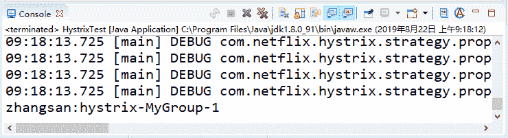
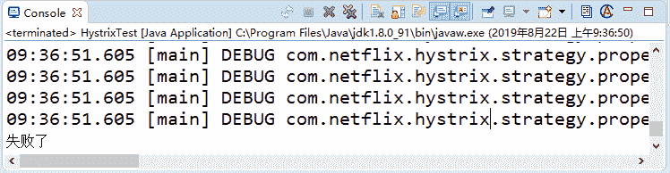

# Spring Cloud Hystrix（熔断器）介绍及使用

> 原文：[`c.biancheng.net/view/5365.html`](http://c.biancheng.net/view/5365.html)

Hystrix 是 Netflix 针对微服务分布式系统采用的熔断保护中间件，相当于电路中的保险丝。

在分布式环境中，许多服务依赖项中的一些必然会失败。Hystrix 是一个库，通过添加延迟容忍和容错逻辑，帮助你控制这些分布式服务之间的交互。Hystrix 通过隔离服务之间的访问点、停止级联失败和提供回退选项来实现这一点，所有这些都可以提高系统的整体弹性。

在微服务架构下，很多服务都相互依赖，如果不能对依赖的服务进行隔离，那么服务本身也有可能发生故障，Hystrix 通过 HystrixCommand 对调用进行隔离，这样可以阻止故障的连锁效应，能够让接口调用快速失败并迅速恢复正常，或者回退并优雅降级。

## Hystrix 的简单使用

创建一个空的 Maven 项目，在项目中增加 Hystrix 的依赖，代码如下所示。

<dependency>
    <groupId>com.netflix.hystrix</groupId>
    <artifactId>hystrix-core</artifactId>
    <version>1.5.18</version>
</dependency>

编写第一个 HystrixCommand，代码如下所示。

```

public class MyHystrixCommand extends HystrixCommand<String> {
    private final String name;
    public MyHystrixCommand(String name) {
        super(HystrixCommandGroupKey.Factory.asKey("MyGroup"));
        this.name = name;
    }

    @Override
    protected String run() {
        return this.name + ":" + Thread.currentThread().getName();
    }
}
```

首先需要继承 HystrixCommand，通过构造函数设置一个 Groupkey。具体的逻辑在 run 方法中，我们返回了一个当前线程名称的值。写一个 main 方法来调用上面编写的 MyHystrixCommand 程序，代码如下所示。

```

public static void main(String[] args) throws InterruptedException, ExecutionException {
    String result = new MyHystrixCommand("zhangsan").execute();
    System.out.println(result);
}
```

输出结果如图 1 所示：


图 1  运行结果
从图 1 中可以看到输出结果是“zhangsan：hystrix-MyGroup-1”。由此可以看出，构造函数中设置的组名变成了线程的名字。

上面是同步调用，如果需要异步调用可以使用如下代码所示的方法。

```

public static void main(String[] args) throws InterruptedException, ExecutionException {
    Future<String> future = new MyHystrixCommand("zhangsan").queue();
    System.out.println(future.get());
}
```

运行结果和图 1 相同。

## 回退支持

下面我们通过增加执行时间模拟调用超时失败的情况。首先改造 MyHystrixCommand，增加 getFallback 方法返回回退内容，代码如下所示。

```

public class MyHystrixCommand extends HystrixCommand<String> {
    private final String name;

    public MyHystrixCommand(String name) {
        super(HystrixCommandGroupKey.Factory.asKey("MyGroup"));
        this.name = name;
    }

    @Override
    protected String run() {
        try {
            Thread.sleep(1000 * 10);
        } catch (InterruptedException e) {
            e.printStackTrace();
        }
        return this.name + ":" + Thread.currentThread().getName();
    }

    @Override
    protected String getFallback() {
        return "失败了 ";
    }
}
```

重新执行调用代码，运行结果如图 2 所示，可以发现返回的内容是“失败了”，证明已经触发了回退。


图 2  运行结果