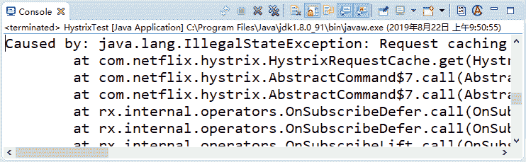
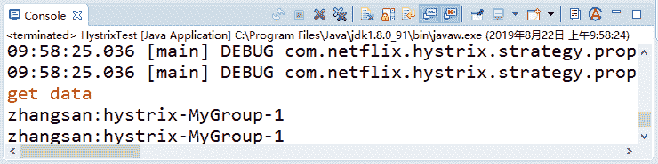
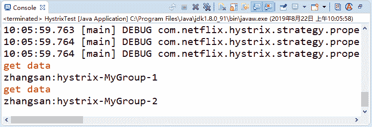
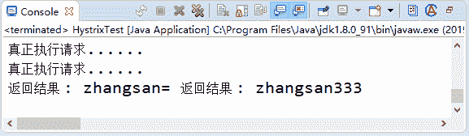

# Spring Cloud Hystrix 缓存与合并请求

> 原文：[`c.biancheng.net/view/5398.html`](http://c.biancheng.net/view/5398.html)

缓存在开发中经常用到，我们常用 Redis 这种第三方的缓存数据库对数据进行缓存处理。本节讲解 Hystrix 缓存的实现和清除，以及请求的合并。

## 结果缓存

在 Hystrix 中也为我们提供了方法级别的缓存。通过重写 getCacheKey 来判断是否返回缓存的数据，getCacheKey 可以根据参数来生成。这样，同样的参数就可以都用到缓存了。

改造之前的 MyHystrixCommand，在其中增加 getCacheKey 的重写实现，代码如下所示。

```

@Override
protected String getCacheKey() {
    return String.valueOf(this.name);
}
```

在上面的代码中，我们把创建对象时传进来的 name 参数作为缓存的 key。

为了证明能够用到缓存，在 run 方法中加一行输出，在调用多次的情况下，如果控制台只输出了一次，那么可以知道后面的都是走的缓存逻辑，代码如下所示。

```

@Override
protected String run() {
    System.err.println("get data");
    return this.name + ":" + Thread.currentThread().getName();
}
```

执行 main 方法，发现程序报错了，如图 1 所示：


图 1  运行结果完整错误信息如下：

Caused by: java.lang.IllegalStateException: Request caching is not available. Maybe you need to initialize the HystrixRequestContext?

根据错误提示可以知道，缓存的处理取决于请求的上下文，我们必须初始化 Hystrix-RequestContext。

改造 main 方法中的调用代码，初始化 HystrixRequestContext，代码如下所示。

```

public static void main(String[] args) throws InterruptedException, ExecutionException {
    HystrixRequestContext context = HystrixRequestContext.initializeContext();
    String result = new MyHystrixCommand("zhangsan").execute();
    System.out.println(result);
    Future<String> future = new MyHystrixCommand("zhangsan").queue();
    System.out.println(future.get());
    context.shutdown();
}
```

改造完之后重写执行 main 方法，就可以做正常运行了，输出结果如图 2 所示：


图 2  运行结果
我们可以看到只输出了一次 get data，缓存生效。

## 缓存清除

刚刚我们学习了如何使用 Hystrix 来实现数据缓存功能。有缓存必然就有清除缓存的动作。

当数据发生变动时，必须将缓存中的数据也更新掉，不然就会出现脏数据的问题。同样地，Hystrix 也有清除缓存的功能。

增加一个支持缓存清除的类，代码如下所示。

```

public class ClearCacheHystrixCommand extends HystrixCommand<String> {
    private final String name;
    private static final HystrixCommandKey GETTER_KEY = HystrixCommandKey.Factory.asKey("MyKey");

    public ClearCacheHystrixCommand(String name) {
        super(HystrixCommand.Setter.withGroupKey(HystrixCommandGroupKey.Factory.asKey("MyGroup"))
                .andCommandKey(GETTER_KEY));
        this.name = name;
    }

    public static void flushCache(String name) {
        HystrixRequestCache.getInstance(GETTER_KEY,HystrixConcurrencyStrategyDefault.getInstance()).clear(name);
    }

    @Override
    protected String getCacheKey() {
        return String.valueOf(this.name);
    }

    @Override
    protected String run() {
        System.err.println("get data");
        return this.name + ":" + Thread.currentThread().getName();
    }

    @Override
    protected String getFallback() {
        return "失败了 ";
    }
}
```

flushCache 方法就是清除缓存的方法，通过 HystrixRequestCache 来执行清除操作，根据 getCacheKey 返回的 key 来清除。

修改调用代码来验证清除是否有效果，代码如下所示。

```

public static void main(String[] args) throws InterruptedException, ExecutionException {
    HystrixRequestContext context = HystrixRequestContext.initializeContext();
    String result = new ClearCacheHystrixCommand("zhangsan").execute();
    System.out.println(result);
    ClearCacheHystrixCommand.flushCache("zhangsan");
    Future<String> future = new ClearCacheHystrixCommand("zhangsan").queue();
    System.out.println(future.get());
}
```

执行两次相同的 key，在第二次执行之前调用缓存清除的方法，也就是说第二次用不到缓存，输出结果如图 3 所示：


图 3  运行结果
由此可以看出，输出两次 get data，这证明缓存确实被清除了。可以把 ClearCache-HystrixCommand.flushCache 这行代码注释掉再执行一次，就会发现只输出了一次 get data，缓存是有效的，输入结果如图 2 所示。

## 合并请求

Hystrix 支持将多个请求自动合并为一个请求（代码如下所示），利用这个功能可以节省网络开销，比如每个请求都要通过网络访问远程资源。如果把多个请求合并为一个一起执行，将多次网络交互变成一次，则会极大地节省开销。

```

public class MyHystrixCollapser extends HystrixCollapser<List<String>, String, String> {
    private final String name;

    public MyHystrixCollapser(String name) {
        this.name = name;
    }

    @Override
    public String getRequestArgument() {
        return name;
    }

    @Override
    protected HystrixCommand<List<String>> createCommand(final Collection<CollapsedRequest<String, String>> requests) {
        return new BatchCommand(requests);
    }

    @Override
    protected void mapResponseToRequests(List<String> batchResponse,
            Collection<CollapsedRequest<String, String>> requests) {
        int count = 0;
        for (CollapsedRequest<String, String> request : requests) {
            request.setResponse(batchResponse.get(count++));
        }
    }

    private static final class BatchCommand extends HystrixCommand<List<String>> {

        private final Collection<CollapsedRequest<String, String>> requests;

        private BatchCommand(Collection<CollapsedRequest<String, String>> requests) {
            super(Setter.withGroupKey(HystrixCommandGroupKey.Factory.asKey("ExampleGroup"))
                    .andCommandKey(HystrixCommandKey.Factory.asKey("GetValueForKey")));
            this.requests = requests;
        }

        @Override
        protected List<String> run() {
            System.out.println(" 真正执行请求......");
            ArrayList<String> response = new ArrayList<String>();
            for (CollapsedRequest<String, String> request : requests) {
                response.add(" 返回结果 : " + request.getArgument());
            }
            return response;
        }
    }
}
```

接下来编写测试代码，代码如下所示。

```

public static void main(String[] args) throws InterruptedException, ExecutionException {
    HystrixRequestContext context = HystrixRequestContext.initializeContext();
    Future<String> f1 = new MyHystrixCollapser("zhangsan").queue();
    Future<String> f2 = new MyHystrixCollapser("zhangsan333").queue();
    System.out.println(f1.get() + "=" + f2.get());
    context.shutdown();
}
```

通过 MyHystrixCollapser 创建两个执行任务，按照正常的逻辑肯定是分别执行这两个任务，通过 HystrixCollapser 可以将多个任务合并到一起执行。从输出结果就可以看出，任务的执行是在 run 方法中去做的，输出结果如图 4 所示：


图 4  运行结果