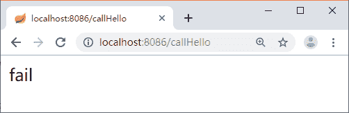

# Spring Cloud 使用 Hystrix 实现容错处理

> 原文：[`c.biancheng.net/view/5372.html`](http://c.biancheng.net/view/5372.html)

创建一个新的 Maven 项目 hystrix-feign-demo，增加 Hystrix 的依赖，代码如下所示。

<dependency>
    <groupId>org.springframework.cloud</groupId>
    <artifactId>spring-cloud-starter-netflix-hystrix</artifactId>
</dependency>

在启动类上添加 @EnableHystrix 或者 @EnableCircuitBreaker。注意，@EnableHystrix 中包含了 @EnableCircuitBreaker。

然后编写一个调用接口的方法，在上面增加一个 @HystrixCommand 注解，用于指定依赖服务调用延迟或失败时调用的方法，代码如下所示。

```

@GetMapping("/callHello")
@HystrixCommand(fallbackMethod = "defaultCallHello")
public String callHello() {
    String result = restTemplate.getForObject("http://localhost:8088/house/hello", String.class);
    return result;
}
```

当调用失败触发熔断时会用 defaultCallHello 方法来回退具体的内容，定义 default-CallHello 方法的代码如下所示。

public String defaultCallHello() {
    return "fail";
}

只要不启动 8088 端口所在的服务，调用 /callHello 接口，就可以看到返回的内容是“fail”，如图 1 所示。


图 1  运行结果
 将启动类上的 @EnableHystrix 去掉，重启服务，再次调用 /callHello 接口可以看到返回的是 500 错误信息，这个时候就没有用到回退功能了。

{
  code: 500,
  message: "I/O error on GET request for
    "http://localhost:8088/house/hello": Connection refused; nested
      exception is java.net.ConnectException: Connection refused
        ", data:
        null
}

## 配置详解

HystrixCommand 中除了 fallbackMethod 还有很多的配置，下面我们来看看这些配置，如下表所示：

HystrixCommand 配置详解

| 名称 | 说明 |
| hystrix.command.default.execution.isolation .strategy | 该配置用来指定隔离策略，具体策略有下面 2 种。 
*   THREAD：线程隔离，在单独的线程上执行，并发请求受线程池大小的控制。
*   SEMAPHORE：信号量隔离，在调用线程上执行，并发请求受信号量计数器的限制。

 |
| hystrix.command.default.execution.isolation .thread.timeoutInMilliseconds | 该配置用于 HystrixCommand 执行的超时时间设置，当 HystrixCommand 执行的时间超过了该配置所设置的数值后就会进入服务降级处理，单位是毫秒，默认值为 1000。 |
| hystrix.command.default.execution .timeout.enabled | 该配置用于确定是否启用 execution.isolation.thread.timeoutInMilliseconds 设置的超时时间，默认值为 true。设置为 false 后 execution.isolation.thread.timeoutInMilliseconds 配置也将失效。 |
| hystrix.command.default.execution.isolation .thread.interruptOnTimeout | 该配置用于确定 HystrixCommand 执行超时后是否需要中断它，默认值为 true。 |
| hystrix.command.default.execution.isolation .thread.interruptOnCancel | 该配置用于确定 HystrixCommand 执行被取消时是否需要中断它，默认值为 false。 |
| hystrix.command.default.execution.isolation .semaphore.maxConcurrentRequests | 该配置用于确定 Hystrix 使用信号量策略时最大的并发请求数。 |
| hystrix.command.default.fallback.isolation .semaphore.maxConcurrentRequests | 该配置用于如果并发数达到该设置值，请求会被拒绝和抛出异常并且 fallback 不会被调用，默认值为 10。 |
| hystrix.command.default.fallback.enabled | 该配置用于确定当执行失败或者请求被拒绝时，是否会尝试调用 hystrixCommand.getFallback()，默认值为 true。 |
| hystrix.command.default.circuitBreaker.enabled | 该配置用来跟踪 circuit 的健康性，如果未达标则让 request 短路，默认值为 true。 |
| hystrix.command.default.circuitBreaker .requestVolumeThreshold | 该配置用于设置一个 rolling window 内最小的请求数。如果设为 20，那么当一个 rolling window 的时间内（比如说 1 个 rolling window 是 10 秒）收到 19 个请求，即使 19 个请求都失败，也不会触发 circuit break，默认值为 20。 |
| hystrix.command.default.circuitBreaker .sleepWindowInMilliseconds | 该配置用于设置一个触发短路的时间值，当该值设为 5000 时，则当触发 circuit break 后的 5000 毫秒内都会拒绝 request，也就是 5000 毫秒后才会关闭 circuit。默认值为 5000。 |
| hystrix.command.default.circuitBreaker .errorThresholdPercentage | 该配置用于设置错误率阈值，当错误率超过此值时，所有请求都会触发 fallback，默认值为 50。 |
| hystrix.command.default.circuitBreaker.forceOpen | 如果配置为 true，将强制打开熔断器，在这个状态下将拒绝所有请求，默认值为 false。 |
| hystrix.command.default.circuitBreaker.forceClosed | 如果配置为 true，则将强制关闭熔断器，在这个状态下，不管错误率有多高，都允许请求，默认值为 false。 |
| hystrix.command.default.metrics .rollingStats.timeInMilliseconds | 设置统计的时间窗口值，单位为毫秒。circuit break 的打开会根据 1 个 rolling window 的统计来计算。若 rolling window 被设为 10 000 毫秒，则 rolling window 会被分成多个 buckets，每个 bucket 包含 success、failure、timeout、rejection 的次数的统计信息。默认值为 10 000 毫秒。 |
| hystrix.command.default.metrics .rollingStats.numBuckets | 设置一个 rolling window 被划分的数量，若 numBuckets=10、rolling window=10 000，那么一个 bucket 的时间即 1 秒。必须符合 rolling window%numberBuckets==0。默认值为 10。 |
| hystrix.command.default.metrics .rollingPercentile.enabled | 是否开启指标的计算和跟踪，默认值为 true。 |
| hystrix.command.default.metrics .rollingPercentile.timeInMilliseconds | 设置 rolling percentile window 的时间，默认值为 60 000 毫秒 |
| hystrix.command.default.metrics .rollingPercentile.numBuckets | 设置 rolling percentile window 的 numberBuckets，默认值为 6。 |
| hystrix.command.default.metrics .rollingPercentile.bucketSize | 如果 bucket size=100、window=10 秒，若这 10 秒里有 500 次执行，只有最后 100 次执行会被统计到 bucket 里去。增加该值会增加内存开销及排序的开销。默认值为 100。 |
| hystrix.command.default.metrics .healthSnapshot.intervalInMilliseconds | 用来计算影响断路器状态的健康快照的间隔等待时间，默认值为 500 毫秒。 |
| hystrix.command.default.requestCache.enabled | 是否开启请求缓存功能，默认值为 true。 |
| hystrix.command.default.requestLog.enabled | 记录日志到 HystrixRequestLog，默认值为 true。 |
| hystrix.collapser.default.maxRequestsInBatch | 单次批处理的最大请求数，达到该数量触发批处理，默认为 Integer.MAX_VALUE。 |
| hystrix.collapser.default.timerDelayInMilliseconds | 触发批处理的延迟，延迟也可以为创建批处理的时间与该值的和，默认值为 10 毫秒。 |
| hystrix.collapser.default.requestCache.enabled | 是否启用对 HystrixCollapser.execute() 和 HystrixCollapser.queue() 的请求缓存，默认值为 true。 |
| hystrix.threadpool.default.coreSize | 并发执行的最大线程数，默认值为 10。 |
| hystrix.threadpool.default.maxQueueSize | BlockingQueue 的最大队列数。当设为 -1 时，会使用 SynchronousQueue；值为正数时，会使用 LinkedBlcokingQueue。该设置只会在初始化时有效，之后不能修改 threadpool 的 queue size。默认值为 -1。 |
| hystrix.threadpool.default.queueSizeRejectionThreshold | 即使没有达到 maxQueueSize，但若达到 queueSizeRejectionThreshold 该值后，请求也会被拒绝。因为 maxQueueSize 不能被动态修改，而 queueSizeRejectionThreshold 参数将允许我们动态设置该值。if maxQueueSize==-1，该字段将不起作用。 |
| hystrix.threadpool.default.keepAliveTimeMinutes | 设置存活时间，单位为分钟。如果 coreSize 小于 maximumSize，那么该属性控制一个线程从实用完成到被释放的时间。默认值为 1 分钟。 |
| hystrix.threadpool.default .allowMaximumSizeToDivergeFromCoreSize | 该属性允许 maximumSize 的配置生效。那么该值可以等于或高于 coreSize。设置 coreSize 小于 maximumSize 会创建一个线程池，该线程池可以支持 maximumSize 并发，但在相对不活动期间将向系统返回线程。默认值为 false。 |
| hystrix.threadpool.default.metrics .rollingStats.timeInMilliseconds | 设置滚动时间窗的时间，单位为毫秒，默认值是 10 000。 |
| hystrix.threadpool.default.metrics .rollingStats.numBuckets | 设置滚动时间窗划分桶的数量，默认值为 10。 |

官方的配置信息文档请参考：[`github.com/Netflix/Hystrix/wiki/Configuration`](https://github.com/Netflix/Hystrix/wiki/Configuration)。

上面列出来的都是 Hystrix 的配置信息，那么在 Spring Cloud 中该如何使用呢？只需要在接口的方法上面使用 HystrixCommand 注解（如下代码所示），指定对应的属性即可。

```

@HystrixCommand(fallbackMethod = "defaultCallHello",commandProperties = {
        @HystrixProperty(name="execution.isolation.strategy", value = "THREAD")
    }
)
@GetMapping("/callHello")
public String callHello() {
    String result = restTemplate.getForObject("http://localhost:8088/house/hello", String.class);
    return result;
}
```