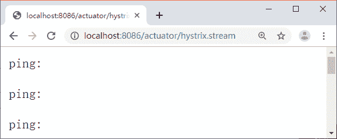
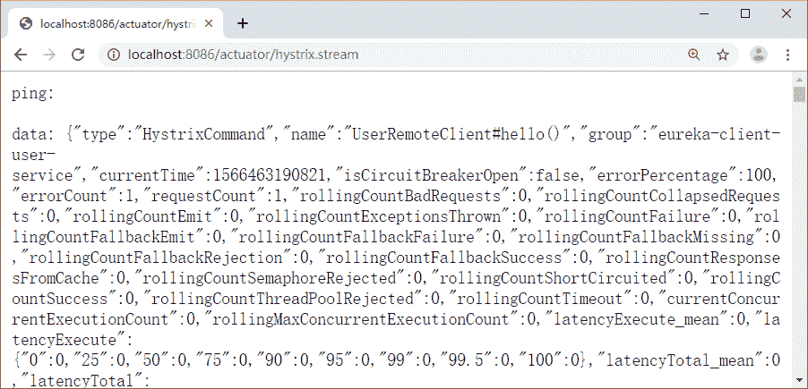

# Spring Cloud Hystrix 的实时监控功能

> 原文：[`c.biancheng.net/view/5376.html`](http://c.biancheng.net/view/5376.html)

在微服务架构中，Hystrix 除了实现容错外，还提供了实时监控功能。在服务调用时，Hystrix 会实时累积关于 HystrixCommand 的执行信息，比如每秒的请求数、成功数等。

更多的指标信息请查看官方文档：[`github.com/Netflix/Hystrix/wiki/Metrics-and-Monitoring`](https://github.com/Netflix/Hystrix/wiki/Metrics-and-Monitoring)。

Hystrix 监控需要两个必备条件：

1）必须有 Actuator 的依赖，代码如下所示。

<dependency>
    <groupId>org.springframework.boot</groupId>
    <artifactId>spring-boot-starter-actuator</artifactId>
</dependency>

2）必须有 Hystrix 的依赖，Spring Cloud 中必须在启动类中添加 @EnableHystrix 开启 Hystrix，代码如下所示。

<dependency>
    <groupId>org.springframework.cloud</groupId>
    <artifactId>spring-cloud-starter-netflix-hystrix</artifactId>
</dependency>

我们改造下 hystrix-feign-demo 这个项目，加入上边两段代码的依赖，将 actuator 中的端点暴露出来，访问端点地址（http://localhost:8086/actuator/hystrix.stream），如图 1 所示：

图 1  运行结果
从图中可以看到一直在输出“ping：”，出现这种情况是因为还没有数据，等到 HystrixCommand 执行了之后就可以看到具体数据了。

调用一下 /callHello 接口 http://localhost:8086/callHello，访问之后就可以看到 http://localhost:8086/actuator/hystrix.stream 这个页面中输出的数据了，如图 2 所示。

图 2  运行结果