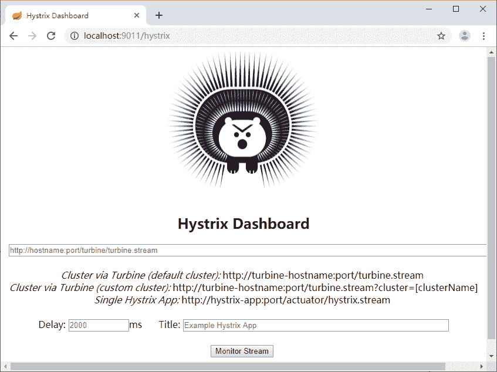
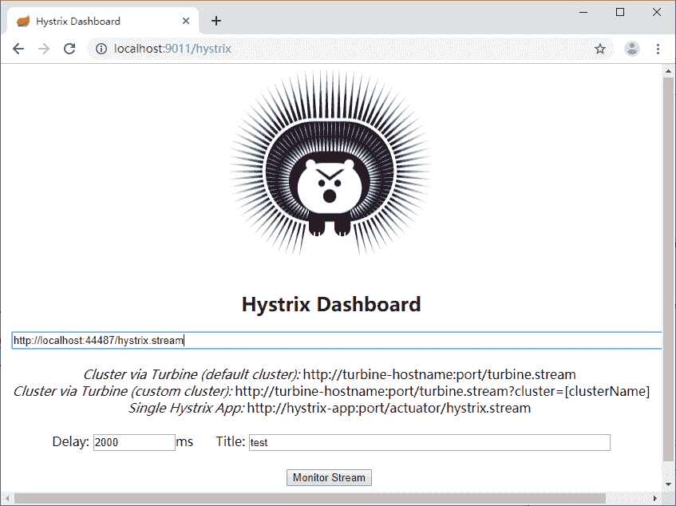
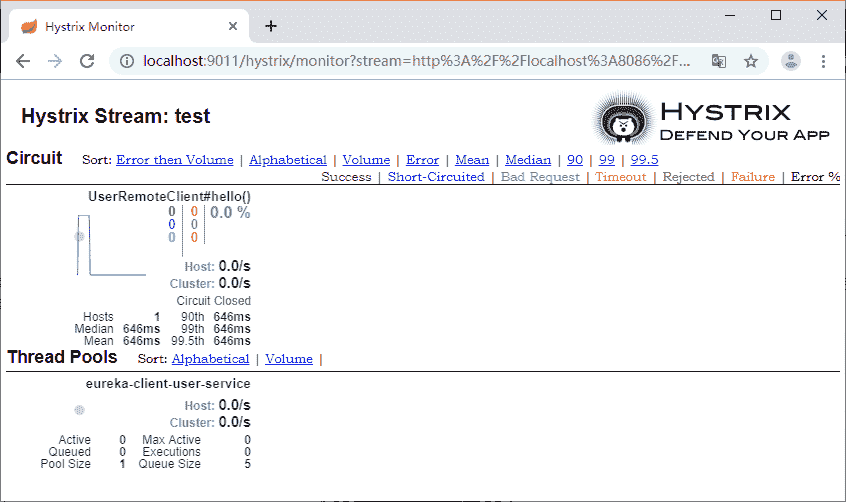

# Spring Cloud 使用 Hystrix Dashboard（熔断仪表盘）查看监控数据

> 原文：[`c.biancheng.net/view/5377.html`](http://c.biancheng.net/view/5377.html)

我们已经知道 Hystrix 提供了监控的功能，可以通过 hystrix.stream 端点来获取监控数据，但是这些数据是以字符串的形式展现的，实际使用中不方便查看。我们可以借助 Hystrix Dashboard 对监控进行图形化展示。

Hystrix Dashboard 是一款针对 Hystrix 进行实时监控的工具，通过 Hystrix Dashboard 可以直观地看到各 Hystrix Command 的请求响应时间，请求成功率等数据。

下面我们单独创建一个项目来集成 dashboard。

创建一个 Maven 项目 hystrix-dashboard-demo，在 pom.xml 中添加 dashboard 的依赖，代码如下所示。

<dependency>
    <groupId>org.springframework.cloud</groupId>
    <artifactId>spring-cloud-starter-netflix-hystrix-dashboard</artifactId>
</dependency>

创建启动类，在启动类上添加 @EnableHystrixDashboard 注解，代码如下所示。

```

@SpringBootApplication
@EnableHystrixDashboard
public class DashboardApplication {

    public static void main(String[] args) {
        SpringApplication.run(DashboardApplication.class, args);
    }
}
```

在属性配置文件中只需要配置服务名称和服务端口：

spring.application.name=hystrix-dashboard-demo
server.port=9011

然后启动服务，访问 http://localhost:9011/hystrix 就可以看到 dashboard 的主页，如图 1 所示。


图 1  dashboard 主页
在主页中有 3 个地方需要我们填写，第一行是监控的 stream 地址，也就是将之前文字监控信息的地址输入到第一个文本框中。第二行的 Delay 是时间，表示用多少毫秒同步一次监控信息，Title 是标题，这个可以随便填写，如图 2 所示。


图 2  dashboard 参数填写
输入完成后就可以点击 Monitor Stream 按钮以图形化的方式查看监控的数据了，如图 3 所示。


图 3  dashboard 数据监控输出页面