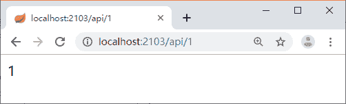

# Spring Cloud Zuul 路由配置详解

> 原文：[`c.biancheng.net/view/5383.html`](http://c.biancheng.net/view/5383.html)

在教程《Zuul 网关介绍和使用》中，我们学习了如何结合 Eureka 来实现动态的路由转发。当 Zuul 集成 Eureka 之后，其实就可以为 Eureka 中所有的服务进行路由操作了，默认的转发规则就是“API 网关地址+访问的服务名称+接口 URI”。

在给服务指定名称的时候，应尽量短一点，这样的话我们就可以用默认的路由规则进行请求，不需要为每个服务都定一个路由规则，这样就算新增了服务，API 网关也不用修改和重启了。

默认规则举例：

*   API 网关地址：http://localhost:2103。
*   用户服务名称：user-service。
*   用户登录接口：/user/login。

那么通过 Zuul 访问登录接口的规则就是 http://localhost：2103/user-service/user/login。

#### 1\. 指定具体服务路由

我们可以为每一个服务都配置一个路由转发规则：

zuul.routes.fsh-house.path=/api-house/**

上述代码将 fsh-house 服务的路由地址配置成了 api-house，也就是当需要访问 fsh-house 中的接口时，我们可以通过 api-house/house/hello 来进行。这其实就是将服务名称变成了我们自定义的名称。

有的时候服务名称太长了，放在 URL 中不太友好，我们希望它变得更友好一点，就可以这么去配置。这里的 api-house/** 后面一定要配置两个星号，两个星号表示可以转发任意层级的 URL，比如“/api-house/house/1”。如果只配置一个星号，那么就只能转发一级，比如“/api-house/house”。

#### 2\. 路由前缀

有的时候我们会想在 API 前面配置一个统一的前缀，比如像 http://c.biancheng.net/user/login 这样登录接口，如果想将其变成 http://c.biancheng.net/rest/user/login，即在每个接口前面加一个 rest，此时我们就可以通过 Zuul 中的配置来实现：

zuul.prefix=/rest

#### 3\. 本地跳转

Zuul 的 API 路由还提供了本地跳转功能，通过 forward 就可以实现。

zuul.routes.fsh-substitution.path=/api/**
zuul.routes.fsh-substitution.url=forward:/local

当我们想在访问 api/1 的时候会路由到本地的 local/1 上去，就可以参照上述代码实现。local 是本地接口需要我们自行添加，因此我们要建一个 Controller，代码如下所示。

```

@RestController
public class LocalController {
    @GetMapping("/local/{id}")
    public String local(@PathVariable String id) {
        return id;
    }
}
```

然后访问 http://localhost：2103/api/1 就可以看到我们想要的返回结果了，如图 1 所示。


图 1  运行结果