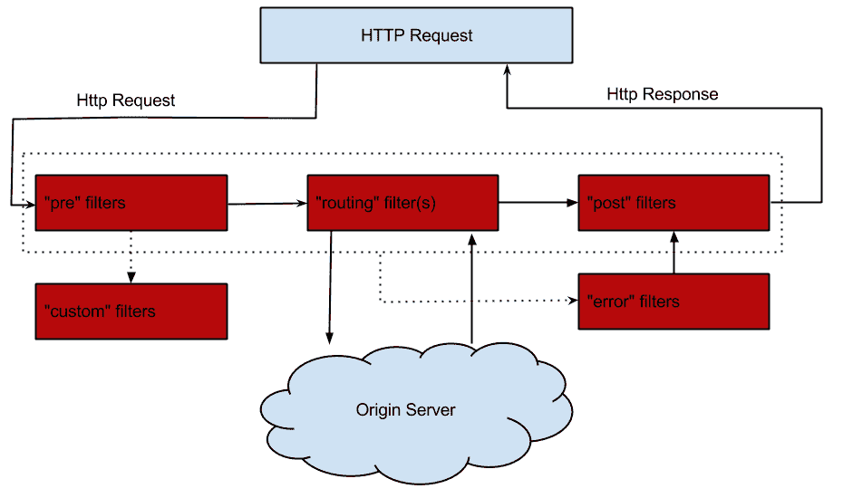
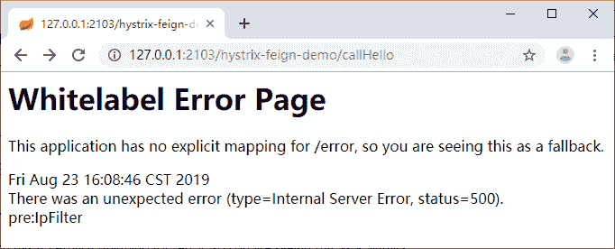
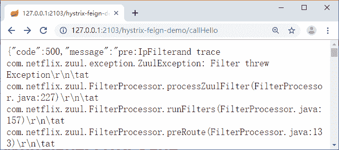

# Spring Cloud Zuul 过滤器介绍及使用（传递数据、拦截请求和异常处理）

> 原文：[`c.biancheng.net/view/5417.html`](http://c.biancheng.net/view/5417.html)

在教程《Zuul 网关的介绍及使用》中一开始就介绍过，Zuul 可以实现很多高级的功能，比如限流、认证等。想要实现这些功能，必须要基于 Zuul 给我们提供的核心组件“过滤器”。下面我们一起来了解一下 Zuul 的过滤器。

## 过滤器类型

Zuul 中的过滤器跟我们之前使用的 javax.servlet.Filter 不一样，javax.servlet.Filter 只有一种类型，可以通过配置 urlPatterns 来拦截对应的请求。

而 Zuul 中的过滤器总共有 4 种类型，且每种类型都有对应的使用场景。

#### 1）pre

可以在请求被路由之前调用。适用于身份认证的场景，认证通过后再继续执行下面的流程。

#### 2）route

在路由请求时被调用。适用于灰度发布场景，在将要路由的时候可以做一些自定义的逻辑。

#### 3）post

在 route 和 error 过滤器之后被调用。这种过滤器将请求路由到达具体的服务之后执行。适用于需要添加响应头，记录响应日志等应用场景。

#### 4）error

处理请求时发生错误时被调用。在执行过程中发送错误时会进入 error 过滤器，可以用来统一记录错误信息。

## 请求生命周期

可以通过图 1 看出整个过滤器的执行生命周期，此图来自 Zuul GitHub wiki 主页。
图 1  过滤器生命周期
通过上面的图可以清楚地知道整个执行的顺序，请求发过来首先到 pre 过滤器，再到 routing 过滤器，最后到 post 过滤器，任何一个过滤器有异常都会进入 error 过滤器。

通过 com.netflix.zuul.http.ZuulServlet 也可以看出完整执行顺序，ZuulServlet 类似 Spring-Mvc 的 DispatcherServlet，所有的 Request 都要经过 ZuulServlet 的处理。

ZuulServlet 源码如下所示：

```

@Override
public void service(javax.servlet.ServletRequest servletRequest, javax.servlet.ServletResponse servletResponse)
        throws ServletException, IOException {
    try {
        init((HttpServletRequest) servletRequest, (HttpServletResponse) servletResponse);
        RequestContext context = RequestContext.getCurrentContext();
        context.setZuulEngineRan();
        try {
            preRoute();
        } catch (ZuulException e) {
            error(e);
            postRoute();
            return;
        }
        try {
            route();
        } catch (ZuulException e) {
            error(e);
            postRoute();
            return;
        }
        try {
            postRoute();
        } catch (ZuulException e) {
            error(e);
            return;
        }
    } catch (Throwable e) {
        error(new ZuulException(e, 500, "UNHANDLED_EXCEPTION_" + e.getClass().getName()));
    } finally {
        RequestContext.getCurrentContext().unset();
    }
}
```

## 使用过滤器

我们创建一个 pre 过滤器，来实现 IP 黑名单的过滤操作，代码如下所示。

```

public class IpFilter extends ZuulFilter {

    // IP 黑名单列表
    private List<String> blackIpList = Arrays.asList("127.0.0.1");

    public IpFilter() {
        super();
    }

    @Override
    public boolean shouldFilter() {
        return true
    }

    @Override
    public String filterType() {
        return "pre";
    }

    @Override
    public int filterOrder() {
        return 1;
    }

    @Override
    public Object run() {
        RequestContext ctx = RequestContext.getCurrentContext();
        String ip = IpUtils.getIpAddr(ctx.getRequest());
        // 在黑名单中禁用
        if (StringUtils.isNotBlank(ip) && blackIpList.contains(ip)) {

            ctx.setSendZuulResponse(false);
            ResponseData data = ResponseData.fail("非法请求 ", ResponseCode.NO_AUTH_CODE.getCode());
            ctx.setResponseBody(JsonUtils.toJson(data));
            ctx.getResponse().setContentType("application/json; charset=utf-8");
            return null;
        }
        return null;
    }
}
```

由代码可知，自定义过滤器需要继承 ZuulFilter，并且需要实现下面几个方法：

#### 1）shouldFilter

是否执行该过滤器，true 为执行，false 为不执行，这个也可以利用配置中心来实现，达到动态的开启和关闭过滤器。

#### 2）filterType

过滤器类型，可选值有 pre、route、post、error。

#### 3）filterOrder

过滤器的执行顺序，数值越小，优先级越高。

#### 4）run

执行自己的业务逻辑，本段代码中是通过判断请求的 IP 是否在黑名单中，决定是否进行拦截。blackIpList 字段是 IP 的黑名单，判断条件成立之后，通过设置 ctx.setSendZuulResponse（false），告诉 Zuul 不需要将当前请求转发到后端的服务了。通过 setResponseBody 返回数据给客户端。

过滤器定义完成之后我们需要配置过滤器才能生效，IP 过滤器配置代码如下所示。

```

@Configuration
public class FilterConfig {

    @Bean
    public IpFilter ipFilter() {
        return new IpFilter();
    }
}
```

## 过滤器禁用

有的场景下，我们需要禁用过滤器，此时可以采取下面的两种方式来实现：

*   利用 shouldFilter 方法中的 return false 让过滤器不再执行
*   通过配置方式来禁用过滤器，格式为“zuul. 过滤器的类名.过滤器类型 .disable=true”。如果我们需要禁用“使用过滤器”部分中的 IpFilter，可以用下面的配置：

zuul.IpFilter.pre.disable=true

## 过滤器中传递数据

项目中往往会存在很多的过滤器，执行的顺序是根据 filterOrder 决定的，那么肯定有一些过滤器是在后面执行的，如果你有这样的需求：第一个过滤器需要告诉第二个过滤器一些信息，这个时候就涉及在过滤器中怎么去传递数据给后面的过滤器。

实现这种传值的方式笔者第一时间就想到了用 ThreadLocal，既然我们用了 Zuul，那么 Zuul 肯定有解决方案，比如可以通过 RequestContext 的 set 方法进行传递，RequestContext 的原理就是 ThreadLocal。

RequestContext ctx = RequestContext.getCurrentContext();
ctx.set("msg", "你好吗");

后面的过滤就可以通过 RequestContext 的 get 方法来获取数据：

RequestContext ctx = RequestContext.getCurrentContext();
ctx.get("msg");

上面我们说到 RequestContext 的原理就是 ThreadLocal，这不是笔者自己随便说的，而是笔者看过源码得出来的结论，下面请看源码，代码如下所示。

```

protected static final ThreadLocal<? extends RequestContext> threadLocal = new ThreadLocal<RequestContext>() {
    @Override
    protected RequestContext initialValue() {
        try {
            return contextClass.newInstance();
        } catch (Throwable e) {
            throw new RuntimeException(e);
        }
    }
};

public static RequestContext getCurrentContext() {
    if (testContext != null)
        return testContext;

    RequestContext context = threadLocal.get();
    return context;
}
```

## 过滤器拦截请求

在过滤器中对请求进行拦截是一个很常见的需求，本节的“使用过滤器”部分中讲解的 IP 黑名单限制就是这样的一个需求。如果请求在黑名单中，就不能让该请求继续往下执行，需要对其进行拦截并返回结果给客户端。

拦截和返回结果只需要 5 行代码即可实现，代码如下所示。

```

RequestContext ctx = RequestContext.getCurrentContext();
ctx.setSendZuulResponse(false);
ctx.set("sendForwardFilter.ran", true);
ctx.setResponseBody("返回信息");
return null;

```

ctx.setSendZuulResponse(false) 告诉 Zuul 不需要将当前请求转发到后端的服务。原理体现在 shouldFilter() 方法上，源码在 org.springframework.cloud.netflix.zuul.filters.route.RibbonRoutingFilter 中的 shouldFilter() 方法里，代码如下所示。

```

@Override
public boolean shouldFilter() {
    RequestContext ctx = RequestContext.getCurrentContext();
    return (ctx.getRouteHost() == null && ctx.get(SERVICE_ID_KEY) != null && ctx.sendZuulResponse());
}
```

代码“ctx.set("sendForwardFilter.ran"，true);”是用来拦截本地转发请求的，当我们配置了 forward：/local 的路由，ctx.setSendZuulResponse(false) 对 forward 是不起作用的，需要设置 ctx.set("sendForwardFilter.ran"，true) 才行。

对应实现的源码体现在 org.springframework.cloud.netflix.zuul.filters.route.SendForwardFilter 的 shouldFilter() 方法中，代码如下所示。

```

protected static final String SEND_FORWARD_FILTER_RAN = "sendForwardFilter.ran";

@Override
public boolean shouldFilter() {
    RequestContext ctx = RequestContext.getCurrentContext();
    return ctx.containsKey(FORWARD_TO_KEY) && !ctx.getBoolean(SEND_FORWARD_FILTER_RAN, false);
}
```

到这一步之后，当前的过滤器中确实将请求进行拦截了，并且可以给客户端返回信息。但是当你的项目中有多个过滤器的时候，假如你需要过滤的那个过滤器是第一个执行的，发现非法请求，然后进行拦截，以笔者之前使用 javax.servlet.Filter 的经验，进行拦截之后，在 chain.doFilter 之前进行返回就可以让过滤器不往下执行了。

但是 Zuul 中的过滤器不一样，即使你刚刚通过 ctx.setSendZuulResponse(false) 设置了不路由到服务，并且返回 null，那只是当前的过滤器执行完成了，后面还有很多过滤器在等着执行。

通过源码可以看出，Zuul 中 Filter 的执行逻辑如下：在 ZuulServlet 中的 service 方法中执行对应的 Filter，比如 preRoute()。preRoute 中会通过 ZuulRunner 来执行（代码如下所示）。

void preRoute() throws ZuulException {
    zuulRunner.preRoute();
}

zuulRunner 中通过调用 FilterProcessor 来执行 Filter（代码如下所示）。

public void preRoute() throws ZuulException {
    FilterProcessor.getInstance().preRoute();
}

FilterProcessor 通过过滤器类型获取所有过滤器，并循环执行（代码如下所示）。

```

public Object runFilters(String sType) throws Throwable {
    if (RequestContext.getCurrentContext().debugRouting()) {
        Debug.addRoutingDebug("Invoking {" + sType + "} type filters");
    }
    boolean bResult = false;
    List<ZuulFilter> list = FilterLoader.getInstance().getFiltersByType(sType);
    if (list != null) {
        for (int i = 0; i < list.size(); i++) {
            ZuulFilter zuulFilter = list.get(i);
            Object result = processZuulFilter(zuulFilter);
            if (result != null && result instanceof Boolean) {
                bResult |= ((Boolean) result);
            }
        }
    }
    return bResult;
}
```

通过上面的讲解，我们大致知道了为什么所有的过滤器都会执行，解决这个问题的办法就是通过 shouldFilter 来处理，即在拦截之后通过数据传递的方式告诉下一个过滤器是否要执行。

改造上面的拦截代码，增加一行数据传递的代码：

ctx.set("isSuccess", false);

在 RequestContext 中设置一个值来标识是否成功，当为 true 的时候，后续的过滤器才执行，若为 false 则不执行。

利用这种方法，在后面的过滤器就需要用到这个值来决定自己此时是否需要执行，此时只需要在 shouldFilter 方法中加上如下所示的代码即可。

```

public boolean shouldFilter() {
    RequestContext ctx = RequestContext.getCurrentContext();
    Object success = ctx.get("isSuccess");
    return success == null ? true : Boolean.parseBoolean(success.toString());
}
```

## 过滤器中异常处理

对于异常来说，无论在哪个地方都需要处理。过滤器中的异常主要发生在 run 方法中，可以用 try catch 来处理。Zuul 中也为我们提供了一个异常处理的过滤器，当过滤器在执行过程中发生异常，若没有被捕获到，就会进入 error 过滤器中。

我们可以定义一个 error 过滤器来记录异常信息，代码如下所示。

```

public class ErrorFilter extends ZuulFilter {

    private Logger log = LoggerFactory.getLogger(ErrorFilter.class);

    @Override
    public String filterType() {
        return "error";
    }

    @Override
    public int filterOrder() {
        return 100;
    }

    @Override
    public boolean shouldFilter() {
        return true;
    }

    @Override
    public Object run() {
        RequestContext ctx = RequestContext.getCurrentContext();
        Throwable throwable = ctx.getThrowable();
        log.error("Filter Erroe : {}", throwable.getCause().getMessage());
        return null;
    }
}
```

然后我们在其他过滤器中模拟一个异常信息，改造本节“使用过滤器”部分中的 IpFilter 代码，在 run 方法中增加下面的代码来模拟 java.lang.ArithmeticException：/by zero。

System.out.println(2/0);

访问我们的服务接口可以看到图 2 所示的内容，500 错误信息表示控制台也有异常日志输出。


图 2  500 错误页面
我们后端的接口服务都是 REST 风格的 API，返回的数据都有固定的 Json 格式，现在变成这样一个页面了，让客户端那边怎么处理？我们通过实现 ErrorController 来解决这个问题。

ErrorController 的代码如下所示：

```

@RestController
public class ErrorHandlerController implements ErrorController {

    @Autowired
    private ErrorAttributes errorAttributes;

    @Override
    public String getErrorPath() {
        return "/error";
    }

    @RequestMapping("/error")
    public ResponseData error(HttpServletRequest request) {
        Map<String, Object> errorAttributes = getErrorAttributes(request);
        String message = (String) errorAttributes.get("message");
        String trace = (String) errorAttributes.get("trace");
        if (StringUtils.isNotBlank(trace)) {
            message += String.format("and trace %s", trace);
        }
        return ResponseData.fail(message, ResponseCode.SERVER_ERROR_CODE.getCode());
    }

    private Map<String, Object> getErrorAttributes(HttpServletRequest request) {
        return errorAttributes.getErrorAttributes(new ServletWebRequest(request), true);
    }
}
```

我们再次访问之前的接口，这次就不是一个错误页面了，而是我们固定好的 Json 格式的数据，如图 3 所示。


图 3  Json 格式 500 错误页面
之前我们讲解过 Spring Boot 中统一进行异常处理的办法，也就是把页面的错误转换成了统一的 Json 格式数据返回给调用方，为什么这里还要用另一种办法来实现呢？

因为 @ControllerAdvice 注解主要用来针对 Controller 中的方法做处理，作用于 @RequestMapping 标注的方法上，只对我们定义的接口异常有效，在 Zuul 中是无效的。