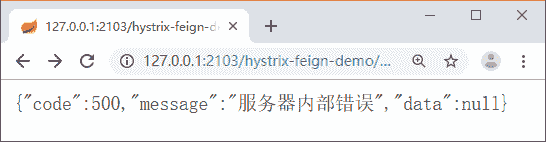

# Spring Cloud 使用 Zuul 实现容错回退功能

> 原文：[`c.biancheng.net/view/5421.html`](http://c.biancheng.net/view/5421.html)

Zuul 主要功能就是转发，在转发过程中我们无法保证被转发的服务是可用的，这个时候就需要容错机制及回退机制。

## 容错机制

容错，简单来说就是当某个服务不可用时，能够切换到其他可用的服务上去，也就是需要有重试机制。在 Zuul 中开启重试机制需要依赖 spring-retry。

首先在 pom.xml 中添加 spring-retry 的依赖，代码如下所示。

<dependency>
    <groupId>org.springframework.retry</groupId>
    <artifactId>spring-retry</artifactId>
</dependency>

在属性文件中开启重试机制以及配置重试次数：

zuul.retryable=true
ribbon.connectTimeout=500
ribbon.readTimeout=5000
ribbon.maxAutoRetries=1
ribbon.maxAutoRetriesNextServer=3
ribbon.okToRetryOnAllOperations=true
ribbon.retryableStatusCodes=500,404,502

其中：

*   zuul.retryable：开启重试。
*   ribbon.connectTimeout：请求连接的超时时间（ms）。
*   ribbon.readTimeout：请求处理的超时时间（ms）。
*   ribbon.maxAutoRetries：对当前实例的重试次数。
*   ribbon.maxAutoRetriesNextServer：切换实例的最大重试次数。
*   ribbon.okToRetryOnAllOperations：对所有操作请求都进行重试。
*   ribbon.retryableStatusCodes：对指定的 Http 响应码进行重试。

可以启动两个 hystrix-feign-demo 服务，默认 Ribbon 的转发规则是轮询，然后我们停掉一个 hystrix-feign-demo 服务。没加重试机制之前，当你请求接口的时候肯定有一次是会被转发到停掉的服务上去的，返回的是异常信息。

当我们加入了重试机制后，你可以循环请求接口，这个时候不会返回异常信息，因为 Ribbon 会根据重试配置进行重试，当请求失败后会将请求重新转发到可用的服务上去。

## 回退机制

在 Spring Cloud 中，Zuul 默认整合了 Hystrix，当后端服务异常时可以为 Zuul 添加回退功能，返回默认的数据给客户端。

实现回退机制需要实现 ZuulFallbackProvider 接口，代码如下所示。

```

@Component
public class ServiceConsumerFallbackProvider implements ZuulFallbackProvider {
    private Logger log = LoggerFactory.getLogger(ServiceConsumerFallbackProvider.class);

    @Override
    public String getRoute() {
        return "*";
    }

    @Override
    public ClientHttpResponse fallbackResponse(String route, Throwable cause) {
        return new ClientHttpResponse() {
            @Override
            public HttpStatus getStatusCode() throws IOException {
                return HttpStatus.OK;
            }

            @Override
            public int getRawStatusCode() throws IOException {
                return this.getStatusCode().value();
            }

            @Override
            public String getStatusText() throws IOException {
                return this.getStatusCode().getReasonPhrase();
            }

            @Override
            public void close() {
            }

            @Override
            public InputStream getBody() throws IOException {
                if (cause != null) {
                    log.error("", cause.getCause());
                }
                RequestContext ctx = RequestContext.getCurrentContext();
                ResponseData data = ResponseData.fail("服务器内部错误 ", ResponseCode.SERVER_ERROR_CODE.getCode());
                return new ByteArrayInputStream(JsonUtils.toJson(data).getBytes());
            }

            @Override
            public HttpHeaders getHeaders() {
                HttpHeaders headers = new HttpHeaders();
                MediaType mt = new MediaType("application", "json", Charset.forName("UTF-8"));
                headers.setContentType(mt);
                return headers;
            }
        };
    }
}
```

getRoute 方法中返回`*`表示对所有服务进行回退操作，如果只想对某个服务进行回退，那么就返回需要回退的服务名称，这个名称一定要是注册到 Eureka 中的名称。

通过 ClientHttpResponse 构造回退的内容。通过 getStatusCode 返回响应的状态码。通过 getStatusText 返回响应状态码对应的文本。通过 getBody 返回回退的内容。通过 getHeaders 返回响应的请求头信息。

通过 API 网关来访问 hystrix-feign-demo 服务，将 hystrix-feign-demo 服务停掉，然后再次访问，就可以看到回退的内容了，如图 1 所示。


图 1  运行结果

## Zuul 高可用

跟业务相关的服务我们都是注册到 Eureka 中，通过 Ribbon 来进行负载均衡，服务可以通过水平扩展来实现高可用。

现实使用中，API 网关这层往往是给 APP、Webapp、客户来调用接口的，如果我们将 Zuul 也注册到 Eureka 中是达不到高可用的，因为你不可能让你的客户也去操作你的注册中心。

这时最好的办法就是用额外的负载均衡器来实现 Zuul 的高可用，比如我们最常用的 Nginx，或者 HAProxy、F5 等。

这种方式也是单体项目最常用的负载方式，当用户请求一个地址的时候，通过 Nginx 去做转发，当一个服务挂掉的时候，Nginx 会把它排除掉。

如果想要 API 网关也能随时水平扩展，那么我们可以用脚本来动态修改 Nginx 的配置，通过脚本操作 Eureka，发现有新加入的网关服务或者下线的网关服务，直接修改 Nginx 的 upstream，然后通过重载（reload）配置来达到网关的动态扩容。

如果不用脚本结合注册中心去做的话，就只能提前规划好 N 个节点，然后手动配置上去。