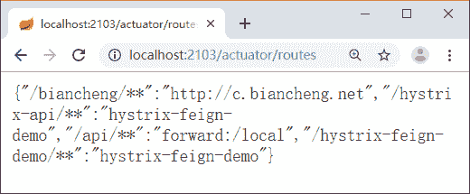
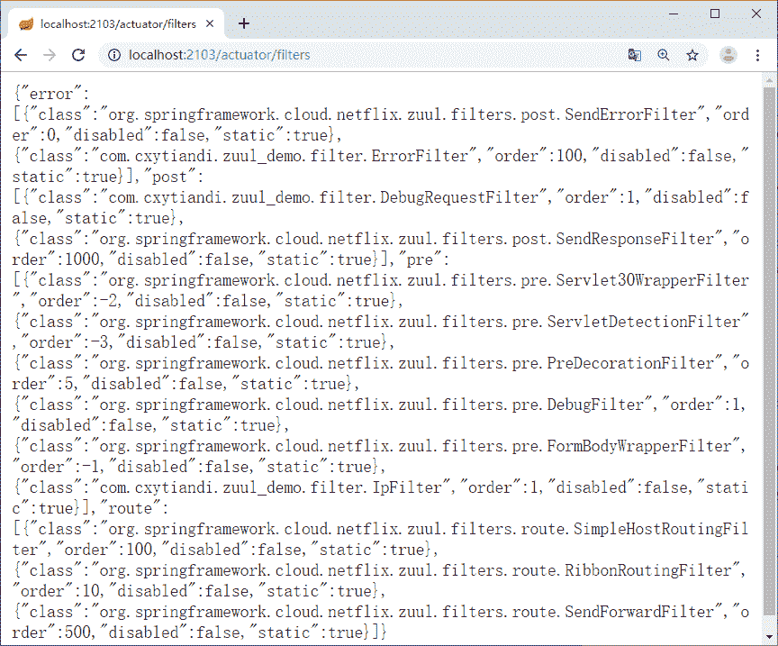

# 查看 Zuul 的路由端点和过滤器信息

> 原文：[`c.biancheng.net/view/5422.html`](http://c.biancheng.net/view/5422.html)

本节实例使用《Zuul 网关的介绍及使用》教程中的 zuul-demo 项目，主要介绍了如何使用 Zuul 查看路由端点和过滤器信息。

## /routes 端点

当 @EnableZuulProxy 与 Spring Boot Actuator 配合使用时，Zuul 会暴露一个路由管理端点 /routes。借助这个端点，可以方便、直观地查看以及管理 Zuul 的路由。

将所有端点都暴露出来，在 application.properties 配置文件中增加以下配置：

management.endpoints.web.exposure.include=*

访问 http://localhost:2103/actuator/routes 可以显示所有路由信息，如图 1 所示。

图 1  路由端点访问结果

## /filters 端点

/fliters 端点会返回 Zuul 中所有过滤器的信息。可以清楚地了解 Zuul 中目前有哪些过滤器，哪些过滤器被禁用了等详细信息。

访问 http://localhost:2103/actuator/filters 可以显示所有过滤器信息，如图 2 所示。

图 2  过滤器访问结果